作業目的：｢專案」是系統發展的基本單位，一個專案就是將來封裝為一套系統。
一家公司可以開啟多個專案，同時發展及維護多個系統。相同公司內，各專案的公共資源可以複製分享，以加速系統發展。不同公司間如果要分享規格或是公共資源，則需透過ruRU IDE 的權限管理處理後，才能夠實現。	對於已經成立的專案，PM要負責管理專案的基本資料、專案的多語言能力、專案成員的名單及角色，成員的工作記錄與績效，以及各類的專案資源等。

 - [3.1 進入專案](#ProjectApply)
 - [3.2 專案管理](#ProjectManaget)
 - [3.3 團隊管理](#ProjectTeam)

---
##  **3.1 進入專案**
> 作業目的：每一個使用者登入ruRU IDE設計平台之後，就可以在專案的下拉清單中找到自己參與的專案。如果找不到你要的專案的話，請洽該專案的PM，請他邀請你加入專案，並賦予你恰當的角色。

1. 專案：點選下拉選項, 會出現你被核准參加的專案清單，供你挑選進入

### **3.1.1 申請專案**
> 作業目的：一個新專案的產生，必須先提出申請，在得到system manager 核准後，才會出現在	登入的專案清單中。

1. 申請專案鍵：點選後會, 開啟【申請專案】的頁面
2. 專案名稱：指定專案的名稱
3. 聯絡電話：
4. 備註事項：輸入密碼, 區分大小寫
5. 預設語言：建立專案時，會預先準備指定語系的共用工具內容
6. 專案負責人：預設登入的使用者為，做為此專案的專案管理者
7. 企業代號：預設為登入帳號的所屬企業為本專案的企業代號，若帳號未定義則可在【專案資訊】中後補
8. 送出鍵：填寫上述資料後按 送出，即完成專案申請的提出，靜候system manager 的核准通知即可。未被核准之前，在下拉的專案清單中是看不到該專案的。

---
##  **3.2 專案管理**
> 作業目的：對於已經成立的專案，PM要負責管理專案的基本資料、專案的多語言能力、專案成員的名單及腳色，成員的工作紀錄與績效，以及各類的專案資源等。

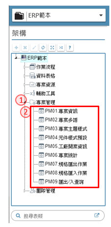
1. 駐啟架構樹上的專案管理節點
2. 展開後, 專案管理節點下呈現相關作業功能

- [3.2.1 專案資訊 ](#ProjectInformation )
- [3.2.2 專案多語 ](#MultilingualProject) 
- [3.2.3 專案主題樣式 ](#ProjectThemeStyle )
- [3.2.4 元件樣式預設 ](#ElementStyleDefault) 
- [3.2.5 工廠開案資訊 ](#FactoryOpenCaseInformation )
- [3.2.6 專案統計 ](#PojectStatistics )
- 3.2.7 規格匯出作業	
- 3.2.8 規格匯入作業	
- 3.2.9 匯出/匯入查詢	

###    3.2.1 專案資訊
> 作業目的：維護專案的基本資訊，以滿足文件製作的需求，對後續的系統發展沒有直接影響。

參考資料：[☢專案資訊](https://youtu.be/thUfFHKWdaA){:target='_blank'} [℗專案資訊](pdf/18-16-1專案資訊.pdf){:target='_blank'}

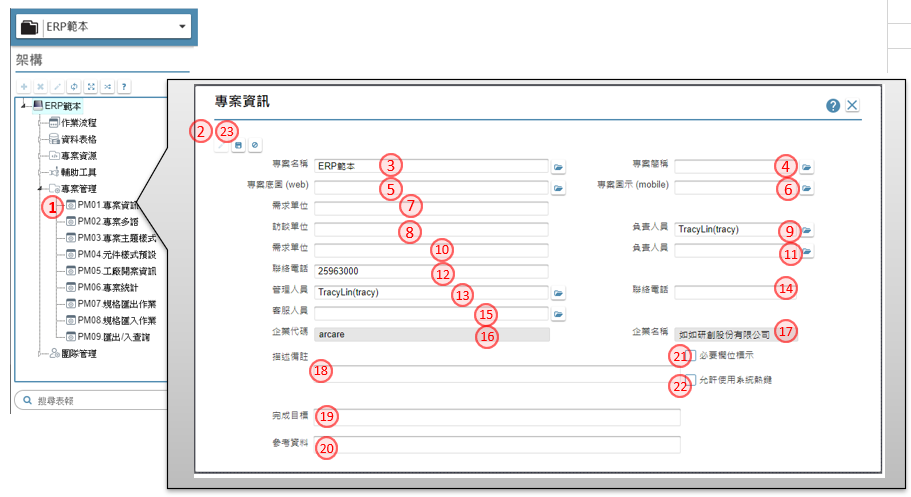
1. 開啟【專案資訊】
2. 編輯鍵：利用本按鈕進入編輯狀態
3. 專案名稱Full Name：可利用開窗鍵, 開啟[【多語詞庫】](16.html#MaintainMultilingual)指定挑選詞庫，操作方法請參考［16.2］, 來改變專案的名稱
4. 專案簡稱Short Name：可利用開窗鍵, 開啟[【多語詞庫】](16.html#MaintainMultilingual)指定挑選詞庫，操作方法請參考［16.2］, 來改變專案的簡稱
5. 專案底圖(Web)：當在PC端開啟系統時，未開啟表單前，系統呈現的底稿圖片；可利用開窗鍵, 開啟[【圖示設定】](16.html#Icon)指定挑選圖示內容。
6. 專案圖示(Mobile)：當利用行動裝置開啟系統時，未開啟表單前，系統呈現的底稿圖片；：可利用開窗鍵, 開啟[【圖示設定】](16.html#Icon)指定挑選圖示內容。
7. 需求單位End User：專案的需求單位, 通常為終端的客戶
8. 訪談單位：專案的訪談單位, 通常為提供服務的顧問團
9. 負責人員：訪談單位的負責人, 通常為專案經理(大PM)
10. 設計單位：專案的設計單位, 通常為邏輯設計的知識秘書
11. 負責人員：設計單位的負責人, 通常為專案經理(小PM)
12. 聯絡電話：設計單位的聯絡電話
13. 管理人員：設計單位的負責人, 通常為專案經理(小PM)
14. 聯絡電話：需求單位的聯絡電話
15. 客服人員：Site 服務的指定窗口
16. 企業代號：指定本專案所屬的企業
17. 企業名稱：指定本專案所屬的企業名稱
18. 描述備註：描述系統的需求備註
19. 完成目標：輸入預計完成的目標
20. 參考資料：輸入專案引用的資料來源
21. 必要欄位標示：勾選本專案是否統一必要欄位的標示內容. 若勾選者, 可在專案主題樣式上指定呈現的方式
22. 允許使用系統熱鍵：勾選後表示在設定規格時，允許系統使用的內定的熱鍵
23. 必要欄位標示：勾選本專案是否統一必要欄位的標示內容. 若勾選者, 可在專案主題樣式上指定呈現的方式

###   3.2.2 專案多語
> 作業目的：宣告本專案的預設語系，以及將來要支援的各個語系。後續的系統發展中則可以	陸續編輯或選取各資料欄位的標語(caption) 之各語系文字內容。對於尚未編輯該外語內容者，再顯示時會先以預設語系的內容來填補。

參考資料：[☢專案多語](https://youtu.be/CqYwJcsP2jg){:target='_blank'} [℗專案多語](pdf/18-16-2.專案多語.pdf){:target='_blank'}

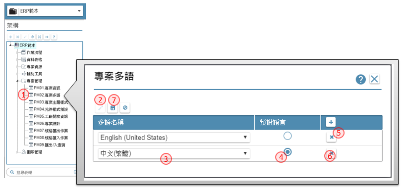
1. 開啟【專案多語】
2. 編輯鍵：利用本按鈕進入編輯狀態
3. 多語名稱：下拉挑選多語內容
4. 預設語言：指定系統預設的語系
5. 增加鍵：增加專案的多語
6. 刪除鍵：刪除專案的多語
7. 儲存鍵：利用本按鈕儲存設定完成的資料

###   3.2.3 專案主題樣式
> 作業目的：挑選IDE平台所提供的(多個)系統樣式納入專案內，作為運行時終端使用者所可	以選擇的系統樣式。

參考資料： [☢專案主題樣式](https://youtu.be/7QBxhLhfNqM){:target='_blank'} [℗專案主題樣式](pdf/18-16-7.專案主題樣式.pdf){:target='_blank'}

1. 開啟【專案主題樣式】
2. 編輯鍵：利用本按鈕進入編輯狀態
3. 標準版規則：當使用者以表單精靈產生傳統表單時，預設套用的版面規則；可下拉挑選來自系統制定的版面規格清單
4. RWD版規則：當使用者以表單精靈產生RWD表單時，預設套用的版面規則；可下拉挑選來自系統制定的版面規格清單
5. 採系統樣式：若有多樣式，但又不事先預設樣式時，可勾選本項
6. 增加鍵：增加專案的樣式
7. 樣式主題名稱：下拉挑選系統提供的樣式內容
8. 突顯：要標示主要欄位的位置，可挑選左上、左下、右上、右下
9. 顏色：要標示主要欄位的標誌顏色，系統自動開啟[【調色盤】](20.html#Palette)進行色號的挑選，操作說明請參考［19.9］
10. 預設：指定為系統預設的樣式
11. 刪除鍵：刪除專案的多語
12. 儲存鍵：利用本按鈕儲存設定完成的資料

###  3.2.4 元件樣式預設
> 作業目的：可預先設定適用於表單排版時各類元件的大小、單元樣式等，減少重複異動的操	作。

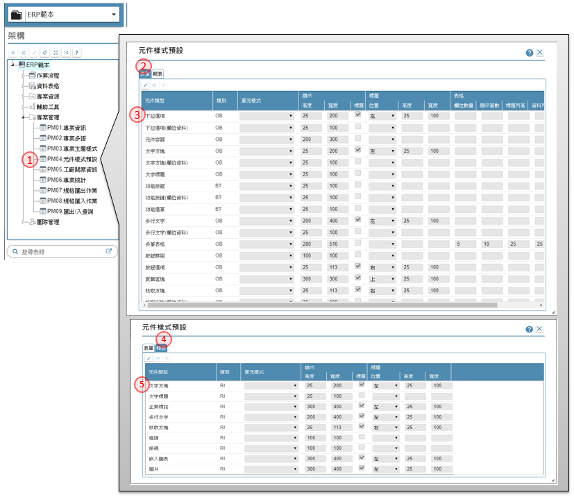
1. 開啟【元件樣式預設】
2. 表單類：駐留表單頁籤，顯示與表單有關元件的樣式預設值
3. 編輯鍵：利用本按鈕進入編輯狀態
4. 元件類型：顯示系統上可指定的元件類型
5. 單元樣式：挑選駐留的元件類型,是否有預設的單元樣式
6. 顯示：輸入元件預設的高度及寛度
7. 標題：勾選是否指定標題及出現的位置
8. 表格：當元件類型=多筆表格時,指定表格所需預設的相關屬性
9. 儲存鍵：利用本按鈕儲存設定完成的資料
10. 報表類：駐留報表頁籤，顯示與報表有關元件的樣式預設值
11. 元件類型：顯示系統上可指定的報表元件類型
12. 各項參數：設定在報表元件產生時的預設值

###  3.2.5 工廠開案資訊
> 作業目的：一個新開立的專案，在第一次要求後台軟體工廠提供發行(publish)服務時，須先提	供工廠開案的資料，讓後台建立此專案的發行環境，才能受理此專案的發行請求。

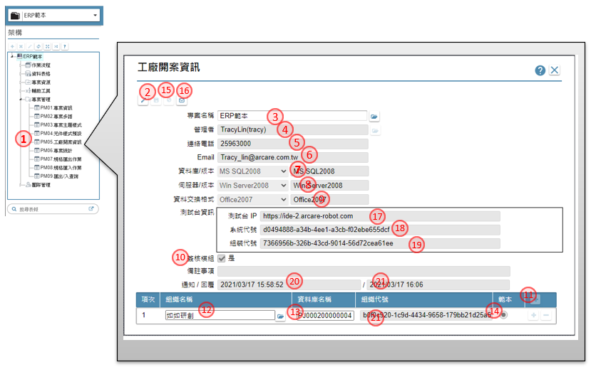
1. 開啟【工廠開案資訊】
2. 編輯鍵：利用本按鈕進入編輯狀態
3. 系統名稱：可利用開窗鍵, 開啟[【多語詞庫】](16.html#MaintainMultilingual)指定挑選詞庫，操作方法請參考［16.2］來改變專案產出後系統的名稱
4. 管理者：指定運行的系統要預設的管理者姓名
5. 聯絡電話：管理者的聯絡電話
6. Email：管理人員的信箱
7. 資料庫/版本：下拉挑選資料庫及版本
8. 伺服器/版本：下拉挑選伺服器及版本
9. 資料交換/版本：下拉挑選負責資料交換軟體及版本
10. 簽核模組：勾選產生的測試環境是否包含簽核模組
11. 新增鍵：設定需要開立組織帳務資料的內容；系統允許建立多套帳務
12. 組織名稱：建置測試系統所需開立的帳務名稱，若有多語系時，利用開窗鍵, 開啟[【多語詞庫】](16.html#MaintainMultilingual)指定挑選詞庫, 來改變專案產出後組織的名稱
13. 資料庫名稱：記錄組織帳務所用的資料庫進行命名
14. 範本否：利用本按鈕儲存設定完成的資料
15. 儲存鍵：利用本按鈕儲存設定完成的資料
16. 開案通知鍵：在確定開案內容無誤後，真正通知後台進行測試環境的準備。
17. 測試台IP：顯示建置測試環境所在的IP
18. 系統代號：顯示建置測試環境所產生的系統唯一號
19. 組裝代號：顯示建置測試環境在軟體工廠所產生的製造唯一號
20. 通知：申請人發出通知的日期時間
21. 回覆：環境建置完成回覆的日期時間

###  3.2.6 專案統計
> 作業目的：一個新開立的專案，在第一次要求後台軟體工廠提供發行(publish)服務時，須先提	供工廠開案的資料，讓後台建立此專案的發行環境，才能受理此專案的發行請求。

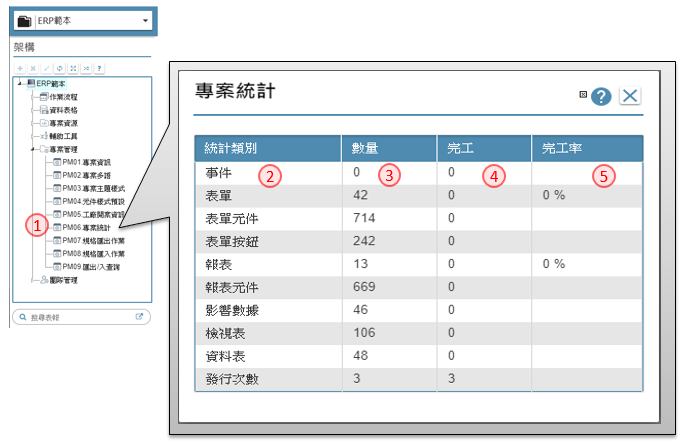
1. 開啟【專案統計】
2. 統計類別：統計專案下各元件類型
3. 數量：顯示各統計類別目前有效的元件數量
4. 完工：表單、報表會有開工、完工記錄，計算完工量
5. 完工率：表單、報表會有開工、完工記錄，計算完工百分比

###  3.2.7 規格匯出作業
> 作業目的：將專案相關的規格選擇備份或其它方式，產生備份檔。以利後續還原或遷移等用途。

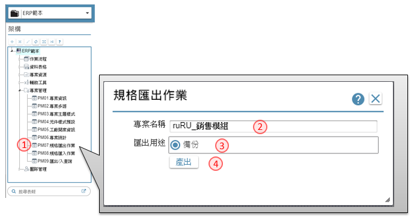
1. 開啟【規格匯出作業】
2. 專案名稱：顯示登入的專案名稱
3. 匯出用途：系統規劃有備份／販賣／遷移等用途，808.7版僅開放備份
4. 產出：點選本鍵後，系統進行相關的檔案備份。完成後可在【匯出／入查詢】頁面下載

###  3.2.8 規格匯入作業
> 作業目的：將專案先前備份的檔案，上傳覆蓋目前的專案內容。

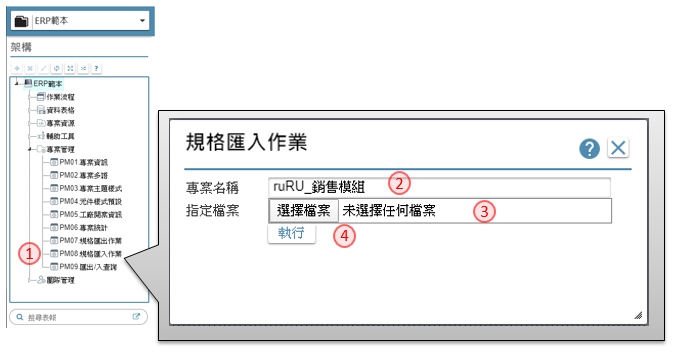
1. 開啟【規格匯入作業】
2. 專案名稱：顯示登入的專案名稱
3. 指定檔案：點擊　選擇檔案，挑選由【規格匯出作業】產生的備份檔
4. 執行：依備份檔內容，還原覆蓋專案內容。完成後可在【匯出／入查詢】頁面查詢記錄

###  3.2.9 匯出／入查詢
> 作業目的：呈現專案下所有規格匯出及匯入的記錄內容。

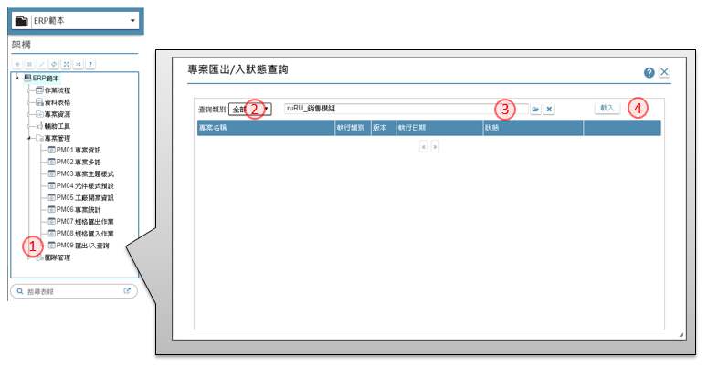
1. 開啟【匯出/匯入查詢】
2. 查詢類別：可下拉針對匯出／匯入／失效，或全部類別的記錄進行指定
3. 專案名稱：顯示登入的專案名稱
4. 載入：點擊本鍵，載入符合查詢類別的記錄
5. 詳細資訊：開啟【匯出／匯入狀態備註】，顯示執行時的異常訊息
6. 下載：點擊 下載，可將經【規格匯出作業】產生的備份檔，載到個人電腦中備存

---
##  3.3 團隊管理
>作業目的：

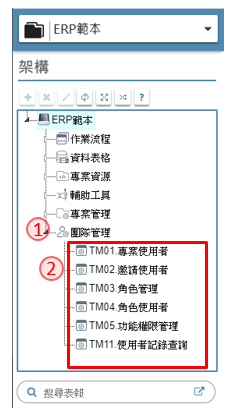
1. 駐啟架構樹上的團隊管理節點
2. 展開後, 團隊管理節點下呈現相關作業功能

###  3.3.1 專案使用者
> 作業目的：管理專案下的使用者生、失效及權限設定

參考資料：[☢使用者管理](https://youtu.be/Blgmi1N8Ek4){:target='_blank'} [℗使用者管理](pdf/18-16-3.使用者管理.pdf){:target='_blank'}

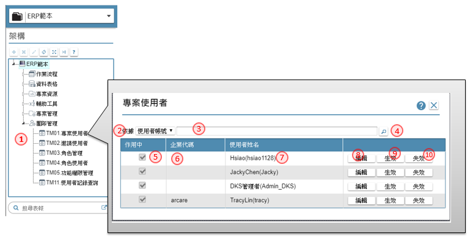
1. 開啟【專案使用者】
3. 搜尋類別：可下拉指定用使用者帳號或使用者姓名進行查詢
3. 關鍵字：輸入查詢的內容
4. 搜尋鍵：依據指定的搜尋類別及關鍵字，找到符合條件的使用者，表列清單
5. 作用中：當駐留記錄的帳號為生效時, 呈現打勾生效的狀態
6. 企業代碼：顯示駐留記錄的帳號所屬的企業
7. 使用者姓名：顯示駐留記錄的帳號的姓名
8. 編輯鍵：可開啟【編輯使用者】修改專案用戶的權限
9. 生效鍵：對駐留記錄的帳號設定為生效
10. 失效鍵：對駐留記錄的帳號設定為失效

###  3.3.2 邀請使用者
> 作業目的：如果已經是ruRU IDE使用者，則是邀請其加入本專案。邀請的方法是以其登	記在ruRU IDE帳號內的e-mail address來搜尋與連結。

1. 開啟【邀請使用者】
2. 電子郵件信箱：輸入已存在ruRU IDE且生效的帳號
3. 送出邀請鍵：指定郵件後, 點選本鍵系統會發出邀請的郵件, 等候受邀人接受
4. 受邀者：顯示受邀記錄裡的受邀者姓名
5. 邀請人：顯示受邀記錄裡的邀請人姓名
6. 邀請日期：顯示受邀記錄裡的日期
7. 是否接受：顯示受邀者, 是否回覆了邀請郵件

###  3.3.3 角色管理
###  3.3.4 角色使用者
###  3.3.5 功能權限管理
### 3.3.6 使用者記錄查詢

---
[回到章節目錄](index.html#MainMenu)