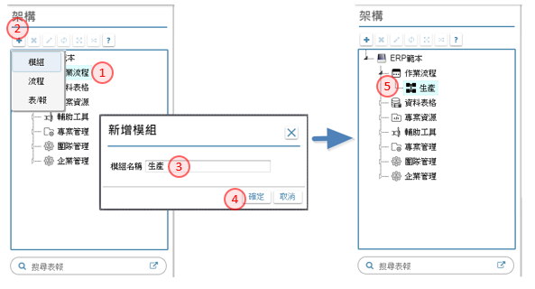
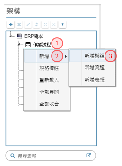
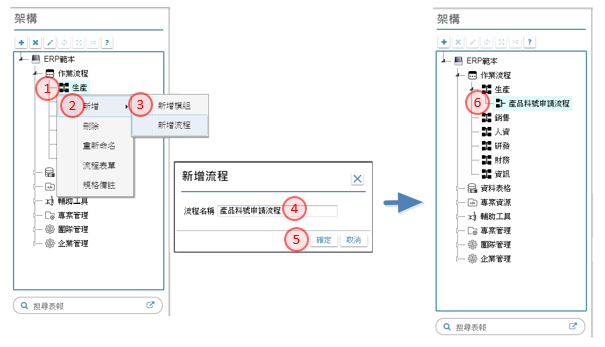
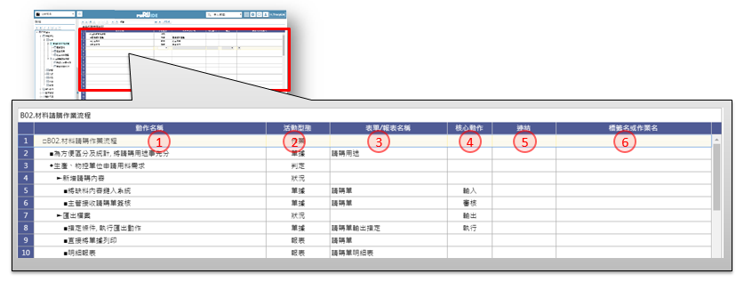
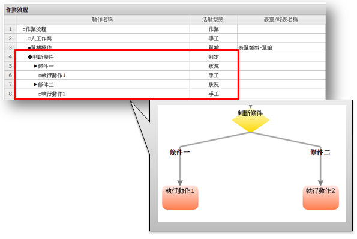
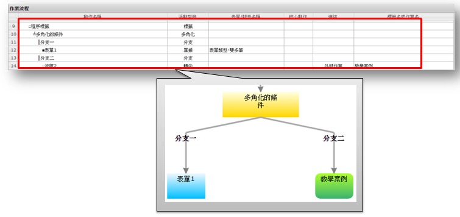
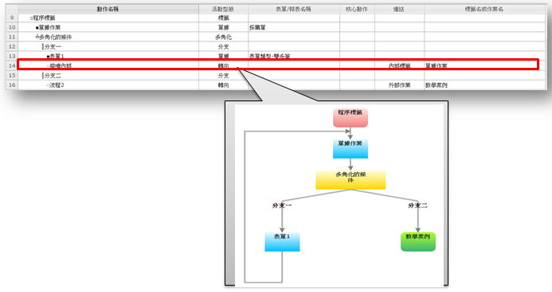

作業目的：說明在專案項下規劃子系統、業務模組，以及作業流程的規劃。

##  **4.1 業務模組架構**
> 作業目的：

### **4.1.1 建立模組**
> 參考資料：[☢影片](https://youtu.be/iAWUYHC2vzE){:target='_blank'} [℗文件](pdf/2-1建立模組.pdf){:target='_blank'}

方式一 

1. 駐留在架構樹的「作業流程」節點，此時工具列上的「新增」圖示可點選。
2. 點選工具列「新增」圖示，選擇『模組』
3. 在開啟的【新增模組】頁面，輸入模組名稱
4. 點選「確認」鍵後，頁面會回到架構樹
5. 在架構樹產生新的模組名節點。

方式二 

1. 駐留在架構樹的「作業流程」節點，點擊滑鼠右鍵
2. 在開啟的小視窗，駐留「新增」選項，會浮出另一功能視窗
3. 在功能視窗，選擇『模組』
4. 以下作業, 請參照 方式一 步驟3

### **4.1.2 建立作業流程**
> 參考資料：[☢影片](https://youtu.be/MJnvrpr8Vhc){:target='_blank'} [℗文件](pdf/2-2建立流程.pdf){:target='_blank'}

1. 駐留在架構樹的「作業流程」節點或 節點屬性為 模組 的節點，點擊滑鼠右鍵
2. 在開啟的小視窗，駐留「新增」選項，會浮出另一功能視窗
3. 在功能視窗選擇『新增流程』
4. 輸入流程名稱
5. 點選「確認」鍵後，頁面會回到架構樹
6. 可在架構樹駐留節點下上產生新的作業流程節點。

### **4.1.3 流程節點對應表單**
> 參考資料：[☢影片](){:target='_blank'} [℗文件](pdf/3-1設定事件流程.pdf){:target='_blank'}

1. 駐留在架構樹節點屬性為 模組 或 流程 的節點，點擊滑鼠右鍵
2. 在開啟的小視窗，點選「流程表單」選項
3. 在開啟的【流程表單】頁面，挑選表單名稱
4. 點選「確認」鍵後，頁面會回架構樹

### **4.1.4 架構樹滑鼠右鍵功能**

|節點類別右鍵功能|專案|作業流程|模組|流程|表單|報表|
| :- | :-: | :-: | :-: | :-: | :-: | :-: |
|新增模組||V|V|||　|
|新增流程||V|V|||　|
|新增表單||V|V|||　|
|重新命名||||||　|
|刪除||V|V|V|V|V|
|流程表單||||V||　|
|規格描述||V|V|V||　|
|重新載入|V|V|V|||　|
|全部展開|V|V|V|||　|
|全部收合|V|V|V|　|　|　|

---
##  **4.2 作業流程敍述**
> 作業目的：

### **4.2.1 工具列的操作**

1. 新增鍵：在駐留的資料列往下增加一列
2. 刪除鍵：刪除駐留的資料列
3. 儲存鍵：存回編輯後的流程內容
4. 重整鍵：重新載入流程內容
5. 提升階層鍵：當在狀況或分支下增加資料列時, 會預設與上列同階層, 若不是同階而要往上層縮減時, 可利用本鍵操作
6. 下降階層鍵：當在判斷或平行下增加資料列時, 會預設與上列同階層, 若不是同階而要往下增加時時, 可利用本鍵操作
7. 操作說明鍵：開啟【線上說明】介紹操作及內容
8. 流程打樣與測試鍵：將駐留指定的流程項目下所有的作業表單，進行打樣的動作
9. 打樣狀態查詢鍵：開啟[【打樣狀態查詢】](20.html#FormPrototypeing_Status)檢視打樣後的結果及歷程，操作方式請參考［附錄A7］
10. 事件單據：當本流程在運行操作時，有指定開啟特定表單時，可在本欄位開窗挑選作業表單
11. 清除鍵：清除已指定的事件單據內容
12. 流程圖鍵：開啟【流程圖】，顯示依據作業流程內容，所繪製展開的流程圖

### **4.2.2 作業流程的敘述**

1. 動作名稱：描述本程序的主要用途
2. 活動型態：定義此動作程序, 所呼應的操作介面, 以下介紹 
　2.1 單據：表示本步驟產生單據的查詢  
　2.2 報表：表示本步驟產生報表的查詢  
　2.3 人工：介紹人為的處理內容  
　2.4 標籤：介紹人為的處理內容  
　2.5 轉向：為流程中的某部份動作的起點  
　2.6 判定：表示以下的動作會依條件而分岐  
　2.7 狀況：配合判斷, 描述條件式  
　2.8 多角化：表示以下的動作會依條件而併行  
　2.9 分支：配合平行, 描述條件式  
　2.10 結束：流程的中斷點  
3. 表單/報表名稱：挑選或建立對應的單據及報表, 操作請參考作業流程的單據清單操作
4. 核心動作：對單據或報表, 在介面上的操作
5. 連結：若介面為流程者, 須在此欄位區分為流程內的程序或跨流程的動作
6. 標籤名或作業名：配合動作欄位的區分, 挑選指定程序點或流程名

### **4.2.3 作業流程與流程圖的關係**

判斷狀況：表示同一事件會有不同的狀況發生

多角化處理：表示同一事件同時往不同的方向進行

接續流程：完成一個動作, 可以回到同流程下的某一程序, 也可以是跳到另一流程

---
[**回到章節目錄**](index.html#MainMenu)