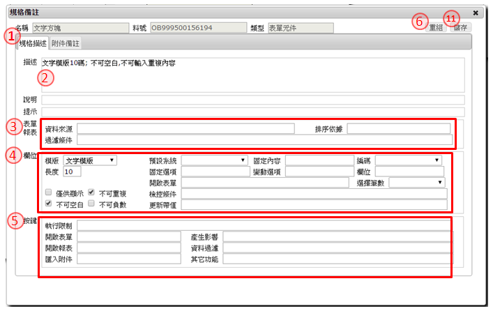
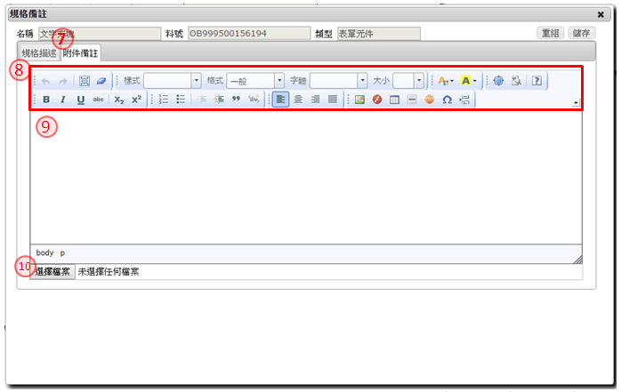
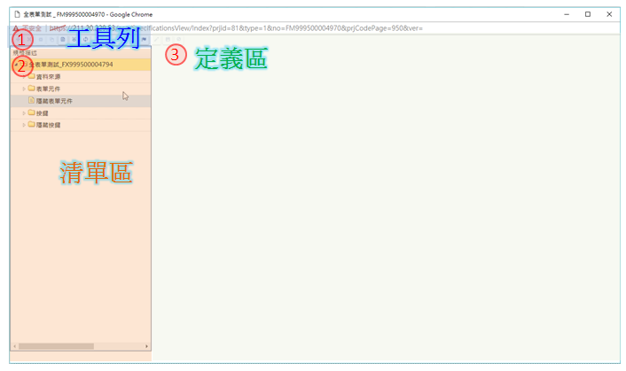
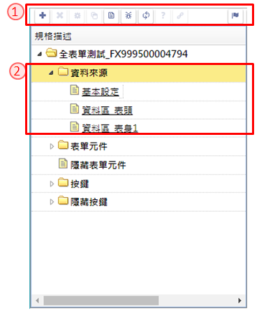
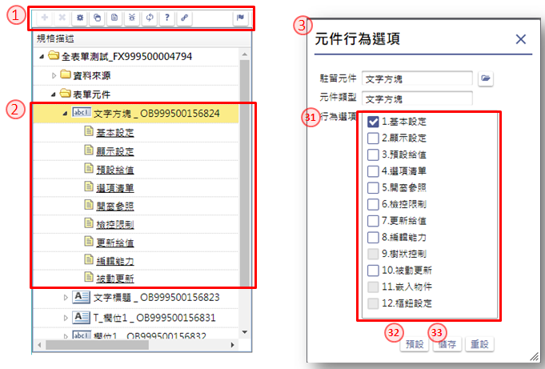
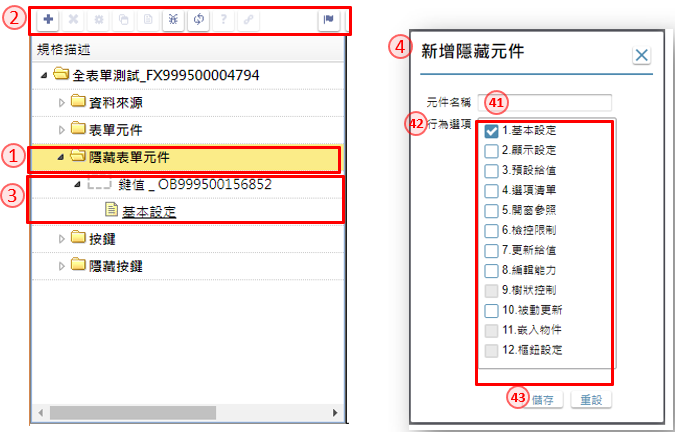
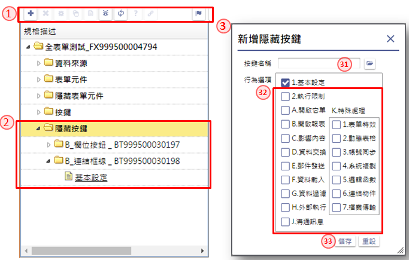

作業目的：系統分析人員需描述規格、業務規範及規格描述記錄下來，讓系統的開發有所依循。

表單規格包含以下項目：  
 - [**6.1 規格描述**](#SpecificationAnnotated)
 - [**6.2 規格展開**](#SpecificationDefinition)
	- 6.2.1 資料來源
	- 6.2.2 表單元件
	- 6.2.3 隱藏元件
	- 6.2.4 表單按鍵
	- 6.2.5 隱藏按鍵
 
## **6.1 規格描述** {#SpecificationAnnotated}

### **一次描述單個元件規格**
> 作業目的：針對單一表單、元件或按鍵，利用個別選項的組合或自行編撰成規格。
> 參考資料：[☢影片] (https://youtu.be/bOhFWR8R6kg) {:target='_blank'} [℗文件](pdf/5-1一次描述多個元件規格.pdf){:target='_blank'}

1. 規格描述頁籤：以文字敍述指定的物件有關的業務規範及規格描述。
2. 描述：描述規範及需求內容
3. 表單描述速成區：利用與表單有關的選項，匹配組合成規格敍述
4. 元件描述速成區：利用與元件有關的選項，匹配組合成規格敍述
5. 按鍵描述速成區：利用與按鍵有關的選項，匹配組合成規格敍述
6. 重組鍵：把各類速成區的內容，利用本按鍵組合起來變成規格描述
7. 附件備註頁籤：在描述中無法單純以文字說明，而必須附件表格的內容、圖形附件才完整的備註項目。
8. 附註工具列：利用各類的工具圖示編輯備註內容
9. 參考附註：編輯具規格參考義意的內容
10. 附件檔：指定有關的檔案附件，上傳到資料庫。
11. 儲存鍵：將設定好的規格描述及參考附件內容，儲存到資料庫

### **6.1.2一次描述多個元件規格**
> 作業目的：在表單版面上點選「規格描述」鍵，開啟本單對表單下的元件、按鍵進行規格撰寫
> 參考資料：[☢影片] (https://youtu.be/sGPa1WibWV4) {:target='_blank'} [℗文件](pdf/5-2單一元件規格描述.pdf){:target='_blank'}

1. 編輯鍵：進入編輯狀態
2. 描述：依資料列駐留的元件類型撰寫需求規格
3. 儲存鍵：將設定好的規格描述儲存到資料庫

---
## **6.2 規格展開** {#SpecificationDefinition}
> 作業目的：在表單版面上點選「規格定義」鍵，開啟本單對表單下的元件、按鍵進行規格註解架構的展開
> 參考資料：[☢影片] (https://youtu.be/TTnNIUrmliI) {:target='_blank'} [℗文件](pdf/8-1開啟規格定義介面.pdf){:target='_blank'}

1. 工具列：放置不同工具圖示的區域，以下針對共通的按鍵進行說明 
　	1.1 規格描述：依清單區留的料號，開啟相對[【規格描述】](#SpecificationAnnotated)進行規格說明，操作方式請參考［6.1.1］ 
　	1.2 檢錯：檢視清單區的定義是否符合語法驗證 
　	1.3 重新整理：重整清單區的內容。 
　	1.4 線上說明：依清單區留的宣告，開啟相對【線上說明】 
　	1.5 處理狀態：切換開工/完工的狀態, 影響【專案統計】 
2. 清單區：將駐留表單下的所有組成的表單、元件、按鍵，以樹狀階層展開 
3. 定義區：依駐留在清單區的記錄或宣告，呈現細部的規格註解、定義 
　	3.1 編輯鍵：進入定義區的編輯狀態 
　	3.2 儲存鍵：將定義區的內容儲存到資料庫。 

### **6.2.1 資料來源**

1. 工具列：駐留「資料來源」節點時，工具列作用如下 
　	1.1 新增鍵：增加資料檔區 
　	1.2 刪除鍵：當駐留在清單的「資料區」時，可點選本鍵刪除記錄
2. 清單區： 
　	2.1 第一階是基本設定、資料區

### **6.2.2 表單元件**
> 作業目的：

1. 工具列：駐留「元件」節點時，工具列作用如下 
　	1.1 設定鍵：開啟【元件行為選項】 
　	1.2 複製鍵：開啟[【元件內容複製】](#ObjectAnnotation_Copy)
2. 清單區： 
　	2.1 第一階是元件名稱 
　	2.2 第二階是基本設定及各類行為宣告 
3.元件行為選項： 
　	3.1 所有跟元件有關的行為選項 
　	3.2 預設鍵：會依元件類型將需要的行為必要項先行勾選 
　	3.3 儲存鍵：系統依據勾選的項目，產生不同的行為，呈現在「清單區」 

### **6.2.3 隱藏元件**
> 作業目的：

1. 駐留「隱藏表單元件」節點		
2. 工具列：駐留「隱藏表單元件」節點時，工具列作用如下		
	2.1 新增鍵：增加不顯示在表單上的元件，開啟【新增隱藏元件】
	2.2 刪除鍵：可刪除駐留的隱藏元件
	2.3 設定鍵：開啟【元件行為選項】
	2.4 複製鍵：開啟[【元件內容複製】](#ObjectAnnotation_Copy)
3. 清單區：		
	3.1 第一階是元件名稱
	3.2 第二階是基本設定及各類行為宣告
4. 新增隱藏元件：		
	4.1 元件名稱：輸入元件名稱
	4.2 所有跟元件有關的行為選項
	4.3 儲存鍵：系統依據勾選的項目，產生不同的行為，呈現在「清單區」

### **6.2.4 表單按鍵**
> 作業目的：

1. 工具列：駐留「按鍵」節點時，工具列作用如下 
　	1.1 設定鍵：開啟【按鍵行為選項】 
　	1.2 複製鍵：開啟[【按鍵內容複製】](#ButtonAnnotation_Copy)
2. 清單區： 
　	2.1 第一階是按鍵名稱 
　	2.2 第二階是基本設定及各類行為宣告 
3.按鍵行為選項： 
　	3.1 所有跟按鍵有關的行為選項 
　	3.2 儲存鍵：系統依據勾選的項目，產生不同的行為，呈現在「清單區」 

|**類别**|**按鍵行為**|**功能說明**|
| :- | :--- | :-- |
|基本設定 ||按鈕屬性的宣告，名稱、類型、位置、致能時機、圖式等 |
||執行限制 |` `此按鈕被點擊時的前置檢查條件，通常是檢查表單資料的完整性與合理性。可以設定多個先決條件來把關，並且排定檢核順序，以減少後台處理失敗的機會。全部都通過後才會正式啟動此按鈕的各項處理功能，依設計者給定的順序執行之。|
|處理功能|開啟它單 |依執行條件開啟另外一個表單，可以帶給參數|
||開啟報表 |挑選要開啟的報表，可以選擇：預覽(再打印)、郵件夾檔、郵件夾檔、產出PDF，或是存入資料庫|
||資料交易 |執行資料庫更新，呼叫 DB TX|
||資料交換 |檔案匯入DB、資料匯出為檔案，|
||郵件發送 |依據執行條件發送電子郵件，並可夾檔或是連結|
||資料載入 |將資料庫的特定資料表內容載入對應檔區，以供操作者瀏覽|
||資料過濾 |通常使用於條件多筆表單，使用者按下包含過濾功能的按鍵後，依過濾設定的條件濾出表身的資料|
||外部執行 |執行本表單以外的功能，例如：開啟檔案、啟動外部程式、啟動它表單的按鈕功能、匯出檔案後的處理等等|
||溝通訊息 |可在兩張表單間傳遞資料，例如A單開B單，兩張單可以主動或是被動式的互傳資訊|
|特殊處理|表單特效 |關閉表單、切換頁籤、更新欄位、啟動按鍵、連結網頁、|
||動態表格 |設定表格內的欄位依條件設定而變動內容|
||帳號同步 |建立簽入帳號的生、失效與系統同步|
||系統複製 |進階對系統複製鍵的基本功能做改變設定|
||邏輯函數 |指定使用系統提供具特定邏輯需求的功能函數|
||連結物件 |連結系統外的網頁、表單、行事曆|
||檔案傳輸 |檔案的上傳、下載功能設定|
||預存程序|執行預存在資料庫的Stroed Procedure|
|行動裝置|裝置支援|在APP的表單作業時，可呼叫裝置上的資源，進行資料處理或邏輯判斷等|
||推播通知|設定表格內的欄位依條件設定而變動內容|

### **6.2.5 隱藏按鍵**
> 作業目的：

1. 駐留「隱藏按鍵」節點時		
2. 工具列：工具列作用如下		
	2.1 新增鍵：增加不顯示在表單上的按鍵，開啟【新增隱藏按鍵】
	2.2 刪除鍵：可刪除駐留的隱藏按鍵
	2.3 設定鍵：開啟【按鍵行為選項】
	2.4 複製鍵：開啟[【按鍵內容複製】](#ButtonAnnotation_Copy)
3. 清單區：		
	3.1 第一階是按鍵名稱
	3.2 第二階是基本設定及各類行為宣告
4.新增隱藏按鍵：		
	4.1 按鍵名稱：輸入按鍵名稱
	4.2 所有跟按鍵有關的行為選項
	4.3 儲存鍵：系統依據勾選的項目，產生不同的行為，呈現在「清單區」

	
---
[**回到章節目錄**](index.html#MainMenu)