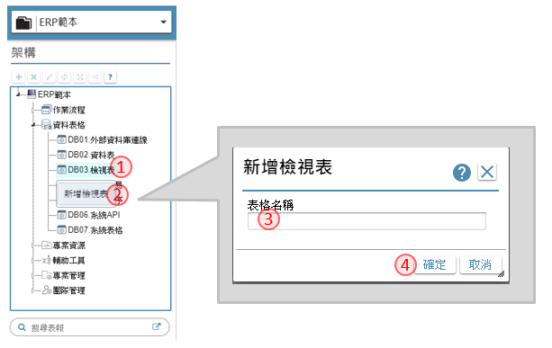
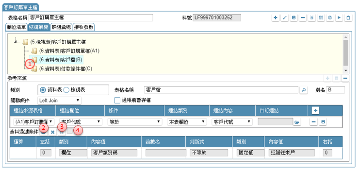
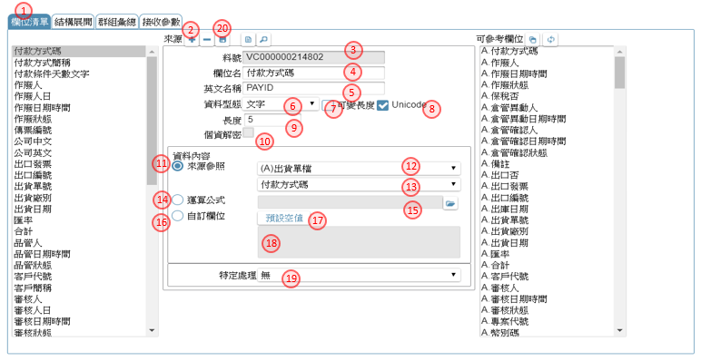
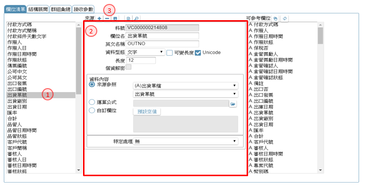
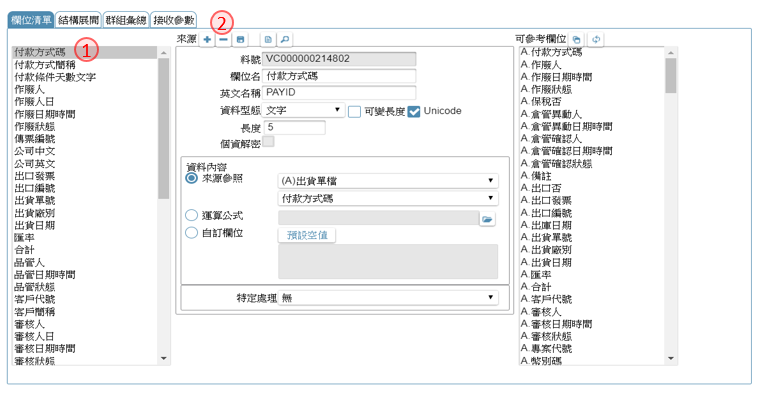
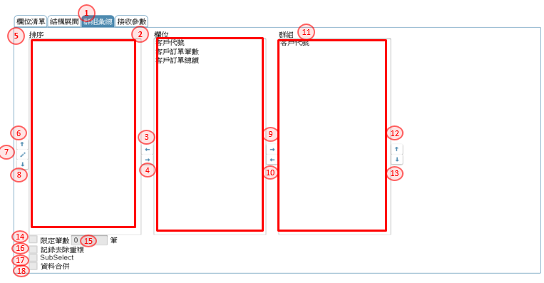

作業目的：定義資料庫裡面的各個檢視表及其包含資料欄位的各項屬性

檢視表包含以下項目：  {#LogicalTable}
 - [**8.1 新增檢視表 DB view design**](#LogicalTable_BasicSet)
 - [**8.2 檢視表工具列**](#LogicalTable_ToolBar)
 - [**8.3 結構展開**](#LogicalTable_StructureExpand)
 - [**8.4.欄位清單**](#LogicalTable_FieldList) 
 - [**8.5 群組彙總**](#LogicalTable_GroupSummary)
 - [**8.6 接收參數**](#LogicalTable_ReceiveParameter)

## **8.1 新增檢視表** {#LogicalTable_BasicSet}
> 作業目的：表單的資料來源、表單內欄位的檢控、按鍵執行條件的檢控…等等都有可能使用到檢視表。
參考資料：[☢影片](https://youtu.be/7Ud-jZkmLHo){:target='_blank'} [℗文件](pdf/7-2建立檢視表.pdf){:target='_blank'}

1.  開啟架構樹下「資料表格」節點，駐留 DB03.檢視表。
2.  滑鼠右鍵，彈出選單，點選「新增檢視表」開啟【新增檢視表】頁面，
3.  表格名稱：此名稱是SD在專案發展時的資源resource名稱。
4.  設定完畢後，按儲存，則此記錄新增完成。
5.  新增後，系統會開啟明細畫面進行的細部定義工作。，操作說明如下

>宣告新增檢視表後，即可進入檢視表的細部定義工作。也可單擊「DB03.檢視表」節點後彈出[【檢視表】](#LogicalTable)頁面

## **8.2 檢視表工具列** {#LogicalTable_ToolBar}

1. 新增鍵：新增一個檢視表，在編輯區出現新增檢視表（同8.1)。										
2. 修改鍵：異動檢視表基本設定。										
3. 儲存鍵：儲存異動後的設定。										
4. 刪除鍵：刪除駐留檢視表。										
5. 檢錯鍵：檢查駐留的檢視表格內容是否符合設定。當有異常時，會提示錯誤內容。					
6. 表格欄位清單：開啟[【表格欄位清單】](17.html#TableFieldList)查詢與檢視表相關的欄位資訊。操作方式請參考［17.5］										
7. 規格描述：開啟[【規格描述】](06.html#SpecificationAnnotated)說明及述敘此表格的相關事項。操作方式請參考［6.1.1］
8. 打樣測試鍵：點選後，執行檢視打樣的動作，先檢錯->打樣->預覽										
9. 打樣狀態鍵：點選後，開啟[【打樣狀態查詢】](20.html#FormPrototypeing_Status)就打樣的記錄及產生錯誤的訊息,進行檢查及排除，操作方式請參考［附錄A7］

## **8.3 結構展開** {#LogicalTable_StructureExpand}
> 作業目的：為了描述檢視表中的資料來源及關聯、過濾條件。

### **8.3.1 設定主表**
> 作業目的：設定檢視表格主要的資料來源。
參考資料：[☢影片](https://youtu.be/wmMbol_yOW4){:target='_blank'} [℗文件](pdf/7-3設定主表或副表.pdf){:target='_blank'}

1. 點選修改鍵，進入編修狀態
2. 結構展開：切換到本頁籤。
3. 駐留根節點的檢視表名
4. 新增鍵：新增檢視表的關連表格。
5. 參考來源類別：選擇資料表格或檢視表
6. 表格名稱：選擇與本檢視表的主要表格名
7. 表格別名：指定本來源的別名，主要表格通常設為為Ａ
8. 過帳前暫存檔：來源的資料來源若為同一交易裡, 尚未存回的資料, 則必須特別勾選本欄位
9. 儲存鍵：把選定的表格儲回資料庫

### **8.3.2 設定副表及關連條件**
> 作業目的：設定參與檢視的其它附屬表格,並定義與主表之間的關連條件。
參考資料：[☢影片](https://youtu.be/Io323c9pB7E){:target='_blank'} [℗文件](pdf/7-5設定副表之關連條件.pdf){:target='_blank'}
[☢關聯種類](https://youtu.be/DRG_pHBgOhU){:target='_blank'} [℗關聯種類](pdf/7-10關聯條件之種類.pdf){:target='_blank'}
[☢UNION](https://youtu.be/UwZewXs5lpE){:target='_blank'} [℗ UNION](pdf/7-11.UNION檢視表設定.pdf){:target='_blank'}

重複 8.3.1 的1~8 動作, 產生B表
1. 駐留要設定關聯條件的表格節點
2. 檔案關聯條件：顯示定義表格之間關連方式與條件 指定檔案的關聯方式, LEFT JOIN/RIGHT JOIN/CROSS JOIN/FULL JOIN/INNER JOIN/UNION/SUB SELECT
3. 連結來源表格：挑選本表與關連的來源表格
4. 連結欄位：挑選本表與關連的來源欄位
5. 判斷式：判斷式:大於/小於/等於/大於等於/小於等於/不等於
6. 連結類別：定義與連結表格的類別 本表欄位/參數/函數/固定值/運算式
7. 連結內容：依連結類別設定內容
　本表欄位：指定與來源欄位關連的本表欄位
　參數：挑選檢視表的參數
　函數：挑選系統提供的函數
　固定值：填入固定值
　運算式：開啟[【運算式】](20.html#ExpressionStatement)設定條件，操作說明請參考［附錄A2］
8. 自訂連結：當連結類別＝連結若不是用兩欄位來定義, 可利用自訂義的方式連結
9. 新增鍵：將新增的連結條件存回

### **8.3.3 設定過濾條件及參數**
> 作業目的：在參與檢視的表格, 設定前置的過濾條件,及必要的參數傳遞。
參考資料：[☢過濾影片](https://youtu.be/U3bO21-hUgg){:target='_blank'} [℗過濾文件](pdf/7-4設定主表或副表之過濾條件.pdf){:target='_blank'}
[☢參數影片](https://youtu.be/ntiD_Ucf5ps){:target='_blank'} [℗參數文件](pdf/7-6檢視表接收參數設定.pdf){:target='_blank'}

1. 駐留要設定過濾條件的表格節點
2. 資料過濾條件：可利用本鍵, 開啟[【條件式】](20.html#ConditionStatement)中, 指定限定符合的條件內容，操作說明請參考［附錄A1］
3. 參數鍵：表格須傳遞參數時,可利用本按鈕開[【傳遞參數】](20.html#PassParameters)，操作說明請參考［附錄A4］
4. 參數旗標：當關聯的表格需要傳遞參數，則本欄則由勾選資訊表示是否已完成設定。

## **8.4 欄位清單** {#LogicalTable_FieldList}

### **8.4.1 新增資料欄位** 
> 作業目的：逐一建立或是維護此檢視表內的資料欄位的屬性。
參考資料：[☢影片](){:target='_blank'} [℗文件](pdf/7-7設定輸出欄位.pdf){:target='_blank'}

1. 點選畫面的[欄位清單]頁籤。
2. 新增鍵：點選 + 新增鍵新增檢視表的輸出欄位(data field)。
3. 料號：顯示此資料欄位的料號，由平台自動編定之，不可修改
4. 欄位名稱：輸入欲輸出的欄位名稱，為SD在規格設計時引用之名。
5. 英文命名：輸入欲輸出的欄位英文名稱，即是View 的field name
6. 資料型態：挑選型態(data type)=文字/數字(bigint)/數字(int)/數字(smallint)/數字(tinyint)/數字/日期/日期時間/備註/二進位/全唯碼
7. 可變長度：指定此資料欄，存入DB時是固定或變動長度；勾選者代表為變動長度。
8. Unicode]；設定本欄位是否需要Unicode編碼轉換。若勾選者在輸入不同語系文字時可自動轉換。
9. 資料長度：輸入資料欄位的長度；[小數位：若型態為數字, 進階指定小數位數
10. 資料解密：當對應來源為資料加密的資料欄位時, 到檢視表時, 進行解密動作
11. 資料內容：來源的類別
12. 來源參照表格：挑選來源表格，須先[結構展開]中建立
13. 來源參照欄位：挑選來源表格的欄位，依據指定的表格挑選可輸出的元件清單
14. 運算公式：選擇本項, 表示本欄位的來源是運算合而來
15. 運算內容：可利用開窗鍵, 開啟[【運算式】](20.html#ExpressionStatement)設定組合運算式, 作為輸出欄位形成的依據，操作說明請參考［附錄A2］
16. 自訂欄位：選擇本項, 表示本欄位為自訂定欄位
17. 自訂欄位內容：輸入自訂義的內容
18. 預設空值鍵：當選擇自訂欄位時，可利用本鍵依欄位型態預設適當的空值內容
19. 特定處理：可將欄位輸出的結果再進階處理, 下拉挑選無/計數(COUNT)/總合(SUM)/最大值(MAX)/最小值(MIN)
20. 儲存鍵：設定完畢後，點選本鍵則此資料欄位新增完成

### **8.4.2 修改資料欄位**

1. 在元件清單裡，駐留指定要修改的資料欄位名稱。
2. 參考 8.4.1 的4~18 動作, 異動欄位內容
3. 儲存鍵：修改完畢後，點選本鍵則此資料欄位異動完成

### **8.4.3 刪除資料欄位**
參考資料：[☢影片](https://youtu.be/iP905SwuQwY){:target='_blank'} [℗文件](pdf/7-8刪除輸出欄位.pdf){:target='_blank'}

1. 在元件清單裡，駐留指定要刪除的資料欄位名稱。
2. 刪除鍵：點選本鍵刪除檢視表的資料欄位(data field)。系統會提示訊息要求再次確認

### **8.4.4 與其它資料欄位相關**

1. 規格描述：開啟[[【規格描述】](06.html#SpecificationAnnotated)](#SpecificationAnnotated)說明及述敘此欄位的相關事項。操作方式請參考［6.1.1］
1. 規格描述：開啟[【規格描述】](06.html#SpecificationAnnotated)說明及述敘此欄位的相關事項。操作方式請參考［6.1.1］
2. 同步參考欄位：開啟[【同步參考欄位】](17.html#TableFieldSync)查詢與資料表相關的欄位資訊。操作方式請參考［17.5.1 同步參考欄位］
3. 引用清單：表列所有在[結構展開]中指定的表格其輸出的欄位清單, 可單選或複選(Ctrl+Click)多筆記錄
4. 複製鍵：將欄位指定的欄位複製到欄位元件清單
5. 重整鍵：重新載入清單內容

## **8.5 群組彙總** {#LogicalTable_GroupSummary}
> 作業目的：為了合計資料、計數、取最大值、取最小值等等運算。
參考資料：[☢影片](https://youtu.be/Q8oDm1B73lo){:target='_blank'} [℗文件](pdf/7-9群組彙總設定.pdf){:target='_blank'}

1. 點選畫面的[群組彙總]頁籤。
2. 元件清單：顯示本檢視表格所有的欄位；可點選指定
3. 排序列入鍵：將駐留在元件清單裡的欄位，設定為排序值；設定後會出現在[排序清單]裡
4. 排序取消鍵：將駐留在[排序清單]欄位，取消為排序的設定；設定後會從在[排序清單]裡消失
5. 排序清單：顯示所有設定為排序的欄位
6. 排序上移鍵：將駐留欄位的排序往上移
7. 排序修改鍵：修改排序的方式
8. 排序下移鍵：將駐留欄位的排序往下移
9. 群組左移鍵：指定駐留欄位做為群組的依據
10. 群組右移鍵：取消駐留欄位做為群組的依據
11. 群組清單：經選擇指定後的群組清單
12. 群組上移鍵：將駐留欄位的群組往上移
13. 群組下移鍵：將駐留欄位的群組往下移
14. 限定筆數：勾選者，表示當檢視表指定排序後, 可選擇是否限定筆數
15. 筆數：當勾選限定筆數時, 輸入筆數
16. 記錄去除重複：可設計利用資料庫的特性, 將重複的資料排除
17. SubSelect：勾選者，表示本檢視表為僅輸出單一欄位的子檢視表
18. 資料合併：勾選者，表示可設計利用資料庫的特性, 將多筆資料行的欄位合併成一個欄位

## **8.6 接收參數** {#LogicalTable_ReceiveParameter}
> 作業目的：檢視表在執行時,需要動態接收參數來變化資料收集的結果時, 可在本處設定參數內容

1. 點選畫面的[接收參數]頁籤。
2. 新增鍵：點選 + 新增鍵新增檢視表的參數項目。
3. 參數名：輸入本筆資料欄位要預設的內容值。
4. 型態：下拉挑選, 型態:文字/數字/日期
5. 儲存鍵：設定完畢後，儲存編修後的內容

---
[**回章節目錄**](index.html#MainMenu)

