作業目的：在表單版面上點選「規格定義」鍵，開啟本單對表單下的元件、按鍵進行規格註解架構的展開。

表單元件包含以下項目： 
- [**10.1 開啟元件加註畫面** ](#ObjectAnnotation)							
- [**10.2 元件基本屬性 basic attributes** ](#ObjectAnnotation_BasicSet)
- [**10.3 顯示設定 advanced display attribute** ](#ObjectAnnotation_DisplaySet)
- [**10.4 預設給值 default value** ](#ObjectAnnotation_PresetValue)
- [**10.5 選項清單 listing for click** ](#ObjectAnnotation_ListOfOption)
- [**10.6 另開視窗 pop-up window** ](#ObjectAnnotation_WindowReference)
- [**10.7 檢控限制 V&V** ](#ObjectAnnotation_ProsecutionRestriction)
- [**10.8 更新給值** ](#ObjectAnnotation_UpdateToValue)
- [**10.9 編輯能力 editing control** ](#ObjectAnnotation_EditCapability)
- [**10.10 樹狀控制 tree control** ](#ObjectAnnotation_TreeControl)
- [**10.11 被動更新 pulled update** ](#ObjectAnnotation_PassiveUpdate)
- [**10.12 嵌入物件 object embed** ](#ObjectAnnotation_EmbeddedObject)
- [**10.13 樞紐設定 pivot** ](#ObjectAnnotation_HubSet)
- [**10.A 元件加註複製** ](#ObjectAnnotation_Copy)

## **10.1 開啟元件加註畫面** {#ObjectAnnotation}
> 作業目的：在表單版面上點選「規格定義」鍵，開啟本單對表單下的元件行規格註解架構的展開[【規格定義】](#SpecificationDefinition)，操作方式請參考［6.2］
參考資料：[☢影片](https://youtu.be/G5Oe-oK1_hs){:target='_blank'} [℗文件](pdf/9-1開啟元件加註畫面.pdf){:target='_blank'}

1. 工具列：駐留「元件」節點時，工具列作用如下 
    1.1 設定鍵：開啟【元件行為選項】 
    1.2 複製鍵：開啟【元件內容複製】 
2. 清單區： 
    2.1 第一階是元件名稱 
    2.2 第二階是基本設定及各類行為宣告 
3.元件行為選項： 

**元件行為選項：依據表單設計類型而有差異**
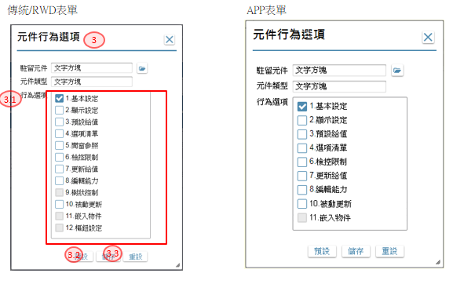

　	3.1 所有跟元件有關的行為選項 
　	3.2 預設鍵：會依元件類型將需要的行為必要項先行勾選 
　	3.3 儲存鍵：系統依據勾選的項目，產生不同的行為，呈現在「清單區」 

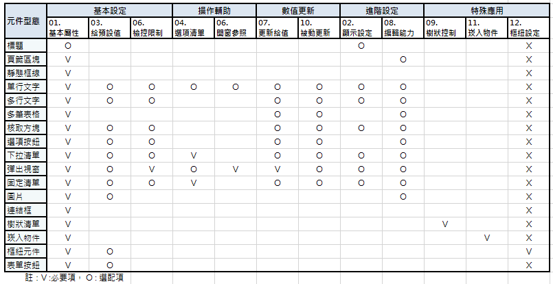

## **10.2 元件基本屬性 basic attributes** {#ObjectAnnotation_BasicSet}
> 作業目的：宣告此表單元件的基本屬性，包含資料屬性、操作屬性，以及相關的文字說明來輔助使用者的操作及產生相關文件。
>
> 作業限制：在完成作業表單的畫面繪製，並完成表單資料設定之後。
>

**傳統/RWD表單**

1. 表單元件：顯示表單元件的名稱
2. 料號：顯示表單元件的料號
3. 元件類型：顯示料號在表單版面上的指定類型
4. 存在檔區：指定本元件資料來源的檢視表所對應的資料檔區，預設:表頭
5. 資料模板：下拉來系統共用設定的模版選項
6. 資料長度：指定元件在畫面顥示或輸入的長度
7. 貨幣元件：當指定的資料模板 在 資料模版.貨幣符號有勾選的話，在本欄指定判斷幣別的欄位元件名
8. 對應欄位：開窗挑選指定的歸屬檔區的來源檢視表格欄位清單
9. 資料型態：顯示指定對應欄位在檢視表中的定義的資料型態
10. 長度：顯示指定對應欄位在檢視表中的定義的長度
11. 選項群組：當元件類型=按鈕選項, 顯示表單版面設定的群組名稱
12. 選項給值：當元件類型=按鈕選項, 指定點選本選項時，儲存時給給的內容值，輸入數字1~99
13. 引用功能：當本欄位具連結若引用按鍵功能時，在本欄指定對應的按鍵名稱；當表單為RWD或APP表單時，與撥號功能互斥，只能擇一
14. 關閉執行中的提示訊息：當引用功能時，是否關閉執行中的提示訊息，讓訊息隱藏
15. 僅供顯示：勾選, 是否為顯示元件
16. 全文顯示：勾選, 是否為全文顯示元件
17. 駐留時機：若勾選顯示欄位, 允許駐留的狀態下, 選擇駐留的時機
18. 新增駐留：在新增狀態下, 顯示欄位可否駐留
19. 修改駐留：在修改狀態下, 顯示欄位可否駐留
20. 瀏覽駐留：在瀏覽狀態下, 顯示欄位可否駐留
21. 資料複製選項：勾選, 是否為設定元件複製的功能
22. 資料複製致能：至檔尾/至頁尾/至遇到相同值/到固定筆數/延遲到執行中決定
23. 到固定筆數_筆數：到固定筆數_筆數＝到固定筆數時，由本欄位指定筆數
24. 不可重複：勾選者, 表示不可與已存在記錄重複
25. 不可負數：勾選者, 表示為不可輸入小於0的數值
26. 密碼處理：勾選者, 表示輸入的文字以*號呈現
27. 操作內容：選擇：必要項或選擇項，必要項限制不可空白
28. 選擇項檢錯時機：選擇：空值不檢錯或空值要檢錯
29. 駐留原欄位：勾選, 是否在輸入完成本欄位後, 不跳離而是停在原欄位上
30. 清空原值：勾選, 配合駐留原欄位, 指定是否要清空原內容值
31. 重顯週期：勾選, 是否為設定元件定時重顯的功能
32. 分鐘數：設定重顯的分鐘
33. 秒數：設定重顯的秒數
34. 多行顯示：當元件類型=元件容器時, 可指定勾選, 是否在同一列裡出現多組欄位
35. 資料行勾選：勾選, 本欄位是否為選擇記錄勾選專用，
36. 資料行勾選＿選項：資料行勾選＝是，則勾選的動作分為以兩種 
傳回呼叫表單：即時把勾選駐留的欄位內容回傳給呼叫本單的上層表單 
傳給按鈕：把勾選的內容暫時傳放在記憶體裡，待傳給按鈕鍵引用 
37. 傳給按鈕內容：在傳給按鈕勾選時，要記在記憶體的相關內容
38. 挑選欄位：要記在記憶體的欄位元件
39. 增加欄位鍵：增加欄位項目
40. 刪除欄位鍵：刪除欄位項目
41. 狀態訊息列：可利用開窗鍵, 開啟[【多語詞庫】](16.html#MaintainMultilingual)指定挑選詞庫, 來指定提示內容
42. 訊息刪除鍵：取消已指定的訊息內容
43. 補充說明：輸入對此元件的說明內容
44. 撥號功能：當表單為RWD或APP表單時，可針對文字方塊類型記載電話的欄位，設定具撥號的功能；唯本勾選與引用功能互斥，只能擇一
45. 關閉執行中的提示訊息

**APP表單**
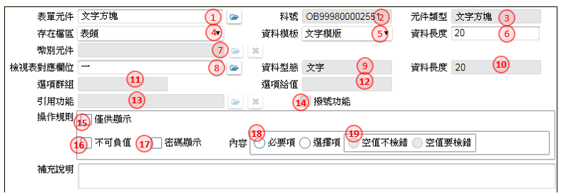
1. 表單元件：顯示表單元件的名稱
2. 料號：顯示表單元件的料號
3. 元件類型：顯示料號在表單版面上的指定類型
4. 存在檔區：指定本元件資料來源的檢視表所對應的資料檔區，預設:表頭
5. 資料模板：下拉來系統共用設定的模版選項
6. 資料長度：指定元件在畫面顥示或輸入的長度
7. 貨幣元件：當指定的資料模板 在 資料模版.貨幣符號有勾選的話，在本欄指定判斷幣別的欄位元件名
8. 對應欄位：開窗挑選指定的歸屬檔區的來源檢視表格欄位清單
9. 資料型態：顯示指定對應欄位在檢視表中的定義的資料型態
10. 長度：顯示指定對應欄位在檢視表中的定義的長度
11. 選項群組：當元件類型=按鈕選項, 顯示表單版面設定的群組名稱
12. 選項給值：當元件類型=按鈕選項, 指定點選本選項時，儲存時給給的內容值，輸入數字1~99
13. 引用功能：當本欄位具連結若引用按鍵功能時，在本欄指定對應的按鍵稱
14. 撥號功能：當表單為RWD或APP表單時，可針對文字方塊類型記載電話的欄位，設定具撥號的功能；唯本勾選與引用功能互斥，只能擇一
15. 僅供顯示：勾選, 是否為顯示元件
16. 不可負數：勾選者, 表示為不可輸入小於0的數值
17. 密碼處理：勾選者, 表示輸入的文字以*號呈現
18. 操作內容：選擇：必要項或選擇項，必要項限制不可空白
19. 選擇項檢錯時機：選擇：空值不檢錯或空值要檢錯

## **10.3 顯示設定 advanced display attribute** {#ObjectAnnotation_DisplaySet}
> 作業目的：針對表單元件顯示的特殊規格。
>
參考資料：[☢影片](){:target='_blank'} [℗文件](pdf/9-3顯示設定.pdf){:target='_blank'}

**傳統/RWD表單**
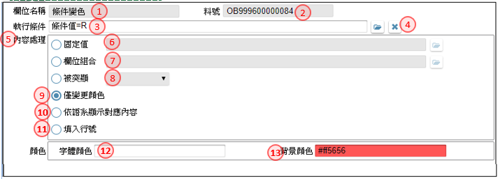
1. 表單元件：顯示表單元件的名稱
2. 料號：顯示表單元件的料號
3. 執行條件：可利用本鍵, 開啟[【條件式】](20.html#ConditionStatement)中, 指定限定符合的條件內容，操作說明請參考［附錄A1］
4. 條件清除鍵：取消已指定的條件內容
5. 欄位內容選項：固定值/欄位組合/被突顯/僅變更顏色/依語系顯示對應內容/填入行號
6. 固定值：選擇本項, 表示顯示的內容為一固定值, 固定顯示文字內容, 可利用開窗鍵, 開啟[【多語詞庫】](16.html#MaintainMultilingual)指定挑選詞庫, 請參考［16.2］來指定顯示的文字內容
7. 欄位組合：選擇本項, 表示欄位內容的顯示, 是由多欄位組合而成, 可利用開窗鍵, 開啟[【運算式】](20.html#ExpressionStatement)指定顯示的文字運算組合內容，操作說明請參考［附錄A2］
8. 被突顯：選擇本項, 表示要在欄位上顯示特殊的標示符號, 選擇標示符號出現的位置, 左上/下/右上/右下, 預設:左上
9. 僅變更顏色：選擇本項, 表示在欄位文字及背景上, 做顏色的差異
10. 依語系顯示對應內容：選擇本項, 表示要依據欄位內容值,參照登入的語系, 對應顯示內容
11. 填入表格的行號：顯示表格列資料列的列數
12. 字體顏色：駐留本欄位, 系統自動開啟[【調色盤】](20.html#Palette)進行色號的挑選，操作說明請參考［附錄A3］
13. 背景顏色：駐留本欄位, 系統自動開啟[【調色盤】](20.html#Palette)進行色號的挑選，操作說明請參考［附錄A3］

**APP表單**

1. 表單元件：顯示表單元件的名稱
2. 料號：顯示表單元件的料號
3. 執行條件：可利用本鍵, 開啟[【條件式】](20.html#ConditionStatement)中, 指定限定符合的條件內容
4. 僅變更顏色：選擇本項, 表示在欄位文字及背景上, 做顏色的差異
5. 填入表格的行號：顯示表格列資料列的列數
6. 字體顏色：駐留本欄位, 系統自動開啟[【調色盤】](20.html#Palette)進行色號的挑選
7. 背景顏色：駐留本欄位, 系統自動開啟[【調色盤】](20.html#Palette)進行色號的挑選

## **10.4 預設給值 default value** {#ObjectAnnotation_PresetValue}
> 作業目的：對於資料收集類的表單元件，可以設定預設值來簡化作者的輸入，並且減少錯誤的機會。不同的應用別，有不同的預設值來源或算式組合或固定值。
>
參考資料：
- [☢系統資訊、登入資訊](https://youtu.be/di2aNE9GGjk){:target='_blank'} [℗系統資訊、登入資訊](pdf/9-4-1系統資訊、登入資訊.pdf){:target='_blank'}
- [☢固定給值](https://youtu.be/Jg8JJUeR_GM){:target='_blank'} [℗固定給值](pdf/9-4-2預設固定給值.pdf){:target='_blank'}
- [☢查表給值](https://youtu.be/aNCc5JWXvGs){:target='_blank'} [℗查表給值](pdf/9-4-3預設查表給值.pdf){:target='_blank'}
- [☢流水編碼](https://youtu.be/RCvSKaw-XdQ){:target='_blank'} [℗流水編碼](pdf/9-4-4流水編碼.pdf){:target='_blank'}
- [☢單據編碼](https://youtu.be/MMvcx3hXlaA){:target='_blank'} [℗單據編碼](pdf/9-4-5單據編碼.pdf){:target='_blank'}

**傳統/RWD表單**
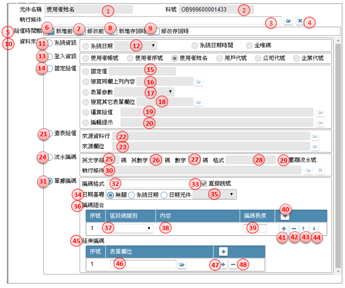
1. 表單元件：顯示表單元件的名稱								
2. 料號：顯示表單元件的料號								
3. 執行條件：可利用本鍵, 開啟[【條件式】](20.html#ConditionStatement)中, 指定限定符合的條件內容								
4. 條件清除鍵：取消已指定的條件內容								
5. 給值時間點：指定在此元件在做預設給值的時機 (APP表單, 無此選項)								
6. 新增前：勾選本項, 表示在進入新增狀態便依以下設定給預設值
7. 修改前：勾選本項, 表示在進入修改狀態便依以下設定給預設值
8. 新增存回時：勾選本項, 表示在新增記錄, 且存回的同時才依以下設定給預設值
9. 修改存回時：勾選本項, 表示在修改記錄, 且存回的同時才依以下設定給預設值
10. 資料來源：指定本欄位的給值的資料來源方式								
11. 系統資訊：由系統資料來當預設值 
系統日期：取得進入或存回時的系統日期 
系統日期時間：取得進入或存回時的系統日期時間 
全唯碼：取得進入或存回時的唯一不重複號碼 
12. 系統日期類別：可選擇日期的預設類別：系統日期/當月首日/當月末日								
13. 登入資訊：由登入資料來當預設值 
使用者帳號：取登入者的帳號 
使用者序號：取登入者的序號 
使用者姓名：取登入者的姓名 
公司代號：取登入時指定的公司代號 
企業代號：取登入帳號在Site管理裡所屬的企業代號 
用戶代號：取登入帳號在帳號明細裡設定的用戶代號 
14. 固定給值：給固定的內容值 
固定值：給固定的內容 
表單參數：給表單的接收參數 
複寫同欄上列內容：複製同表格同欄位上一列的元件內容當預設值 
複製其它表單欄位：複製同表單上其它欄位元件的內容當預設值 
運算給值：以運算式的方式給預設值 
編輯提示：在未輸入內容值前的提示文字 
15. 固定給值內容：輸入固定給值的內容								
16. 複製上列同欄內容：挑選表單元件當預設值								
17. 表單參數：挑選表單參數當預設值								
18. 複製其它表單欄位：挑選表單元件當預設值
19. 運算給值：開啟[【運算式】](20.html#ExpressionStatement)指定運算內容給預設值								
20. 編輯提示：開啟[【多語詞庫】](16.html#MaintainMultilingual)指定挑選詞庫, 來指定給預設值								
21. 查表給值：選擇本項, 表示欄位的內容必須經由其它表格取得								
22. 來源資料行：可利用本鍵, 開啟[【條件式】](20.html#ConditionStatement)中, 指定限定符合的條件內容								
23. 來源欄位：開窗挑選指定表格內的欄位清單								
24. 流水編碼：選擇本項, 表示欄位的內容是由英數流水編號								
25. 英文字母：指定英文字母的碼數, A~Z								
26. 英數字：指定英文字母+數字的碼數, 0~9,A~Z								
27. 數字：指定數字的碼數, 0~9								
28. 格式：由上述三項組合而成的格式顯示								
29. 重顯流水號：當本預設值出現在表格時，若刪除資料列時，是否重編流水號								
30. 執行條件：可利用本鍵, 開啟[【條件式】](20.html#ConditionStatement)中, 指定限定符合的編製流水號條件內容
31. 單據編碼：選擇本項, 表示欄位的內容是由編碼原則設定組成								
32. 編碼格式：顯示經挑選定後, 編碼的格式內容								
33. 直接跳號：勾選時，表示在儲回時發現在號碼衝突時，直接跳下一號								
34. 日期基礎：是否有日期需要參與編碼 
　　無關：選擇本項, 表示沒有 
　　系統日期：選擇本項, 表示以操作本單的系統日期做為編碼參考 
　　日期元件：選擇本項, 表示以表單上的其它日期欄位, 作為編碼參考 
35. 日期元件：挑選本表單上的其它日期欄位, 欄位的模版格式,必須為日期類, 才允挑選
36. 編碼組合：可依編碼的需求訂定多組、依序的類別組合進行編碼								
37. 區段碼類別：可選擇：固定值/表單欄位/系統函數/年度/月份/日期/週次/流水號
38. 內容：依[區段碼類別]內容，對應不同的內容指定 
　　區段碼類別=固定值: 自行輸入 
　　區段碼類別=表單欄位:代碼:K  挑選表單元件 
　　區段碼類別=系統函數:代碼:F  指定系統函數 
　　區段碼類別=年度:下拉：YYYY(西元年4碼)/YY(西元年後2碼)/CCC(民國年3碼)) 
　　區段碼類別=月份:代碼:M 下拉：MM(月份2碼)/M(1碼,0~9,A,B,C) 
　　區段碼類別=日期: 代碼:D 
　　區段碼類別=週次: 代碼:W 
　　區段碼類別=流水號: 代碼:9 
39. 編碼長度：依[區段碼類別]內容，對應不同的內容指定
40. 新增編碼鍵 ：除了指定下拉的年度、月份、日期、週次限定長度外，其它在此輸入長度
41. 插入編碼鍵 ：點選本鍵，插入編碼的資料列								
42. 刪除編碼鍵 ：點選本鍵，刪除編碼的資料列								
43. 資料列上移鍵 ：點選本鍵，把駐留的資料列往上移								
44. 資料列下移鍵 ：點選本鍵，把駐留的資料列往下移								
45. 延伸編碼：在編碼原則之前，區隔不同流水號依據								
46. 表單欄位：挑選當區隔的表單元件								
47. 新增延伸編碼鍵 ：點選本鍵，增加延伸編碼的資料列								
48. 刪除延伸編碼鍵 ：點選本鍵，刪除延伸編碼的資料列

**APP表單**
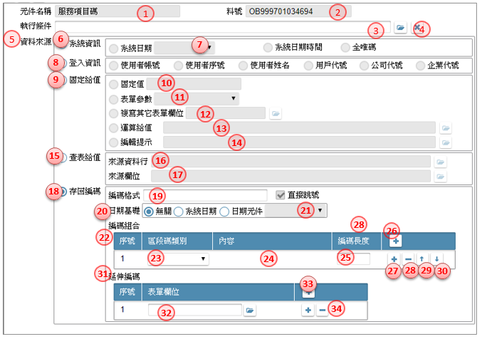
1. 表單元件：顯示表單元件的名稱								
2. 料號：顯示表單元件的料號								
3. 執行條件：可利用本鍵, 開啟[【條件式】](20.html#ConditionStatement)中, 指定限定符合的條件內容								
4. 條件清除鍵：取消已指定的條件內容								
5. 資料來源：指定本欄位的給值的資料來源方式								
6. 系統資訊：由系統資料來當預設值 
系統日期：取得進入或存回時的系統日期 
系統日期時間：取得進入或存回時的系統日期時間 
全唯碼：取得進入或存回時的唯一不重複號碼 
7. 系統日期類別：可選擇日期的預設類別：系統日期/當月首日/當月末日								
8. 登入資訊：由登入資料來當預設值 
使用者帳號：取登入者的帳號 
使用者序號：取登入者的序號 
使用者姓名：取登入者的姓名 
公司代號：取登入時指定的公司代號 
企業代號：取登入帳號在Site管理裡所屬的企業代號 
用戶代號：取登入帳號在帳號明細裡設定的用戶代號	 					
9. 固定給值：給固定的內容值 包含 固定值/表單參數/複製其它表單欄位/運算給值/編輯提示
10. 固定給值內容：輸入固定給值的內容								
11. 表單參數：挑選表單參數當預設值								
12. 複製其它表單欄位：複製同表單上其它欄位元件的內容當預設值, 挑選表單元件當預設值
13. 運算給值：開啟[【運算式】](20.html#ExpressionStatement)指定運算內容給預設值								
14. 編輯提示：開啟[【多語詞庫】](16.html#MaintainMultilingual)指定挑選詞庫, 來指定給預設值								
15. 查表給值：選擇本項, 表示欄位的內容必須經由其它表格取得								
16. 來源資料行：可利用本鍵, 開啟[【條件式】](20.html#ConditionStatement)中, 指定限定符合的條件內容								
17. 來源欄位：開窗挑選指定表格內的欄位清單								
18. 存回編碼：選擇本項, 表示欄位的內容是由編碼原則設定組成								
19. 編碼格式：顯示經挑選定後, 編碼的格式內容								
20. 日期基礎：是否有日期需要參與編碼 
無關：選擇本項, 表示沒有 
系統日期：選擇本項, 表示以操作本單的系統日期做為編碼參考 
日期元件：選擇本項, 表示以表單上的其它日期欄位, 作為編碼參考	 						
21. 日期元件：挑選本表單上的其它日期欄位, 欄位的模版格式,必須為日期類, 才允挑選
22. 編碼組合：可依編碼的需求訂定多組、依序的類別組合進行編碼								
23. 區段碼類別：可選擇：固定值/表單欄位/系統函數/年度/月份/日期/週次/流水號
24. 內容：依[區段碼類別]內容，對應不同的內容指定 
區段碼類別=固定值: 自行輸入 
區段碼類別=表單欄位:代碼:K  挑選表單元件 
區段碼類別=系統函數:代碼:F  指定系統函數 
區段碼類別=年度:下拉：YYYY(西元年4碼)/YY(西元年後2碼)/CCC(民國年3碼)) 
區段碼類別=月份:代碼:M 下拉：MM(月份2碼)/M(1碼,0~9,A,B,C) 
區段碼類別=日期: 代碼:D 
區段碼類別=週次: 代碼:W 
區段碼類別=流水號: 代碼:9 							
25. 編碼長度：依[區段碼類別]內容，對應不同的內容指定								
26. 新增編碼鍵 ：除了指定下拉的年度、月份、日期、週次限定長度外，其它在此輸入長度
27. 插入編碼鍵 ：點選本鍵，插入編碼的資料列								
28. 刪除編碼鍵 ：點選本鍵，刪除編碼的資料列								
29. 資料列上移鍵 ：點選本鍵，把駐留的資料列往上移								
30. 資料列下移鍵 ：點選本鍵，把駐留的資料列往下移								
31. 延伸編碼：在編碼原則之前，區隔不同流水號依據								
32. 表單欄位：挑選當區隔的表單元件								
33. 新增延伸編碼鍵 ：點選本鍵，增加延伸編碼的資料列								
34. 刪除延伸編碼鍵 ：點選本鍵，刪除延伸編碼的資料列

## **10.5 選項清單 listing for click** {#ObjectAnnotation_ListOfOption}
> 作業目的：對於下清單及固定清單這一類的資料收集型表單元件，可以設定操作可以選	取的固定項目，或是來自資料庫經特殊過濾條件的項目清單，來輔助操作者加快輸入，	並且減少錯誤的發生。
>
參考資料：
-  [☢固定下拉選項](https://youtu.be/Nqtfv490j7Y){:target='_blank'} [℗固定下拉選項](pdf/9-5-1固定下拉選項.pdf){:target='_blank'}
-  [☢變動下拉選項](https://youtu.be/-hO8aaJ29Hk){:target='_blank'} [℗變動下拉選項(Q下拉)](pdf/9-5-2變動下拉選項(Q下拉).pdf){:target='_blank'}
-  [☢變動下拉選項變化](https://youtu.be/2QQcrt2oDMU){:target='_blank'} [℗變動下拉選項變化](pdf/9-5-3變動下拉選項變化.pdf){:target='_blank'}
-  [☢清單選項](https://youtu.be/qbGC5gKqCq8){:target='_blank'} [℗清單選項](pdf/9-5-4清單選項.pdf){:target='_blank'}

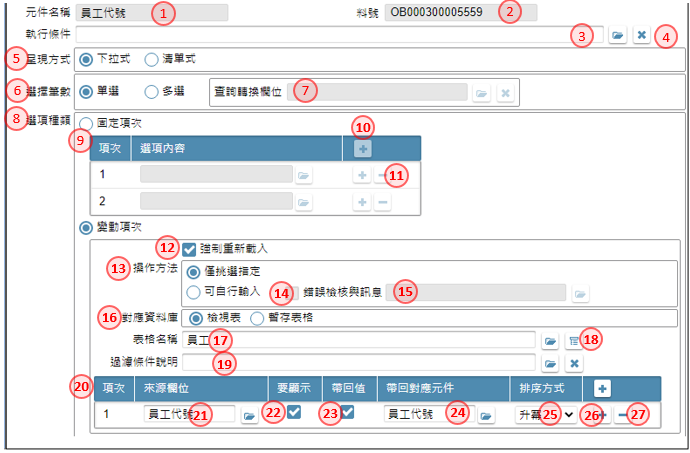
1. 表單元件：顯示表單元件的名稱
2. 料號：顯示表單元件的料號
3. 執行條件：可利用本鍵, 開啟[【條件式】](20.html#ConditionStatement)中, 指定限定符合的條件內容，操作說明請參考［附錄A1］
4. 條件清除鍵：取消已指定的條件內容
5. 呈現方式：選項清單的樣式  
下拉選項：選擇本項，表示這是下拉才會看到選項清單的下拉式選單 
固定式：選擇本項, 表示是多選項的清單挑選 
6. 固定式的筆數：當呈現方式=固定式時, 可指定筆數=單選/複選
7. 選項類別：指定選項的來源類別 
固定選項：選擇本項,表示選項的來源為固定的內容, 由下列表格進行指定 
變動選項：選擇本項,表示選項的來源為由其它表格維維護, 為變動項目, 須才查表才得明細, 由下列表格進行指定 
8. 固定清單的選項：將要下拉的內容表列在此
9. 選項內容：可直接輸入選項內容，或有多語需求時，開啟[【多語詞庫】](16.html#MaintainMultilingual)指定挑選詞庫, 請參考［16.2］來指定選項內容
10. 新增鍵：增加一選項內容
11. 刪除鍵：刪除一選項內容
12. 強制重新載入：指定變動的來源, 是否須逐次載入, 針對的變動頻率較者,可勾選指定
13. 操作模式：在變動選項的狀態下, 是否可由使用者利用輸入關鍵字的模式,來建立資料 
僅挑選指定：選擇本項, 表示不允輸入, 只能用挑選的 
可自行輸入：選擇本項, 表示可輸入, 那就必須再附加在條件不成立時, 提示的訊息(APP表單,無此選項) 
14. 錯誤檢核及訊息：勾選，是否進行檢控並提示訊息
15. 訊息內容：可利用開窗鍵, 開啟[【多語詞庫】](16.html#MaintainMultilingual)指定挑選詞庫, 請參考［16.2］來指定訊息內容
16. 錯誤檢核及訊息：勾選，是否進行檢控並提示訊息
17. 表格名稱：依據對應資料庫類別，挑選檢視表或資料表
18. 檢視表參數：當對應資料庫類別＝檢視表
19. 過濾條件說明：可利用本鍵, 開啟[【條件式】](20.html#ConditionStatement)中, 指定限定符合的條件內容，操作說明請參考［附錄A1］
20. 項次：系統顯示選項項次
21. 來源欄位：開窗挑選指定的選項來源檢視表格的欄位清單
22. 要顯示：該欄位是否顯示在選項內
23. 帶回值：該欄位是否在挑選後被帶回
24. 帶回對應元件：帶回的目的元件, 開窗同一表單的元件清單
25. 排序方式：下拉挑選升冪(由小到大排)/降冪(由大到小排列)
26. 新增來源鍵 ：點選本鍵，增加來源的資料列
27. 刪除來源鍵 ：點選本鍵，刪除來源的資料列

## **10.6 另開視窗 pop-up window** {#ObjectAnnotation_WindowReference}
> 作業目的：對於開啟其它作業表單或檔案總管這一類的可以重複挑選元件的行為，可以	設定開窗表列清單，來輔助操作者進行指定動作。
>
參考資料：
-  [☢單選帶回](https://youtu.be/_2BORH46Sj4){:target='_blank'} [℗單選帶回](pdf/9-6-1單選帶回.pdf){:target='_blank'}
-  [☢複選帶回](https://youtu.be/YcJ9Rkd6dl4){:target='_blank'} [℗複選帶回](pdf/9-6-2複選帶回.pdf){:target='_blank'}
-  [☢上傳檔案到資料庫](https://youtu.be/A3QvUuulHwI){:target='_blank'} [℗上傳檔案到資料庫](pdf/9-6-3上傳檔案到資料庫.pdf){:target='_blank'}

**傳統/RWD表單(APP表單無此行為選項)**
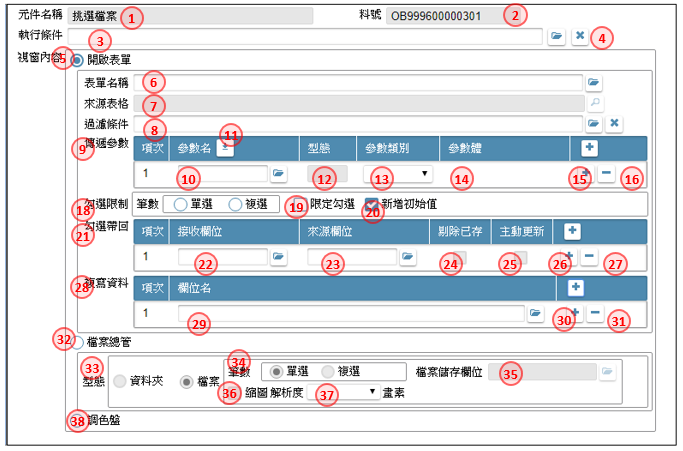
1. 表單元件：顯示表單元件的名稱
2. 料號：顯示表單元件的料號
3. 執行條件：可利用本鍵, 開啟[【條件式】](20.html#ConditionStatement)中, 指定限定符合的條件內容，操作說明請參考［附錄A1］
4. 條件清除鍵：取消已指定的條件內容
5. 呈現方式：選項清單的樣式  
下拉選項：選擇本項，表示這是下拉才會看到選項清單的下拉式選單 
固定式：選擇本項, 表示是多選項的清單挑選 
6. 固定式的筆數：當呈現方式=固定式時, 可指定筆數=單選/複選
7. 選項類別：指定選項的來源類別 
固定選項：選擇本項,表示選項的來源為固定的內容, 由下列表格進行指定 
變動選項：選擇本項,表示選項的來源為由其它表格維維護, 為變動項目, 須才查表才得明細, 由下列表格進行指定 
8. 固定清單的選項：將要下拉的內容表列在此
9. 選項內容：可直接輸入選項內容，或有多語需求時，開啟[【多語詞庫】](16.html#MaintainMultilingual)指定挑選詞庫, 請參考［16.2］來指定選項內容
10. 新增鍵：增加一選項內容
11. 刪除鍵：刪除一選項內容
12. 強制重新載入：指定變動的來源, 是否須逐次載入, 針對的變動頻率較者,可勾選指定
13. 操作模式：在變動選項的狀態下, 是否可由使用者利用輸入關鍵字的模式,來建立資料 
僅挑選指定：選擇本項, 表示不允輸入, 只能用挑選的 
可自行輸入：選擇本項, 表示可輸入, 那就必須再附加在條件不成立時, 提示的訊息(APP表單,無此選項) 
14. 錯誤檢核及訊息：勾選，是否進行檢控並提示訊息
15. 訊息內容：可利用開窗鍵, 開啟[【多語詞庫】](16.html#MaintainMultilingual)指定挑選詞庫, 請參考［16.2］來指定訊息內容
16. 錯誤檢核及訊息：勾選，是否進行檢控並提示訊息
17. 表格名稱：依據對應資料庫類別，挑選檢視表或資料表
18. 檢視表參數：當對應資料庫類別＝檢視表
19. 過濾條件說明：可利用本鍵, 開啟[【條件式】](20.html#ConditionStatement)中, 指定限定符合的條件內容，操作說明請參考［附錄A1］
20. 項次：系統顯示選項項次
21. 來源欄位：開窗挑選指定的選項來源檢視表格的欄位清單
22. 要顯示：該欄位是否顯示在選項內
23. 帶回值：該欄位是否在挑選後被帶回
24. 帶回對應元件：帶回的目的元件, 開窗同一表單的元件清單
25. 排序方式：下拉挑選升冪(由小到大排)/降冪(由大到小排列)
26. 新增來源鍵 ：點選本鍵，增加來源的資料列
27. 刪除來源鍵 ：點選本鍵，刪除來源的資料列

## **10.7 檢控限制 V&V** {#ObjectAnnotation_ProsecutionRestriction}
> 作業目的：為了避免使用者操作時輸入不合規範的資料，需在欄位中針對輸入內容進行	檢控。
>
參考資料：
-  [☢運算判斷](https://youtu.be/AbSjQOPACD8){:target='_blank'} [℗運算判斷](pdf/9-7-1運算判斷.pdf){:target='_blank'}
-  [☢查表比對](https://youtu.be/6Fd7CGGoNKo){:target='_blank'} [℗查表比對](pdf/9-7-2查表比對.pdf){:target='_blank'}
-  [☢鍵入控制](https://youtu.be/izcCcqLXfQg){:target='_blank'} [℗鍵入控制](pdf/9-7-3鍵入控制.pdf){:target='_blank'}
-  [☢元件檢控動態訊息](https://youtu.be/TRqPCgMNFeI){:target='_blank'} [℗元件檢控動態訊息](pdf/9-7-4元件檢控動態訊息.pdf){:target='_blank'}

**傳統/RWD表單**
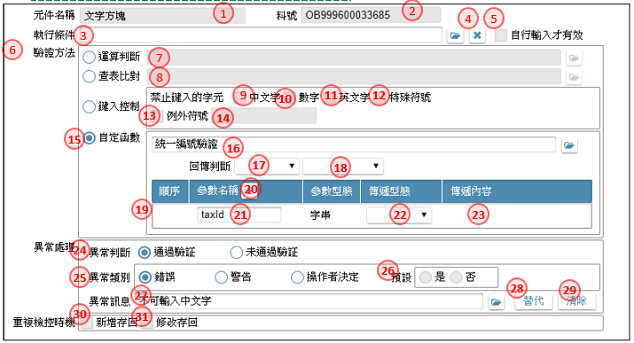
1.	表單元件：顯示表單元件的名稱
2. 料號：顯示表單元件的料號
3. 執行條件：可利用本鍵, 開啟[【條件式】](20.html#ConditionStatement)中, 指定限定符合的條件內容，操作說明請參考［附錄A1］
4. 條件清除鍵：取消已指定的條件內容
5. 自行輸入才有效：勾選本項, 表示以下檢控在自行輸入欄位時, 才啟動; 若是由開窗帶回、它欄更新者, 沒有作用
6. 驗證方法：選擇檢控驗證的類別 運算判斷/查表比對/鍵入控制/自定函數
7. 運算判斷：選擇本項, 表示檢控的內容為各欄位間的運算判斷,可利用開窗鍵, 開啟[【運算式】](20.html#ExpressionStatement)設定組合運算式, 作為欄位執行限制的依據"
8. 查表比對：選擇本項, 表示輸入的內容必須與其它表格做條件比對,可利用本鍵, 開啟[【條件式】](20.html#ConditionStatement)中, 指定限定符合的條件內容
9. 禁止鍵入_中文字：選擇本項, 表示輸入的內容禁止為中文字
10. 禁止鍵入_數字：選擇本項, 表示輸入的內容禁止為數字
11. 禁止鍵入_英文字：選擇本項, 表示輸入的內容禁止為英文字
12. 禁止鍵入_特殊符號：選擇本項, 表示輸入的內容禁止為特殊符號
13. 禁止鍵入_例外符號：選擇本項, 表示輸入的內容禁止為指定例外符號
14. 禁止鍵入_例外符號內容：在勾選: 禁止鍵入_例外符號內容 時, 輸入可輸入例外內容
15. 自定函數：可利用開窗鍵, 開啟[【自定函數】](16.html#UserDefineFunction)指定挑選自定函數, 來指定函數執行的內容
16. 回傳判斷_判斷邏輯式：判斷邏輯式: 大於/小於/等於/大於等於/小於等於/不等於, 預設:大於
17. 回傳判斷_判斷類別：判斷類別:表單元件/固定值/函數
18. 回傳判斷_判斷內容：判斷類別=固定值，由使用者自行輸入 
判斷類別=表單元件，挑選表單元件通則, 過濾:表單料號 
判斷類別=函數，開啟系統函數清單挑選，過濾:適用等式右邊且無參數 
19. 傳遞參數表格：設定呼叫自定函數相關的參數內容
20. 參數下載鍵：可利用本鍵載入所有的參數項目
21. 參數名稱：顯示自定函數參數，開窗[【自定函數】](16.html#UserDefineFunction)顯示自定函數參數內容，操作說明請參考［16.3］
22. 傳遞類型：下拉挑選要傳遞的參數類型：表單元件／固定值／參數／全域變數
23. 傳遞內容：依傳遞類別輸入 
傳遞類型=固定值，由使用者自行輸入 
傳遞類型=表單元件，挑選表單元件 
傳遞類型=參數，勾選表單下的參數內容 
傳遞類型=全域變數，挑選全域變數 
24. 異常判斷：指定判斷異常的基礎 通過驗證/ 未通過驗證
25. 異常類別：選擇提示訊息類別  
錯誤：選擇本項, 表示以錯誤的方式, 提示訊息後, 會回原欄位 
警告：選擇本項, 表示出現警告訊息, 但仍會通過本欄位檢控 
操作者決定：選擇本項, 表示出現詢問的訊息, 由使用者決定 
26. 按鈕預設：出現詢問訊息時，預設決定的內容 
是：選擇本項, 表示預設為是, 為Pass 
否：選擇本項, 表示預設為否, 會回到原欄位 
27. 異常訊息：可利用開窗鍵, 開啟[【多語詞庫】](16.html#MaintainMultilingual)指定挑選詞庫, 來指定訊息內容
28. 替代鍵：訊息有變數需要替代時，可利用本鍵開啟[【訊息替代】](20.html#MessageReplace)進行替代內容的設定
29. 清除鍵：清除訊息及替代內容
30. 重複檢控時機_新增存回：設定本檢控條件，在新增存回前是否再判斷一次
31. 重複檢控時機_修改存回：設定本檢控條件，在修改存回前是否再判斷一次

**APP表單**

1. 表單元件：顯示表單元件的名稱
2. 料號：顯示表單元件的料號
3. 執行條件：可利用本鍵, 開啟[【條件式】](20.html#ConditionStatement)中, 指定限定符合的條件內容
4. 條件清除鍵：取消已指定的條件內容
5. 運算判斷：選擇本項, 表示檢控的內容為各欄位間的運算判斷,可利用開窗鍵, 開啟[【運算式】](20.html#ExpressionStatement)設定組合運算式, 作為欄位執行限制的依據
6. 查表比對：選擇本項, 表示輸入的內容必須與其它表格做條件比對,可利用本鍵, 開啟[【條件式】](20.html#ConditionStatement)中, 指定限定符合的條件內容"
7. 禁止鍵入_中文字：選擇本項, 表示輸入的內容禁止為中文字
8. 禁止鍵入_數字：選擇本項, 表示輸入的內容禁止為數字
9. 禁止鍵入_英文字：選擇本項, 表示輸入的內容禁止為英文字
10. 禁止鍵入_特殊符號：選擇本項, 表示輸入的內容禁止為特殊符號
11. 禁止鍵入_例外符號：選擇本項, 表示輸入的內容禁止為指定例外符號
12. 禁止鍵入_例外符號內容：在勾選: 禁止鍵入_例外符號內容 時, 輸入可輸入例外內容
13. 異常判斷：指定判斷異常的基礎 通過驗證/ 未通過驗證
14. 異常類別：選擇提示訊息類別  
錯誤：選擇本項, 表示以錯誤的方式, 提示訊息後, 會回原欄位 
警告：選擇本項, 表示出現警告訊息, 但仍會通過本欄位檢控 
操作者決定：選擇本項, 表示出現詢問的訊息, 由使用者決定 
15. 按鈕預設：出現詢問訊息時，預設決定的內容　 
是：選擇本項, 表示預設為是, 為Pass 
否：選擇本項, 表示預設為否, 會回到原欄位 
16. 異常訊息：可利用開窗鍵, 開啟[【多語詞庫】](16.html#MaintainMultilingual)指定挑選詞庫, 來指定訊息內容
17. 替代鍵：當按鍵的訊息有變數需要替代時，可利用本鍵開啟[【訊息替代】](20.html#MessageReplace)進行替代內容的設定
18. 清除鍵：清除訊息及替代內容

## **10.8 更新給值 UpdateToValue** {#ObjectAnnotation_UpdateToValue}
> 作業目的：許多輸入行為，會讓使用者輸入某個欄位，但是影響另一個欄位的內容，此	時需使用此功能。例如，在代號欄位輸入代號後，名稱欄位自動顯示相對應的名稱。
>
參考資料：
-  [☢駐留原欄位功能](https://youtu.be/e0zOR1qGdSo){:target='_blank'} [℗駐留原欄位功能](pdf/9-8-1駐留原欄位功能.pdf){:target='_blank'}
-  [☢查表更新給值](https://youtu.be/XCTQmRaCHYI){:target='_blank'} [℗查表更新給值](pdf/9-8-2查表更新給值.pdf){:target='_blank'}
-  [☢固定更新給值](https://youtu.be/-XIOriyGcxU){:target='_blank'} [℗固定更新給值](pdf/9-8-3固定更新給值.pdf){:target='_blank'}
-  [☢異動關聯記錄或欄位](https://youtu.be/2Vtpi7l5OYs){:target='_blank'} [℗異動關聯記錄或欄位](pdf/9-8-4異動關聯記錄或欄位.pdf){:target='_blank'}
-  [☢由元件執行功能鍵](https://youtu.be/QC0tyvyv2zM){:target='_blank'} [℗由元件執行功能鍵](pdf/9-8-5由元件執行功能鍵.pdf){:target='_blank'}

**傳統/RWD表單**
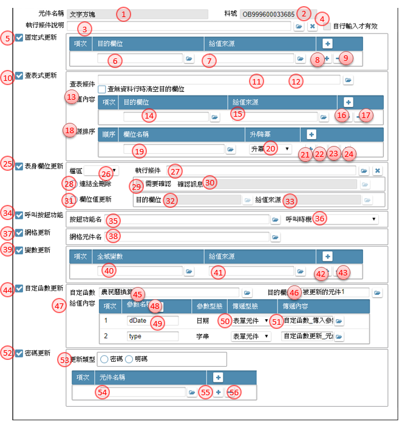
1. 表單元件：顯示表單元件的名稱
2. 料號：顯示表單元件的料號
3. 執行條件：可利用本鍵, 開啟[【條件式】](20.html#ConditionStatement)中, 指定限定符合的條件內容，操作說明請參考［附錄A1］
4. 自行輸入才有效：勾選本項, 表示以下檢控在自行輸入欄位時, 才啟動; 若是由開窗帶回、它欄更新者, 沒有作用
5. 固定更新：勾選者，表示目的欄位以固定的算式給更新值
6. 目的欄位：更新的目的欄位，開窗挑選表單元件
7. 給值來源：可利用開窗鍵, 開啟[【運算式】](20.html#ExpressionStatement)設定組合運算式, 作為更新給值的內容，操作說明請參考［附錄A2］
8. 增加固定給值鍵：可利用本鍵, 增加帶值條件項目
9. 刪除固定給值鍵：可利用本鍵, 刪除帶值條件項目
10. 查表式更新：勾選者, 表示經由查詢其它表格的方式, 取得相關資訊
11. 查表條件式：可利用本鍵, 開啟[【條件式】](20.html#ConditionStatement)中, 指定限定符合的條件內容，操作說明請參考［附錄A1］
12. 無資料時清空：勾選本欄，表示當條件式執行時無符合的內容時，要把目的欄位內容清空
13. 查表更新的欄位：指定要查表帶回的欄位內容
14. 目的欄位：更新的目的欄位，開窗挑選表單元件
15. 給值來源：可利用開窗挑選條件式裡指指定表格的欄位清單
16. 增加查表給值鍵：可利用本鍵, 增加帶值條件項目
17. 刪除查表給值鍵：可利用本鍵, 刪除帶值條件項目
18. 來源排序：指定挑選條件式裡指指定表格的輸出欄位的排序依據
19. 欄位名稱：挑選指定參與排序的欄位
20. 排序的方式：下拉挑選升冪(由小到大排)/降冪(由大到小排列)
21. 增加排序鍵：可利用本鍵, 增加排序項目
22. 刪除排序鍵：可利用本鍵, 刪除排序項目
23. 資料列上移鍵：點選本鍵，把駐留的資料列往上移
24. 資料料列下移鍵：點選本鍵，把駐留的資料列往下移
25. 表身欄位更新：勾選本項, 作用於是否因本欄位的改變而檔區需異動其它的內容更新方法: 連結全刪除／欄位值更新
26. 紀錄檔區：指定異動的資料區域
27. 執行條件：可利用本鍵, 開啟[【條件式】](20.html#ConditionStatement)中, 指定限定符合的條件內容，操作說明請參考［附錄A1］
28. 連結全刪除：勾選本項目時，表示刪除關連檔區內的所有記錄
29. 需要確認：勾選者，表示在執行連結全刪除的時須提示訊息
30. 確認訊息：可利用開窗鍵, 開啟[【多語詞庫】](16.html#MaintainMultilingual)指定挑選詞庫, 請參考［16.2］來指定訊息內容
31. 欄位值更新：勾選本項目時，更新異動特定欄位內容值
32. 目的欄位：更新的目的欄位，開窗挑選指定檔區的表單元件
33. 給值來源：可利用開窗鍵, 開啟[【運算式】](20.html#ExpressionStatement)設定組合運算式, 作為更新給值的內容，操作說明請參考［附錄A2］
34. 呼叫按鈕功能：勾選本項, 表示因本欄位的異動, 而啟動功能鍵的執行
35. 按鈕功能名：啟動的功能鍵名, 可利用開窗勾選本單下的功能鍵清單
36. 呼叫時機：下拉選擇時機點: 駐留移動/記錄移動/滑鼠右鍵/滑鼠雙擊/超連結/自動完成
37. 網格更新：勾選本項, 表示因本欄位的異動, 而影響另一個多筆表格的內容
38. 網格元件名：影響的網格元件名, 可利用開窗勾選本單下的多筆表格清單
39. 變數更新：勾選本項, 表示因本欄位的異動, 可影響全域變數的更新
40. 全域變數名：可利用開窗鍵, 開啟[[【全域變數】](16.html#GlobalVariable)挑選變數欄位，請參考［16.11］
41. 給值來源：可利用開窗鍵, 開啟[【運算式】](20.html#ExpressionStatement)設定組合運算式, 作為更新給值的內容，操作說明請參考［附錄A2］
42. 增加變數鍵：可利用本鍵, 增加變數項目
43. 刪除變數鍵：可利用本鍵, 刪除變數項目
44. 自定函數更新：勾選本項, 表示因本欄位的異動, 由自定函數回傳
45. 自定函數：可利用開窗鍵, 開啟[【自定函數】](16.html#UserDefineFunction)指定挑選自定函數, 來指定函數執行的內容
46. 目的欄位：挑選回傳值要影響的目的欄位值
47. 傳遞參數表格：設定呼叫自定函數相關的參數內容
48. 參數下載鍵：可利用本鍵載入所有的參數項目
49. 參數名稱：顯示自定函數參數，開窗【自定函數參數】顯示自定函數參數內容
50. 傳遞型態：下拉挑選要傳遞的參數型態：表單元件／固定值／參數／全域變數
51. 傳遞內容：依傳遞類別輸入 
傳遞類型=固定值，由使用者自行輸入 
傳遞類型=表單元件，挑選表單元件 
傳遞類型=參數，勾選表單下的參數內容 
傳遞類型=全域變數，挑選全域變數 
52. 密碼更新：勾選本項, 表示因本欄位異動而必須更新其它密碼型態的元件
53. 更新類型：勾選更新密碼欄位的內容為：密碼或明碼
54. 元件名稱：勾選欲更新的欄位
55. 增加元件鍵：可利用本鍵, 增加密碼元件項目
56. 刪除元件鍵：可利用本鍵, 刪除密碼元件項目

**APP表單**

1. 表單元件：顯示表單元件的名稱
2. 料號：顯示表單元件的料號
3. 執行條件：可利用本鍵, 開啟[【條件式】](20.html#ConditionStatement)中, 指定限定符合的條件內容，操作說明請參考［附錄A1］
4. 固定更新：勾選者，表示目的欄位以固定的算式給更新值
5. 目的欄位：更新的目的欄位，開窗挑選表單元件
6. 給值來源：可利用開窗鍵, 開啟[【運算式】](20.html#ExpressionStatement)設定組合運算式, 作為更新給值的內容，操作說明請參考［附錄A2］
7. 增加固定給值鍵：可利用本鍵, 增加帶值條件項目
8. 刪除固定給值鍵：可利用本鍵, 刪除帶值條件項目
9. 查表式更新：勾選者, 表示經由查詢其它表格的方式, 取得相關資訊
10. 查表條件式：可利用本鍵, 開啟[【條件式】](20.html#ConditionStatement)中, 指定限定符合的條件內容，操作說明請參考［附錄A1］
11. 無資料時清空：勾選本欄，表示當條件式執行時無符合的內容時，要把目的欄位內容清空
12. 目的欄位：更新的目的欄位，開窗挑選表單元件
13. 給值來源：可利用開窗挑選條件式裡指指定表格的欄位清單
14. 增加查表給值鍵：可利用本鍵, 增加帶值條件項目
15. 刪除查表給值鍵：可利用本鍵, 刪除帶值條件項目
16. 來源排序：指定挑選條件式裡指指定表格的輸出欄位的排序依據
17. 欄位名稱：挑選指定參與排序的欄位
18. 排序的方式：下拉挑選升冪(由小到大排)/降冪(由大到小排列)
19. 增加排序鍵：可利用本鍵, 增加排序項目
20. 刪除排序鍵：可利用本鍵, 刪除排序項目
21. 資料列上移鍵：點選本鍵，把駐留的資料列往上移
22. 資料料列下移鍵：點選本鍵，把駐留的資料列往下移
23. 變數更新：勾選本項, 表示因本欄位的異動, 可影響全域變數的更新
24. 全域變數名：可利用開窗鍵, 開啟[【全域變數】](16.html#GlobalVariable)挑選變數欄位，請參考［16.11］
25. 給值來源：可利用開窗鍵, 開啟[【運算式】](20.html#ExpressionStatement)設定組合運算式, 作為更新給值的內容，操作說明請參考［附錄A2］
26. 增加變數鍵：可利用本鍵, 增加變數項目
27. 刪除變數鍵：可利用本鍵, 刪除變數項目
28. 密碼更新：勾選本項, 表示因本欄位異動而必須更新其它密碼型態的元件
29. 更新類型：勾選更新密碼欄位的內容為：密碼或明碼
30. 元件名稱：勾選欲更新的欄位
31. 增加元件鍵：可利用本鍵, 增加密碼元件項目
32. 刪除元件鍵：可利用本鍵, 刪除密碼元件項目

## **10.9 編輯能力 editing control** {#ObjectAnnotation_EditCapability}
> 作業目的：為了讓特定元件在指定的條件下功能受限，例如唯讀。
>
參考資料：
-  [☢元件編輯能力](https://youtu.be/azVdqrhlp_s){:target='_blank'} [℗元件編輯能力](pdf/9-9-1元件編輯能力.pdf){:target='_blank'}
-  [☢頁籤編輯能力](https://youtu.be/BR5AAyMztqk){:target='_blank'} [℗頁籤編輯能力](pdf/9-9-2頁籤編輯能力.pdf){:target='_blank'}
-  [☢多筆表格編輯能力](https://youtu.be/36nlELubVyA){:target='_blank'} [℗多筆表格編輯能力](pdf/9-9-3多筆表格編輯能力.pdf){:target='_blank'}

**傳統/RWD表單**

1. 表單元件：顯示表單元件的名稱
2. 料號：顯示表單元件的料號
3. 執行條件：可利用本鍵, 開啟[【條件式】](20.html#ConditionStatement)中, 指定限定符合的條件內容
4. 條件清除鍵：取消已指定的條件內容
5. 元件類別：選擇依據元件類別要控制的形式
6. 可編輯欄位：選擇本項, 表示要控制本欄位的動作
7. 可編輯欄位_控制方式：元件類別=可編輯欄位, 可設定不同的控制方式 
唯讀：選擇本項, 表示僅可顯示, 可駐留 
勿駐：選擇本項, 表示僅可顯示, 且不可留 
資料隱藏：選擇本項, 表示將欄位的資料隱藏 
元件隱藏：選擇本項, 表示將整個欄位隱藏 
8. 頁籤失能：選擇本項, 表示要控制本頁籤的動作
9. 頁籤名稱：下拉選擇要失能的頁籤分頁
8. 網格資料行：選擇本項, 表示要控制增刪多筆表格記錄的動作
10. 網格資料行：選擇本項，表示要控制增刪多筆表格記錄的動作
11. 新增能力：選擇本項，表示條件下控制新增的動作
12. 新增能力＿致能：選擇本項，表示可以有新增的能力
13. 新增能力＿除能：選擇本項，表示可以不可以有新增的能力
14. 刪除能力：選擇本項，表示條件下控制刪除的動作
15. 刪除能力＿致能：選擇本項，表示可以有刪除的能力
16. 刪除能力＿除能：選擇本項，表示可以不可以有刪除的能力
17. 矛盾提示：當檢控成立時, 使用者仍操作動作, 是否提示訊息?
18. 訊息內容：在提示訊息的狀態下, 可利用開窗鍵, 開啟[【多語詞庫】](16.html#MaintainMultilingual)指定挑選詞庫, 來指定訊息內容

**APP表單**

1. 表單元件：顯示表單元件的名稱
2. 料號：顯示表單元件的料號
3. 執行條件：可利用本鍵, 開啟[【條件式】](20.html#ConditionStatement)中, 指定限定符合的條件內容
4. 條件清除鍵：取消已指定的條件內容
5. 元件類別：選擇依據元件類別要控制的形式
6. 可編輯欄位：選擇本項, 表示要控制本欄位的動作
7. 可編輯欄位_控制方式：元件類別=可編輯欄位, 可設定不同的控制方式 
唯讀：選擇本項, 表示僅可顯示, 可駐留 
勿駐：選擇本項, 表示僅可顯示, 且不可留 
資料隱藏：選擇本項, 表示將欄位的資料隱藏 
元件隱藏：選擇本項, 表示將整個欄位隱藏 

## **10.10 樹狀控制 tree contro** {#ObjectAnnotation_TreeControl}
> 作業目的：設定樹元件的父子階關聯和其他設定，使樹元件能夠正確顯示資料。
>
參考資料：
-  [☢樹狀元件-單檔區](https://youtu.be/M024JFHFgYY){:target='_blank'} [℗樹狀元件-單檔區](pdf/9-10-1樹狀元件-單檔區.pdf){:target='_blank'}
-  [☢樹狀元件-雙檔區](https://youtu.be/PciYgdjrv40){:target='_blank'} [℗樹狀元件-雙檔區](pdf/9-10-2樹狀元件-雙檔區.pdf){:target='_blank'}
-  [☢樹狀元件勾選功能](https://youtu.be/IVWCwYnr99o){:target='_blank'} [℗樹狀元件勾選功能](pdf/9-10-3樹狀元件勾選功能.pdf){:target='_blank'}
-  [☢樹狀元件異動功能](https://youtu.be/aJ6R5l_jeh4){:target='_blank'} [℗樹狀元件異動功能](pdf/9-10-4樹狀元件異動功能.pdf){:target='_blank'}

**傳統/RWD表單(APP表單無此行為選項)**
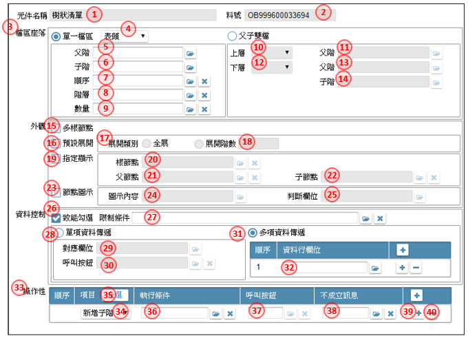
1. 表單元件：顯示表單元件的名稱
2. 料號：顯示表單元件的料號
3. 檔區座落：選擇樹狀清單的處理方式為單一檔區/父子檔區 
單一檔區：選項表示此樹狀清單為單一檔區的樹狀結構。請參考本節註一 
父子檔區：選擇此項表示此樹節點，在維護時為父子階同時維護。請參考本節註二 
4. 歸屬檔區：單一檔區樹時，下拉指定表單佈建的檔區清單
5. 父階元件：單一檔區樹時，選擇歸屬檔區下的父階元件
6. 子階元件：單一檔區樹時，選擇歸屬檔區下的子階元件
7. 順序元件：單一檔區樹時，選擇歸屬檔區下的做為記錄同一階層順序的元件，檔區為表頭者，可空白
8. 階層元件：單一檔區樹時，選擇歸屬檔區下的做為記錄駐留記錄的階層元件，檔區為表頭者，可空白
9. 數量元件：單一檔區樹時，選擇歸屬檔區下的做為記錄同一階層筆數的元件，檔區為表頭者，可空白
10. 上層檔區：父子檔區樹時，指定表單的那個檔區為父階
11. 上層父階元件：父子檔區樹時，選擇上層檔區下的父階元件
12. 下層檔區：父子檔區樹時，指定表單的那個檔區為子階
13. 下層父階元件：父子檔區樹時，選擇下層檔區下的父階元件
14. 下層子階元件：父子檔區樹時，選擇下層檔區下的子階元件
15. 多根節點：勾選者，表示允許顯示多個根節點。
16. 預設展開：勾選者，表示要指定展開的方式。
17. 展開類別：在預設展開的前題下，指定為全展或階數展開
18. 展開階數：在提示訊息的狀態下, 可利用開窗鍵, 開啟[【多語詞庫】](16.html#MaintainMultilingual)指定挑選詞庫, 請參考［16.2］來指定訊息內容
19. 指定顯示：勾選者，表示要指定樹清單上的節點顯示內容。
20. 根節點：在勾選指定顯示的狀態下，開啟[【運算式】](20.html#ExpressionStatement)設定顯示運算式, 作為根節點的內容，操作說明請參考［附錄A2］
21. 父節點：在勾選指定顯示的狀態下，開啟[【運算式】](20.html#ExpressionStatement)設定顯示運算式, 作為父節點的內容，操作說明請參考［附錄A2］
22. 子節點：在勾選指定顯示的狀態下，開啟[【運算式】](20.html#ExpressionStatement)設定顯示運算式, 作為子節點的內容，操作說明請參考［附錄A2］
23. 節點圖示：勾選者，表示要指定樹清單上的節點圖示要替換。
24. 圖示內容：在勾選節點圖示的狀態下，開啟【圖示清單】裡指定圖示用途＝樹枝者，挑選指定成要換替的圖示內容
25. 判斷欄位：開窗挑選邏表元件，依元件內容決定顯示的圖示；輸出元件的內容值必須配合圖片的順序（以數字1,2,3…)排列對應
26. 致能勾選：勾選者，代表樹狀清單具有勾選的能力
27. 限制條件：指定在何條件下，才允許勾選，可開啟[【條件式】](20.html#ConditionStatement)中, 指定限定符合的條件內容，操作說明請參考［附錄A1］
28. 單項資料傳遞：選擇本項時，表示一次只能勾選一筆記錄
29. 對應欄位：當勾選單項時，在勾選的狀態下儲存勾選值的欄位；影響勾選欄位的顯示
30. 呼叫按鈕：當勾選單項且時，在勾選的狀態下啟動的功能鍵名
31. 多項資料傳遞：選擇本項時，表示一次只能勾選多筆記錄
32. 資料行欄位：當勾選多項時，在勾選的狀態下記錄資料的欄位名
33. 操作性選項：設定樹狀清單具備的功能項目及相關的操作設定
34. 項目：可下拉: 新增子階/插入同階/刪除節點/移動節點/複製/剪下/複製貼上/剪下貼上
35. 全選鍵：可利用本按鍵，把所有的項目一次載入
36. 執行條件：指定在何條件下，才允許執行本項目，可開啟[【條件式】](20.html#ConditionStatement)中, 指定限定符合的條件內容，操作說明請參考［附錄A1］
37. 呼叫按鈕：指定要替代系統鍵處理的功能鍵內容，僅限於項目=複製貼上有效用
38. 不成立訊息：當不符合執行條件時，要顯示的訊息， 開啟[【多語詞庫】](16.html#MaintainMultilingual)指定挑選詞庫, 請參考［16.2］來指定訊息內容
39. 增加項目鍵：可利用本鍵, 增加項目
40. 刪除項鍵：可利用本鍵, 刪除項目

**註一 ：單檔樹狀**
資料來源為同一資料表格, 以不同欄位記錄父子階的關係。一次編輯維護一個節點

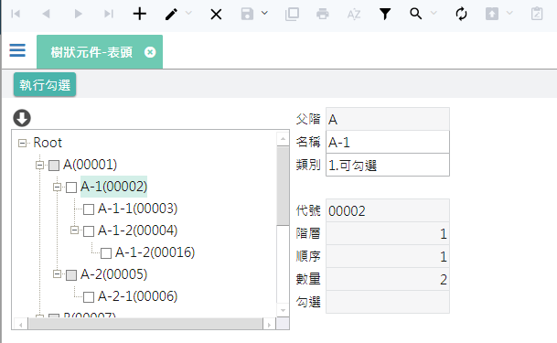

**註二 ：雙檔樹狀**
以一父階,同時處理同一子階多筆的內容, 並以樹狀清單輔檢視者。一次維護是以單一父節點及多筆子節點的方法，處理資料。

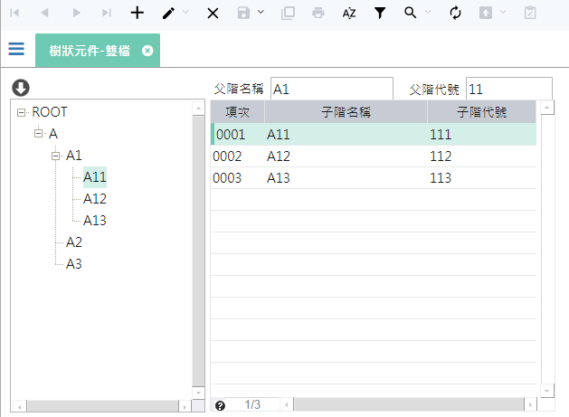

## **10.11 被動更新 pulled update** {#ObjectAnnotation_PassiveUpdate}
> 作業目的：為了讓特定元件在指定的條件下功能受限，例如唯讀。
>
參考資料：
-  [☢單筆被動更新](https://youtu.be/Ip5u5Xde4ew){:target='_blank'} [℗單筆被動更新](pdf/9-11-1單筆被動更新.pdf){:target='_blank'}
-  [☢多筆被動更新](https://youtu.be/M--wN38FRYc){:target='_blank'} [℗多筆被動更新](pdf/9-11-2多筆被動更新.pdf){:target='_blank'}

**傳統/RWD表單**

1. 表單元件：顯示表單元件的名稱
2. 料號：顯示表單元件的料號
3. 執行條件：可利用本鍵, 開啟[【條件式】](20.html#ConditionStatement)中, 指定限定符合的條件內容
4. 條件清除鍵：取消已指定的條件內容
5. 單筆：勾選者，表示被異動的方式是單一運算式允許顯示多個根節點。
6. 單筆運算式：在勾選單筆的狀態下，開啟[【條件式】](20.html#ConditionStatement)設定更新運算式更新的內容
7. 多筆累加：勾選者，表示被異動的方式是從一多筆表格中累算而來。
8. 網格名：在勾選多筆的狀態下，指定數據來源的多筆網格元件
9. 過濾式：限定多筆網格裡的內容須符合的條件，才參與計算，可開啟[【條件式】](20.html#ConditionStatement)中, 指定限定符合的條件內容
10. 多筆運算式：在勾選多筆的狀態下，開啟[【條件式】](20.html#ConditionStatement)設定更新運算式更新的內容
11. GPS距離計算：勾選本項，表示要針對欄位內容值做距離計算
12. 計算方式：在勾選GPS距離的項目下，選擇計算距離的方式，直徑／行徑
13. 交通工具：在勾選GPS距離的項目下，選擇計算距離的方式，1.行走／2.開車
14. 回傳單位：在勾選GPS距離的項目下，選擇距離的單位，1.公尺／2.公里／3.英里
15. 地址類別：經緯度／地址
16. 起點：在勾選GPS距離的項目下，選擇計算距離的起點，挑選指定表單上的元件
17. 終點：在勾選GPS距離的項目下，選擇計算距離的終點，挑選指定表單上的元件

**APP表單**

1. 表單元件：顯示表單元件的名稱
2. 料號：顯示表單元件的料號
3. 執行條件：可利用本鍵, 開啟[【條件式】](20.html#ConditionStatement)中, 指定限定符合的條件內容
4. 條件清除鍵：取消已指定的條件內容
5. GPS距離計算：勾選本項，表示要針對欄位內容值做距離計算
6. 計算方式：在勾選GPS距離的項目下，選擇計算距離的方式，直徑／行徑
7. 回傳單位：在勾選GPS距離的項目下，選擇距離的單位，1.公尺／2.公里／3.英里
8. 計算方式：在勾選GPS距離的項目下，選擇計算距離的方式，1.行走／2.開車
9. 地址類別：經緯度／地址
10. 起點：在勾選GPS距離的項目下，選擇計算距離的起點，挑選指定表單上的元件
11. 終點：在勾選GPS距離的項目下，選擇計算距離的終點，挑選指定表單上的元件

## **10.12 嵌入物件 object embed** {#ObjectAnnotation_EmbeddedObject}
> 作業目的：為了避免使用者操作時輸入不合規範的資料，需在欄位中針對輸入內容進	行檢控。
>
參考資料：

1. 表單元件：顯示表單元件的名稱									
2. 料號：顯示表單元件的料號									
3. 執行條件：可利用本鍵, 開啟[【條件式】](20.html#ConditionStatement)中, 指定限定符合的條件內容									
4. 條件清除鍵：取消已指定的條件內容									
5. 物件類別：依表單類型支援不同選項 
傳統表單：網頁/地圖/影片/圖表/系統內表單/檔案櫃圖片 
RWD表單：網頁/地圖/影片/圖表/系統內表單/檔案櫃圖片/檔案容器控制/行事曆 
APP 表單：檔案容器控制/行事曆 

### **嵌入網頁**
參考資料： [☢影片](https://youtu.be/O41xDiOaSY8){:target='_blank'} [℗文件](pdf/9-12-3嵌入網頁.pdf){:target='_blank'}

#11. 物件類別：挑選：網頁 
#12. 檔區：下拉挑選表單下的檔區清單 
#13. 來源欄位：挑選儲存網頁網址的元件欄位 
#14. 參數：設定要傳給網頁的參數內容 

### **嵌入地圖**
-  [☢影片](https://youtu.be/9L_eDzo5hDk){:target='_blank'} [℗文件](pdf/9-12-4嵌入地圖.pdf){:target='_blank'}

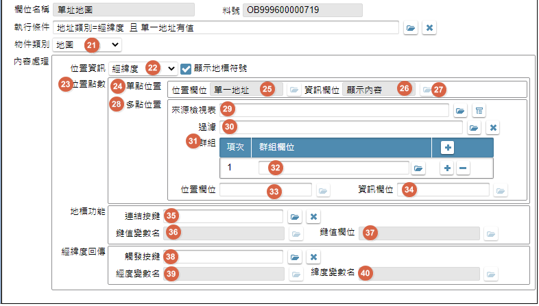
#21. 物件類別：挑選：地圖，頁面上會出現要設定的欄位內容 
#22. 位置資料：選擇位置的表現方式，下拉選項:地址/經緯度, 預設:地址 
#23. 位置點數：指定嵌入地圖的類別，單點／多點位置 
#24. 單點位置：選擇本項時，表示地圖中只標示一組地址資料 
#25. 檔區：下拉挑選表單下的檔區清單 
#26. 位置欄位：挑選儲存位置資訊的元件欄位 
#27. 資料欄位：挑選要在地圖上顯示資訊的元件欄位 
#28. 多點位置：選擇本項時，表示地圖中有多組地址資料 
#29. 來源邏輯表格：指定儲存位置資料的表格名稱 
#30. 過濾：指定在何條件下才是符合顯示的記錄，可開啟[【條件式】](20. html#ConditionStatement)中, 指定限定符合的條件內容 
#31. 群組：在多組位置時，可利用群組功能將資料群聚在一起，在本表格設定要群組的條件欄位 
#32. 群組欄位：挑選來源邏輯表格中的輸出元件 
#33. 位置欄位：挑選儲存位置資訊的元件欄位 
#34. 資料欄位：挑選要在地圖上顯示資訊的元件欄位 
#35. 連結按鍵：當點選地圖裡的地標時，可連結時要啟動的功能鍵，挑選表單功能鍵名 
#36. 鍵值變數名：挑選表單變數欄位，取得地圖連結回傳的變數內容 
#37. 鍵值欄位：挑選表單檢視表的輸出欄位，供地圖連結的鍵值回傳。 
#38. 觸發按鍵：當移動點選地圖裡的地置時，可連結時要觸發的功能鍵，挑選表單功能鍵名 
#39. 經度變數名：挑選全域變數欄位，取得駐留地圖位置的經度數值 
#40. 緯度變數名：挑選全域變數欄位，取得駐留地圖位置的緯度數值 

### **嵌入圖表**
-  [☢影片](https://youtu.be/8FjOJ43dhvI){:target='_blank'} [℗文件](pdf/9-12-2嵌入圖表.pdf){:target='_blank'}

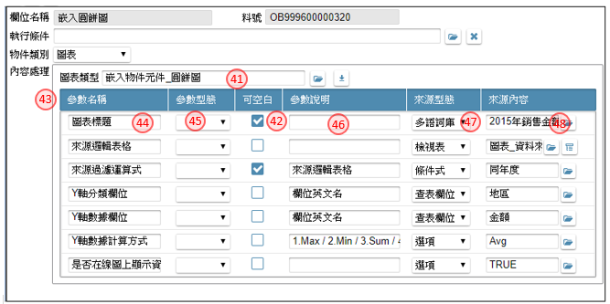
#41. 物件類別：挑選：圖表，頁面上會出現要設定的欄位內容 
#42. 圖表類型：指定要呈現的圖表內容，可開啟【邏輯函數】中, 指定適當的內容 
#43. 參數名稱：系統依據指定的圖表類型，所需要的參數載入表格中，逐一依要呈現的效果進行設定 
#44. 參數型態：選擇本項時，表示地圖中只標示一組地址資料 
#45. 可空白：系統顯示勾選者，表示本欄位可空白不輸入 
#46. 參數說明：系統顯示參數的用途說明47. 來源型態：選擇對應參數的資料來源類型 
#48. 來源內容：依來源類型挑選指定對應內容 

### **嵌入表單**
-  [☢影片](https://youtu.be/E2SOtvee_ME){:target='_blank'} [℗文件](pdf/9-12-1嵌入表單.pdf){:target='_blank'}

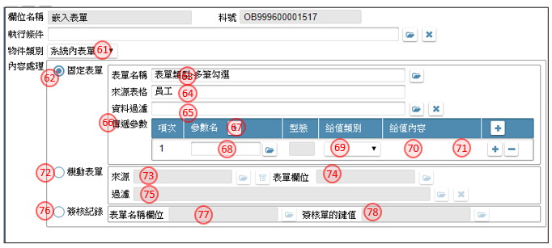
#61. 物件類別：選擇：系統內表單 
#62. 固定表單：若選擇此項，可將系統中某張表單嵌入在這個元件中 
#63. 表單名稱：可指定嵌入的表單名稱 
#64. 來源表格：顯示表單對應的檢視表格名稱 
#65. 資料過濾式：可利用本鍵, 開啟[【條件式】](20. html#ConditionStatement)中, 指定限定符合的條件內容 
#66. 傳遞參數：若開啟的表單有指定的接收參數時，必須在此表格中對應傳入的內容 
#67. 載入：載入表單的參數 
#68. 參數名：開窗勾選表單的接收參數，並指定回傳到欄位上 
#69. 參數型態：顯示參數的資料型態 
#70. 給值類別：給值類別: 元件/固定值/參數/運算式/變數 
#71. 給值內容：給值類別=元件: 開窗勾選【表單元件清單】 
給值類別=固定值: 開放編輸本欄位 
給值類別=參數: 開窗勾選【表單參數清單】 
當給值類別=運算式: 本欄位不輸入, 開啟[【運算式】](20. html#ExpressionStatement) 
#72. 機動表單：選擇此項，可將某個邏輯表格的某個欄位的內容值嵌入在此元件中 
#73. 來源：設定要從哪個檢視表中嵌入資料 
#74. 表單欄位：設定要嵌入資料的表單欄位 
#75. 過濾：可利用本鍵, 開啟[【條件式】](20. html#ConditionStatement)中, 指定限定符合的條件內容 
#76. 簽核記錄：選擇本項，可嵌入簽核記錄 
#77. 表單名稱欄位：設定簽核的表單名稱 
#78. 簽核單的鍵值：設定簽核表單的鍵值欄位 

### **嵌入影片**

#81. 物件類別：挑選：影片 
#82. 來源欄位：挑選儲存影片短網址的元件欄位 

### **嵌入檔案櫃圖片**

#91. 物件類別：挑選：檔案櫃圖檔 
#92. 櫃名欄位：下拉挑選儲放圖片的檔案櫃 
#93. 記錄欄位：開窗挑選儲存圖片檔名的表單元件檔位 

### **嵌入檔案容器控制**

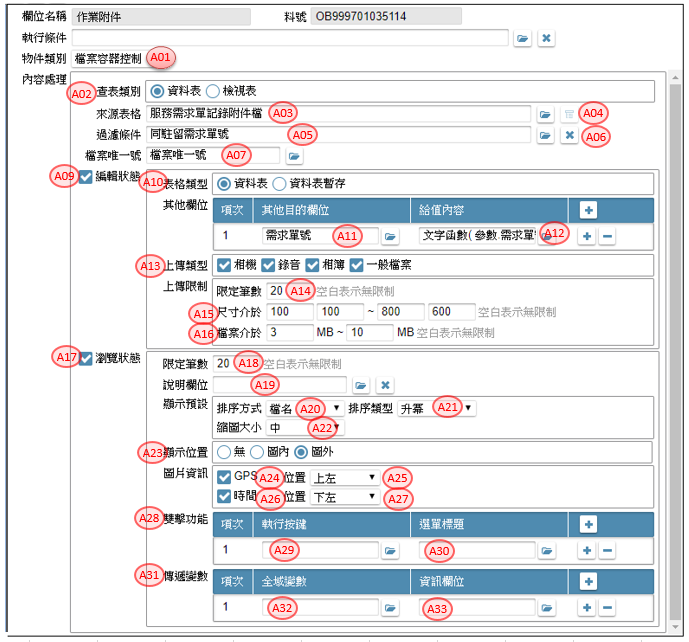

A01. 物件類別：挑選：檔案容器控制 
A02. 查表類別：檔案內容的來源別，資料表/檢視表，預設資料表 
A03. 查表來源：依查表來源，開窗挑選指定表格名稱 
A04. 參數鍵：依該檢視表是否有定義接收參數，而點選本鍵開啟[【傳遞參數】](20. html#PassParameters)，操作說明請參考［附錄A4］ 
A05. 過濾條件：可利用本鍵, 開啟[【條件式】](20. html#ConditionStatement)中, 指定表格來源記錄的符合條件內容，操作說明請參考［附錄A1］ 
A06. 清除鍵：利用本鍵清除原指定的條件式 
A07. 檔案唯一號：從來源表格中挑選宣告 檔案唯一號　的欄位當依據（不可為資料加密或密碼欄位） 
A08. 編輯狀態：勾選本元件是否有編輯的能力 
A09. 表格類型：選擇檔案的資料儲存後放置的表格類型，資料表/資料表暫存，預設資料表 
A10. 其它欄位：在儲存資料時，是否連帶存回其它欄位內容 
A11. 其它目的欄位：選擇資料表下的欄位 
A12. 其它來源欄位：利用運算式，組成來源的內容 
A13. 上傳類型：複選　相機／錄音／相簿／一般檔案 
A14. 限定筆數：容器可上傳的檔案總筆數，關係到儲存時的時間及效能；僅可輸入大於0的數值或空白不限定 
A15. 尺寸限制：限定圖檔的解析度, 寛高的最小及最大值，空白表示不限制 
A16. 檔案限制：限定檔案的大小, 最小及最大值, 空白表示不限制 
A17. 瀏覽狀態：指定本元件時為瀏覽狀態 
A18. 限定筆數：容器可顯示的檔案總筆數，空白表示不限定 
A19. 說明欄位：從來源表格中挑選欄位當滑鼠移入檔案時的提示來源欄位（不可為資料加密或密碼欄位） 
A20. 顯示排序方式：下拉 1. 檔名/2. 時間/3. 類型 預設1. 檔名 
A21. 排序類型：下拉 1. 升冪/2. 降冪 預設1. 升冪 
A22. 顯示縮圖尺寸：下拉 1. 大/2. 中/3. 小 預設2. 中 
A23. 顯示圖片資訊否：選擇 無/圖內:表示資料在圖片內/圖外:表示資料在圖片外 
A24. GPS：勾選是否在圖片上顯示GPS 內容 
A25. GPS顯示位置：在勾選顯示GPS 狀態下，選擇1. 上左 / 2. 上中 / 3. 上右 / 4. 下左 / 5. 下中 / 6. 下右，預設 1. 上左 
A26. 時間：勾選是否在圖片上顯示拍照內容 
A27. 時間顯示位置：在勾選顯示時間狀態下，選擇1. 上左 / 2. 上中 / 3. 上右 / 4. 下左 / 5. 下中 / 6. 下右，預設 1. 上左 
A28. 雙擊功能表格：最多可以新增5個功能鍵，若為多個功能鍵時，系統會以選單的方式供挑選指定，若只有一個按鍵時，則會直接執行 
A29. 執行按鍵：指定本表單預先安排的隱藏按鍵 
A30. 選單標題：功能鍵出現在選單上的名稱 
A31. 傳遞變數表格:在呼叫指定功能鍵時，會將駐留的頁面資訊置入全域變數，供後續按鍵取值 
A32. 全域變數名：可利用開窗鍵, 開啟[【全域變數】](16. html#GlobalVariable)挑選變數欄位，請參考［16. 11］ 
A33. 資訊欄位：依查表來源，開窗挑選指定表格欄位 

### **行事曆**

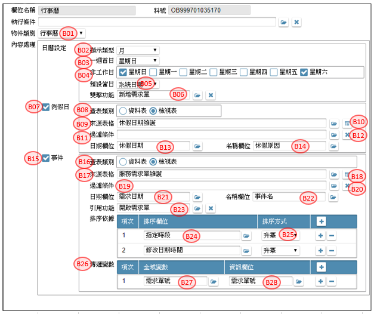

B01. 物件類別：挑選：行事曆 
B02. 顯示類型：指定顯示行事曆時，預設的樣式，是以單月 或單週 預設為月 
B03. 一週首日：指定計算週別的第一天，選擇 星期日 / 星期一 ；預設：星期日 
B04. 非工作日：複選一週不工作的日期，系統會以不同顏色標示 
B05. 預設當日：開啟行事曆時，駐留的日期，選擇　1. 系統日期 / 2. 表單參數 / 3. 全域變數 預設1. 系統日期 
B06. 雙擊功能：指定在單一日期雙擊時，欲執行的功能按鍵；挑選表單的隱藏功能鍵 
B07. 例假日：若行事曆有參考的例假日來源時時，勾選本欄，並完成以下設定 
B08. 例假日查表類別：例假日來源別，資料表/檢視表，預設資料表 
B09. 例假日查表來源：依查表來源，開窗挑選指定表格名稱 
B10. 例假日來源表格參數鍵：依該檢視表是否有定義接收參數，而點選本鍵開啟[【傳遞參數】](20. html#PassParameters)，操作說明請參考［附錄A4］ 
B11. 例假日來表格過濾條件：可利用本鍵, 開啟[【條件式】](20. html#ConditionStatement)中, 指定表格來源記錄的符合條件內容，操作說明請參考［附錄A1］ 
B12. 例假日來源表格過濾清除鍵：利用本鍵清除原指定的條件式 
B13. 例假日來源表格日期欄位：來源表格中的日期欄位；必須為日期型態 
B14. 例假日來源表格假日名稱：來源表格中的假日名稱資料欄位 
B15. 事件：若行事曆有參考的事件來源時時，勾選本欄，並完成以下設定 
B16. 事件查表類別：事件來源別，資料表/檢視表，預設資料表 
B17. 事件查表來源：依查表來源，開窗挑選指定表格名稱 
B18. 事件來源表格參數鍵：依該檢視表是否有定義接收參數，而點選本鍵開啟[【傳遞參數】](20. html#PassParameters)，操作說明請參考［附錄A4］ 
B19. 事件來表格過濾條件：可利用本鍵, 開啟[【條件式】](20. html#ConditionStatement)中, 指定表格來源記錄的符合條件內容，操作說明請參考［附錄A1］ 
B20. 事件來源表格過濾清除鍵：利用本鍵清除原指定的條件式 
B21. 事件來源表格日期欄位：來源表格中判的日期欄位；必須為日期型態 
B22. 事件來源表格資料欄位：要顯示事件內容的欄位 
B23. 事件引用功能：在事件內容的欄位上，雙擊時要執行的功能內容 
B24. 排序欄位：在事件清單裡指定的排序依據 
B25. 排序方式：指定的排序欄位是升冪或降冪 
B26. 傳遞變數表格:在呼叫指定功能鍵時，會將駐留的頁面資訊置入全域變數，供後續按鍵取值 
B27. 全域變數名：可利用開窗鍵, 開啟[【全域變數】](16. html#GlobalVariable)挑選變數欄位，請參考［16. 11］ 
B28. 資訊欄位：依查表來源，開窗挑選指定表格欄位 

## 10.13 樞紐設定 pivot {#ObjectAnnotation_HubSet}
> 作業目的：設定一個樞紐表單元件。
>
參考資料：[☢影片](https://youtu.be/ega2lbe50JY){:target='_blank'} [℗文件](pdf/9-13樞紐表單.pdf){:target='_blank'}

**傳統/RWD表單(APP表單無此行為選項)**
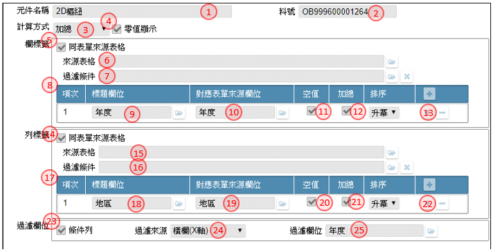
1. 表單元件：顯示表單元件的名稱
2. 料號：顯示表單元件的料號
3. 計算方式：計算方式有五種：加總、項目個數、平均值、最大值、最小值。
4. 零值顯示：勾選者，表示數值為零的欄位，顯示０，而不是空白
5. 欄標籤＿同表單來源表格：勾選者，表示資料欄的資料來源與表單相同，不額外指定
6. 欄標籤＿來源表格：當欄標籤＿同表單來源表格＝勾選時，本欄顯示表單的資料來源表格名。否則可開窗指定檢視表格名
7. 欄標籤＿過濾條件：依欄標籤＿來源表格的指定表格，可利用本鍵, 開啟[【條件式】](20. html#ConditionStatement)中, 指定限定符合的條件內容
8. 欄標籤＿欄位內容：在本表格設定要出現在樞紐表格欄上的欄位內容
9. 標題元件：依欄標籤＿來源表格的指定表格，挑選對應的輸出椚欄位
10. 對應表單來源欄位：依欄標籤＿來源表格的指定表格，挑選對應的輸出椚欄位
11. 空值：勾選時，表示空值的欄位也要出現
12. 加總：勾選時，表示數據要加總
13. 排序：下拉挑選升冪(由小到大排)/降冪(由大到小排列)
14. 列標籤＿同表單來源表格：勾選者，表示資料列的資料來源與表單相同，不額外指定
15. 列標籤＿來源表格：當列標籤＿同表單來源表格＝勾選時，本列顯示表單的資料來源表格名。否則可開窗指定檢視表格名
16. 列標籤＿過濾條件：依列標籤＿來源表格的指定表格，可利用本鍵, 開啟[【條件式】](20. html#ConditionStatement)中, 指定限定符合的條件內容
17. 列標籤＿列位內容：在本表格設定要出現在樞紐表格列上的列位內容
18. 標題元件：依列標籤＿來源表格的指定表格，挑選對應的輸出椚列位
19. 對應表單來源列位：依列標籤＿來源表格的指定表格，挑選對應的輸出椚列位
20. 空值：勾選時，表示空值的列位也要出現
21. 加總：勾選時，表示數據要加總
22. 排序：下拉挑選升冪(由小到大排)/降冪(由大到小排列)
23. 條件列：勾選者，表示要出現過濾的條件
24. 過濾來源：指定要過濾的資料區域, 下拉: 資料(Z軸)/橫欄(X軸)/緃列(Y軸), 預設:資料(Z軸)
25. 條件列過濾欄位：依過濾來源給值 
　　資料(X軸)：依欄標籤＿來源表格，挑選表輸出元件 
　　資料(Y軸)：依列標籤＿來源表格，挑選表輸出元件 
　　資料(Z軸)：依表單檢視表，挑選表輸出元件 
26. 新增來源鍵 ：點選本鍵，增加來源的資料列
27. 刪除來源鍵 ：點選本鍵，刪除來源的資料列

## **10.A 元件加註複製** {#ObjectAnnotation_Copy}
> 作業目的：為了避免使用者操作時輸入不合規範的資料，需在欄位中針對輸入內容進行檢控。

1. 目的表單：顯示啟動本作業的表單名稱
2. 目的元件：顯示啟動本作業的按鈕名稱
3. 來源表單：挑選指定要複製的按鈕所在的表單名稱
4. 來源按鈕：挑選指定要複製的按鈕名稱
5. 規格項目：表列所有按鍵上可定義的功能項目，依作業需求進行勾選
6. 全選鍵：可利用本鍵，把所有的規格項目全數勾選，或全數取消
7. 載入鍵：點選本鍵時，會把來源按鈕在指定的規格項目裡所勾選的內容
8. 替代：來源按鈕在指定的規格項目若有使用到須要替換的項目時，會表列在本表格，供設計者挑選指定
9. 頁籤：顯示應替代內容所在的規格項目
10. 類型：顯示應替代內容使用到的類型
11. 原使用名稱：顯示應替代內容使用到的元件名稱
12. 替換名稱：依應替換元件原先定義的類型，挑選指定要替代的內容
13. 同名對應鍵：利用本按鍵，依替代表格內所出現的原使用名稱，找到本表單內有相同類型、相同名稱者進行對應，減少用戶挑選的時間
14. 替代鍵：點選按鍵，把已指定好的規格項目及替代內容，替換掉原本按鍵的加註定義
15. 附加鍵：點選按鍵，除了原有的規格定義外，把指定好的規格項目及替代內容，附加進來

---
[**回到章節目錄**](index.html#MainMenu)