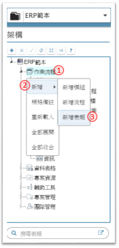
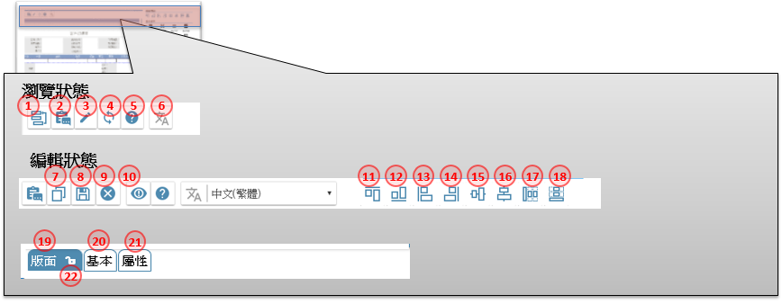
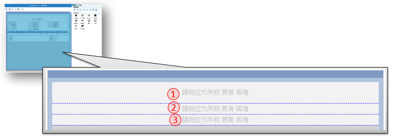
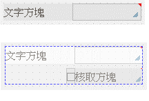
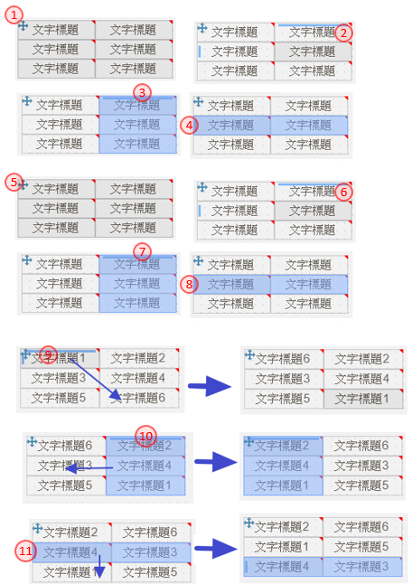
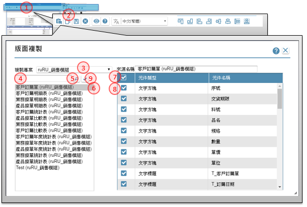
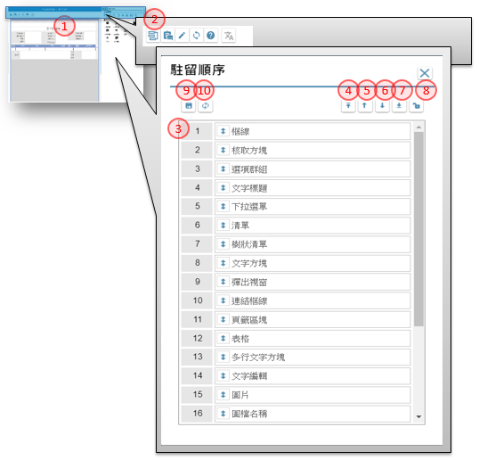

#摘要說明：
報表是單筆或是大量資料輸出的一種型態，以滿足作業上的需求。報表的宣告時機適在敘述作業流程時。後續再將其屬性及規格逐一補充完整。

## **13.1 作業報表的宣告**
報表被宣告(declare) 的方法有二:
 - 1. 由架構樹 的作業流程裡的流程裡, 使用單據, 同時建立作業報表的名稱
 - 2. 直接在架構樹的作業流程上, 新增作業報表。

### **13.1.1 新增報表**
>參考資料 
- [☢報表版面](https://youtu.be/tnbN6wM2frc){:target='_blank'} [℗報表版面](pdf/12-1-1報表版面.pdf){:target='_blank'}
- [☢階層設定](https://youtu.be/5WlLGbMsul0){:target='_blank'} [℗階層設定](pdf/12-1-2階層設定.pdf){:target='_blank'}

方法一：由作業流程節點，直接新增報表

1. 架構樹上的「作業流程」節點，利用滑鼠右鍵開啟選單後
2. 點選單內的新增項，進入第二層的選單
3. 選擇新增表報，開啟【新增表單／報表】頁面

方法二：在流程清單裡，建立新報表

1. 在流程清單裡的活動類型選擇：報表
2. 駐留表單／報表名稱欄位，會出現【單據清單】，點選其新增鍵，就會開啟【新增表單／報表】的頁面

1. 類型：選擇 報表
2. 名稱：輸入要新增的報表名稱
3. 作業代號：輸入要新增的的作業代號，同一專案下不允重複
4. 功能說明：描述本張報表的作用
5. 使用時機：說明本張報表的操作情況及時機
6. 儲存鍵：系統依報表名稱，產生空白版面

## **13.2 報表版面介紹**
> 作業目的：在不同的版面區域均安排不同用途的操作介面,以方便完成版面的編排。

### **13.2.1 工具列**
> 功能說明：在編輯模式及瀏覽模式下的按鈕選項有些差異, 以下說明。
> 參考資料： [☢報表元件對齊功能](https://youtu.be/-7i5kFINXY0){:target='_blank'} [℗報表元件對齊功能](pdf/12-3-3報表元件對齊功能.pdf){:target='_blank'}

1. 駐留順序鍵：點選後，開啟【駐留順序】調整各元件駐留順序
2. 規格描述鍵：點選後，開啟[【規格描述】](06.html#SpecificationAnnotated)檢視及設定各元件的規格說明。操作方式請參考［6.1.1］
3. 編輯鍵：進入報表版面編輯模式
4. 畫面同步鍵：當專案設有多語系時，各版面是獨立設定。可依版面指定的語系為依據，改變其它語系的版面
5. 線上說明鍵：點選後，開啟【線上說明】駐留在表單版面說明
6. 語系：依據專案多語的設定，可下拉選擇不同語系的版面內容；選擇後依指定的語系顯示該語系版面內容
7. 複製鍵：點選後，開啟【複製報表元件】可複製其它單據存在的元件
6. 報表設定鍵：點選後，在屬性區會出現【報表屬性】的畫面，設定基本資訊
7. 規格描述鍵：開啟[【規格描述】](06.html#SpecificationAnnotated)進行規格說明。操作方式請參考［6.1.1］
8. 儲存鍵：將排版內容記錄儲存
9. 取消鍵：取消排版的異動, 回復到編輯前狀態
10. 顯示異動項目鍵：切換是否標示有異動的元件內容
11. 對齊工具列_置上鍵：在複選多個元件的狀態下, 以標註的元件為基準, 向上對齊
12. 對齊工具列_置下鍵：在複選多個元件的狀態下, 以標註的元件為基準, 向下對齊
13. 對齊工具列_置左鍵：在複選多個元件的狀態下, 以標註的元件為基準, 向左對齊
14. 對齊工具列_置右鍵：在複選多個元件的狀態下, 以標註的元件為基準, 向右對齊
15. 對齊工具列_垂直置中鍵：在複選多個元件的狀態下, 以標註的元件為基準, 垂直置中對齊
16. 對齊工具列_水平置中鍵：在複選多個元件的狀態下, 以標註的元件為基準, 水平置中
17. 對齊工具列_同寬鍵：在複選多個元件的狀態下, 以標註的元件為基準, 將其它元件設為同寬度
18. 對齊工具列_同高鍵：在複選多個元件的狀態下, 以標註的元件為基準, 將其它元件設為同高度
19. 屬性區_版面頁：顯示與版面元件類型清單，供拖拉、挑選
20. 屬性區_報表頁：顯示及設定報表有關的資訊
21. 屬性區_屬性頁：顯示及設定元件、按鍵有關的資訊

### **13.2.2 編輯區**
> 功能說明：利用拖拉的方式, 在元件清單中,挑選元件到本區域, 移動位置、調整大小, 組成版面所屬的樣式。

1. 頁首：顯示報表的主要的資訊區塊
2. 頁身：呈現報表指定的資料列內容
3. 頁尾：呈現報表表尾要落的條文

## **13.3 報表屬性設定**
> 功能說明：使用於純粹顯示文字，不需要資料輸入；即，不是輸入欄位的文字顯示。

<table>
  <tr>
    <td width="40%" > </td>
    <td>
     1. 報表名稱：此報表的命名，使用於規格設定時的資源名稱(resource name) 
     2. 作業代號：出現在文件旳作業號 
3. 報表料號：顯示報表的料號 
4. 報表成品料號：顯示報表的成品料號 
5. 紙張大小：挑選紙張大小 
6. 列印方向：下拉挑選直向／橫向 
7. 寛度(pcx)：若紙張大小為制式標準時，此處顯示寛度(pcx),若自訂義時，可依需求自行輸入 
8. 寛度(cm)：若紙張大小為制式標準時，此處顯示寛度(pcx),若為自訂義時，可依需求自行輸入 
9. 高度(pcx)：若紙張大小為制式標準時，此處顯示高度(pcx),若為自訂義時，可依需求自行輸入 
10. 高度(cm)：若紙張大小為制式標準時，此處顯示高度(pcx),若為自訂義時，可依需求自行輸入 
11. 背景圖：可利用底圖做為比對位置之用，報表不輸出此內容。開啟[【圖示設定】](16.html#Icon) 
12. 邊界＿上：報表保留的上邊界 
13. 邊界＿下：報表保留的下邊界 
14. 邊界＿左：報表保留的左邊界 
15. 邊界＿右：報表保留的右邊界 
    </td>
  </tr>
</table>

## **13.4 報表元件類型(component type in form)**
> 作業目的：作業報表的操作畫面是由許多的元件所組成的，基本的元件共14個，包含顯示目的的文字說明與執行時的圖片顯示，以及資料輸入的各類方法元件。

<table>
  <tr>
    <td width="40%" > </td>
    <td>
    1. 文字標題(label)：顯示標題用 
    2. 單行文字(TextEdit)：最常使用，顯示有來源資料 
    3. 多行文字(MultiEdit)：當資料須多行顯示時，可使用 
    4. 核取方塊(check box)：多項選擇的勾取格 
    5. 多筆表格(Table)：多欄位且有多筆物件 
    6. 企業圖示(logo)：目前限定選擇圖示中的公司LOGO 
    7. 圖片(image)：顯示來源為圖示者 
    8. 框線(border)：顯示框線用 
    9. 條碼(Barcode)：條碼格式 
    10. 崁入圖表：是要崁入統計圖表 
    </td>
  </tr>
</table>

### **13.4.1 文字標題(label)**
> 功能說明：使用於純粹顯示固定文字，無關資料來源。

<table>
  <tr>
    <td width="40%" > </td>
    <td>
    1. 元件類型：說明本元件的類型名稱 
    2. 元件名稱：此元件的命名 
    3. 所屬階層：顯示元件的的位階在報表的階層名稱 
    4. 標題：此元件的顯示在版面上的文字 
    5. X軸座標：相對於編輯區起點的X軸 
    6. Y軸座標：相對於編輯區起點的Y軸 
    7. 寬度：元件的寬度 
    8. 高度：元件的高度 
    9. 自訂樣式：此元件的在指定的單元樣式 
    </td>
  </tr>
</table>

### **13.4.2 文字方塊(Text)**
> 功能說明：使用於需要一般性文數字資料輸入的元件，可以帶有顯示標題，也可以不要顯示標題。也可以設定是一個純顯示用的欄位。。

<table>
  <tr>
    <td width="40%" > </td>
    <td>
    1. 元件類型：說明本元件的類型名稱 
    2. 元件名稱：此元件的命名 
    3. 所屬階層：顯示元件的的位階在報表的階層名稱 
    4. X軸座標：相對於編輯區起點的X軸 
    5. Y軸座標：相對於編輯區起點的Y軸 
    6. 寬度：元件的寬度 
    7. 高度：元件的高度 
    8. 顯示標題：是否有標題的顯示 
    9. 標題內容：此元件的顯示在版面上的標題文字 
    10. 標題位置：標題顯示在原文件的上、下、左、右 
    11. 標題寬度：標題的寬度，若標題位置在上、下時，限定與元件內容同寛度；不允修改 
    12. 標題高度：標題的高度，若標題位置在左、右時，限定與元件內容同高度；不允修改 
    13. 自訂樣式：此元件的在指定的單元樣式 
    </td>
  </tr>
</table>

### **13.4.3 多行文字(MultiEdit)**
> 功能說明：使用於文字性資料長資料的欄位，可以使用多行空間來收集或呈現資料。其餘屬性與文字方塊(單行) 相同。可以帶有顯示標題，也可以不要顯示標題；也可以設定是一個純顯示用的欄位，操作者無法鍵入資料。

<table>
  <tr>
    <td width="40%" > </td>
    <td>
    1. 元件類型：說明本元件的類型名稱 
    2. 元件名稱：此元件的命名 
    3. 所屬階層：顯示元件的的位階在報表的階層名稱 
    4. X軸座標：相對於編輯區起點的X軸 
    5. Y軸座標：相對於編輯區起點的Y軸 
    6. 寬度：元件的寬度 
    7. 高度：元件的高度 
    8. 顯示標題：是否有標題的顯示 
    9. 標題內容：此元件的顯示在版面上的標題文字 
    10. 標題位置：標題顯示在原文件的上、下、左、右 
    11. 標題寬度：標題的寬度，若標題位置在上、下時，限定與元件內容同寛度；不允修改 
    12. 標題高度：標題的高度，若標題位置在左、右時，限定與元件內容同高度；不允修改 
    13. 自訂樣式：此元件的在指定的單元樣式 
    </td>
  </tr>
</table>

### **13.4.4 核取方塊(check box)**
> 功能說明：使用於文字性資料長資料的欄位，可以使用多行空間來收集或呈現資料。其餘屬性與文字方塊(單行) 相同。可以帶有顯示標題，也可以不要顯示標題；也可以設定是一個純顯示用的欄位，操作者無法鍵入資料。。

<table>
  <tr>
    <td width="40%" > </td>
    <td>
    1. 元件類型：說明本元件的類型名稱 
    2. 元件名稱：此元件的命名 
    3. 所屬階層：顯示元件的的位階在報表的階層名稱 
    4. X軸座標：相對於編輯區起點的X軸 
    5. Y軸座標：相對於編輯區起點的Y軸 
    6. 寬度：元件的寬度 
    7. 高度：元件的高度 
    8. 顯示標題：是否有標題的顯示 
    9. 標題內容：此元件的顯示在版面上的標題文字 
    10. 標題位置：標題顯示在原文件的上、下、左、右 
    11. 標題寬度：標題的寬度，若標題位置在上、下時，限定與元件內容同寛度；不允修改 
    12. 標題高度：標題的高度，若標題位置在左、右時，限定與元件內容同高度；不允修改 
    13. 自訂樣式：此元件的在指定的單元樣式 
    </td>
  </tr>
</table>

### **13.4.5 多筆表格(Table)**
> 功能說明：使用於在報表上放置圖片，訂出圖片顯示的寬與高。	可以定義圖片標題顯示於此圖片的相對位置，也可以不要顯示標題文字。

<table>
  <tr>
    <td width="40%" > </td>
    <td>
    1. 水平欄數：指要產生表格的欄數 
    2. 垂直列數：指要產生表格的列數 
    3. 預設類型：指定產生標題類型，下拉：元件類型 
    4. 確認鍵：確認產生依指定欄、列數的表格 
    5. 元件類型：說明本元件的類型名稱 
    6. 元件名稱：此元件的命名 
    7. 所屬階層：顯示元件的的位階在報表的階層名稱 
    8. X軸座標：相對於編輯區起點的X軸 
    9. Y軸座標：相對於編輯區起點的Y軸 
    10. 寬度：元件的寬度 
    11. 高度：元件的高度 
    12. 水平欄數：顯示表格的水平欄數 
    13. 垂直列數：顯示表格的垂直列數 
    </td>
  </tr>
</table>

### **13.4.6 企業圖示(logo)**
> 功能說明：

<table>
  <tr>
    <td width="40%" > </td>
    <td>
    1. 元件類型：說明本元件的類型名稱 
    2. 元件名稱：此元件的命名 
    3. 所屬階層：顯示元件的的位階在報表的階層名稱 
    4. X軸座標：相對於編輯區起點的X軸 
    5. Y軸座標：相對於編輯區起點的Y軸 
    6. 寬度：元件的寬度 
    7. 高度：元件的高度 
    8. 顯示標題：是否有標題的顯示 
    9. 標題內容：此元件的顯示在版面上的標題文字 
    10. 標題位置：標題顯示在原文件的上、下、左、右 
    11. 標題寬度：標題的寬度，若標題位置在上、下時，限定與元件內容同寛度；不允修改 
    12. 標題高度：標題的高度，若標題位置在左、右時，限定與元件內容同高度；不允修改 
    13. 自訂樣式：此元件的在指定的單元樣式 
    </td>
  </tr>
</table>

### **13.4.7 圖片(image)**
> 功能說明：使用於在報表上放置圖片，訂出圖片顯示的寬與高。可以定義圖片標題顯示於此圖片的相對位置，也可以不要顯示標題文字。

<table>
  <tr>
    <td width="40%" > </td>
    <td>
    1. 元件類型：說明本元件的類型名稱 
    2. 元件名稱：此元件的命名 
    3. 所屬階層：顯示元件的的位階在報表的階層名稱 
    4. X軸座標：相對於編輯區起點的X軸 
    5. Y軸座標：相對於編輯區起點的Y軸 
    6. 寬度：元件的寬度 
    7. 高度：元件的高度 
    8. 顯示標題：是否有標題的顯示 
    9. 標題內容：此元件的顯示在版面上的標題文字 
    10. 標題位置：標題顯示在原文件的上、下、左、右 
    11. 標題寬度：標題的寬度，若標題位置在上、下時，限定與元件內容同寛度；不允修改 
    12. 標題高度：標題的高度，若標題位置在左、右時，限定與元件內容同高度；不允修改 
    </td>
  </tr>
</table>

### **13.4.8 框線(border)**
> 功能說明：

<table>
  <tr>
    <td width="40%" > </td>
    <td>
    1. 元件類型：說明本元件的類型名稱 
    2. 元件名稱：此元件的命名 
    3. 所屬階層：顯示元件的的位階在報表的階層名稱 
    4. X軸座標：相對於編輯區起點的X軸 
    5. Y軸座標：相對於編輯區起點的Y軸 
    6. 寬度：元件的寬度 
    7. 高度：元件的高度 
    8. 自訂樣式：此元件的在指定的單元樣式 
    </td>
  </tr>
</table>

### **13.4.9 條碼(Barcode)**
> 功能說明：使用於在報表上放置圖片，訂出圖片顯示的寬與高。	可以定義圖片標題顯示於此圖片的相對位置，也可以不要顯示標題文字。

<table>
  <tr>
    <td width="40%" > </td>
    <td>
    1. 元件類型：說明本元件的類型名稱 
    2. 元件名稱：此元件的命名 
    3. 所屬階層：顯示元件的的位階在報表的階層名稱 
    4. X軸座標：相對於編輯區起點的X軸 
    5. Y軸座標：相對於編輯區起點的Y軸 
    6. 寬度：元件的寬度 
    7. 高度：元件的高度 
    8. 條碼類型：條碼的類型，下拉：一維條碼／二維條碼 
    9. 編碼格式：依條碼類型指定格式，當 條碼類型=一維條碼 時, 下拉: Code39 / Code128, 預設: Code128　當 條碼類型=二維條碼 時, 下拉: QRCode / PDF417, 預設: QRCode 
    10. 自訂樣式：此元件的在指定的單元樣式 
    </td>
  </tr>
</table>

### **13.4.10 崁入圖表**
> 功能說明：

<table>
  <tr>
    <td width="40%" > </td>
    <td>
    1. 元件類型：說明本元件的類型名稱 
    2. 元件名稱：此元件的命名 
    3. 所屬階層：顯示元件的的位階在報表的階層名稱 
    4. X軸座標：相對於編輯區起點的X軸 
    5. Y軸座標：相對於編輯區起點的Y軸 
    6. 寬度：元件的寬度 
    7. 高度：元件的高度 
    8. 顯示標題：是否有標題的顯示 
    9. 標題內容：此元件的顯示在版面上的標題文字 
    10. 標題位置：標題顯示在原文件的上、下、左、右 
    </td>
  </tr>
</table>

## **13.5 報表繪製的操作**
> 作業目的：使用於報表版面美化，調整報表元件的寬高、位置。

### **13.5.1 報表元件移位的操作 ove component location**
> 功能說明：可以單個元件處理，也可以以群組處理。

**一般元件：**		

1. 移動位置：當元件的外框出現駐留的陰影時, 即對著元件按下滑鼠左鍵不放, 進行移動, 待確定位置後, 放掉滑鼠左鍵					
2. 調整寬高：在元件的右下角有一調整的符號, 滑鼠移到該符號上, 按下滑鼠左鍵不放, 進行拖拉動作,  待確定大小後, 放掉滑鼠左鍵					
3. 圈選多元件: 同時選擇多個元件(左圖)一併做位置上的調整時, 可將滑鼠移到空白處, 按下滑鼠左鍵進行拖拉動作, 將要選擇的元件, 包含在框框內, 放掉滑鼠左鍵, 即產生右圖的結果					
4. 複製：對元件進行圈選的動作後, Ctrl+C 複製		
5. 貼上：將已複製的元件貼在目前游標所在位置, Ctrl+V 貼上					
6. 刪除：圈選元件後, 鍵盤 Delete鍵					
7. 對齊：對多元件進行圈選的動作後, 被圈選的元件中會出現一個紅色框線的元件(圈選的過程中, 第一個被完全包含在框框內的元件), 則是對齊的基準元件,在點選工具列的對齊項目時, 皆以該元件為標準。				

**多筆表格元件：**

1. 定位指標：滑鼠左鍵長按, 點選本符號, 可拖拉多筆表格位置					
2. 駐留顯示：當駐留在表格內元件時, 直欄感應條及橫列感應條會駐留在相對位置					
3. 直欄感應條 : 點選時，可標註單欄					
4. 橫列感應條 : 點選時，可標註單列
5. 定位指標：滑鼠左鍵長按, 點選本符號, 可拖拉多筆表格位置					
6. 駐留顯示：當駐留在表格內元件時, 直欄感應條及橫列感應條會駐留在相對位置					
7. 直欄感應條 : 點選時，可標註單欄				
8. 橫列欄感應條 : 點選時，可標註單列
9. 欄位移動：點選單一欄位後，按著滑鼠左鍵拖拉到預定位置後，放開滑鼠後，會把欄位互調		
10. 整欄移動：點選單一欄後，按著滑鼠左鍵拖拉到預定位置後，放開滑鼠後，會把移動的整欄插在目的欄位之前			

### **13.5.2 編輯狀態的右鍵的操作**
> 功能說明：可以單個元件處理，也可以以群組處理。

<table>
  <tr>
    <td width="40%" > </td>
    <td>
    新的一般元件： 
    1. 刪除：刪除本元件 	    
    已經過存檔後的元件： 			
    2. 功能敍述鍵：點選後，開啟[【規格描述】](06.html#SpecificationAnnotated)設定本元件的規格說明。操作方式請參考［6.1.1］ 
    3. 規格定義鍵：點選後，開啟[【規格定義】](06.html#SpecificationDefinition)畫面，並駐留在相關元件上，操作方式請參考［6.2］ 
    </td>
  </tr>
  <tr>
    <td width="40%" > </td>
    <td>
    多筆表格： 					
    4. 駐留單一欄位 					
    5. 此處的刪除欄，是刪除直欄感應條所在的整欄 
    6. 此處的刪除欄，是刪除橫列欄感應條所在的整列 
    7. 標註一整欄 
    8. 可在駐留欄插入一整欄 
    9. 可新增一整列 
    10. 此處的刪除欄，是刪除直欄感應條所在的整欄 
    11. 標註一整列	 
    12. 可新增一整欄 
    13. 可在駐留欄插入一整列 
    14. 此處的刪除，是刪除橫列感應條所在的整列 
    </td>
  </tr>
  <tr>
    <td width="40%" > </td>
    <td>
    階層區塊： 					
    15. 駐留在各階層的版面上 
    16. 新增鍵：可在版面上新增階層區塊 
    17. 報表階層：區分為４個固定的階層，頁首／頁身／頁尾／總計，區分為８個變動的階層，由階層一到八 
    18. 階層位置：可指定分佈在階首或階尾，依勾選的數目產生階層區塊 
    19. 階層高度：駐留指定在某階區塊時，可設定高度 
    </td>
  </tr>
</table>

### **13.5.3 複製其它報表的元件 copy component from a form**
> 功能說明：為了加快報表元件的規格定義，如果知道本專案已完成的報表中有相同的規格，或是部分相同的規格可以參考使用，則可以把它的內容複製過來修改使用；分為完全複製及部分複製。
> 參考資料：
-  [☢報表內元件複製](https://youtu.be/ev7KgAkcgHk){:target='_blank'} [℗報表內元件複製](pdf/12-3-1報表內元件複製.pdf){:target='_blank'}
-  [☢從其它報表複製元件](https://youtu.be/CDOAVqkPpqw){:target='_blank'} [℗從其它報表複製元件](pdf/12-3-2從其它報表複製元件.pdf){:target='_blank'}

1. 駐留報表工具列，進入報表編輯狀態
2. 複製鍵：點選工具列本鍵，開啟【報表版面複製】，操作方式請參考［13.5.3］
3. 複製專案：挑選欲複製來源報表的專案，必須具該專案的權限可允檢視
4. 關鍵字：輸入要查詢的報表關鍵字
5. 搜尋鍵：依據指定的關鍵字，畫面出現符合條件的報表清單
6. 報表名稱：指定要複製的來源報表
7. 全選/全不選：利用此核取方塊，決定全選/全不選指定報表的所有元件
8. 勾選指定：針對報表的元件, 進行勾選／取消的動作
9. 複製鍵：將指定的報表元件，所勾選的元件複製到目的報表

## **13.6 駐留順序設定**
> 功能說明：如果報表操作的欄位順序(按tab 鍵到下一個欄位) 與宣告順序不同，或是經過位置調整過後的順序整理。

1. 在報表版面的瀏覽狀態
2. 駐留順序鍵：點選工具列本鍵，開啟【駐留順序】 ，操作方式請參考［5.7］
3. 移動 : 駐留報表欄位資料列，按住滑鼠往上或往下拖拉到指定的位置，再放掉滑鼠
4. 解鎖: 解除鎖定的欄位
5. 頂端：把鎖定的多欄位, 移到是前面
6. 上移：把駐留的單一欄位或鎖定的多欄位, 往上移
7. 下移：把駐留的單一欄位或鎖定的多欄位, 往下移
8. 底端：把駐留的單一欄位或鎖定的多欄位, 移到是後面
9. 存回: 儲存調整後的駐留順序
10. 取消: 取消編修後的內容

---
[**回到章節目錄**](index.html#MainMenu)