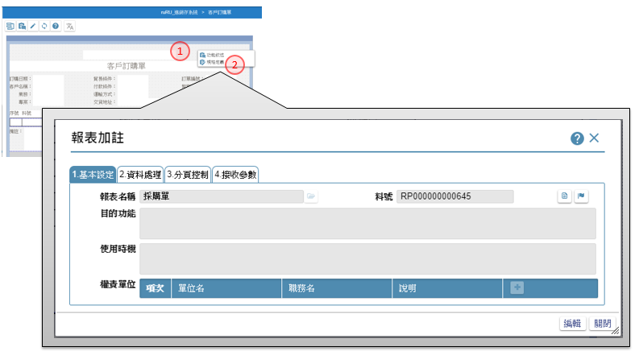
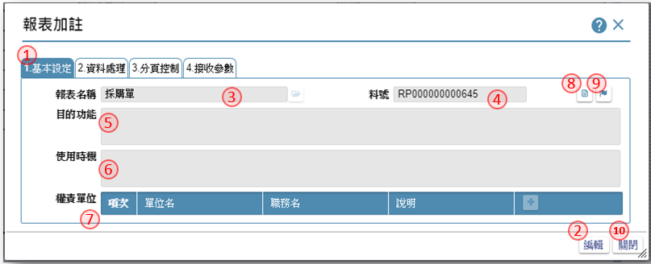
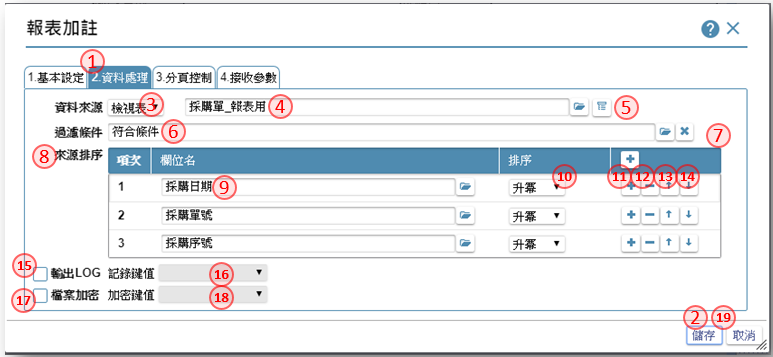
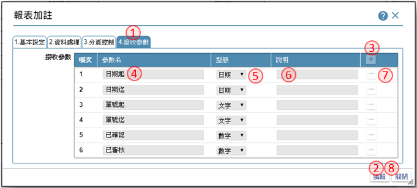

> 作業目的：在完成報表的版面設計，宣告了報表上的資料欄位，接下來就是對各個輸出的資料欄位定義其資料處理規格，以滿足報表的需求。
參考資料：

1. 在表單版面空白處，點選滑鼠右鍵
2. 在選單中，選擇「規格定義」 ，即可開啟【報表加註】

## **14.1 基本設定**
> 作業目的：報表的基本資料。
參考資料：[☢影片](https://youtu.be/5vJPh1n7Xzo){:target='_blank'} [℗文件](pdf/13-1開啟報表規格定義介面.pdf){:target='_blank'}

1. 基本設定：駐留本頁籤進行報表的基本設定
2. 編輯鍵：點選本鍵，進入編輯狀態
3. 報表名稱：顯示報表的名稱，可利用開窗鍵, 開啟[【多語詞庫】](16.html#MaintainMultilingual)指定挑選詞庫, 請參考［16.2］來變更內容
4. 料號：顯示報表的料號
5. 目的功能：顯示已輸入的規格內容
6. 使用時機：輸入本報表的使用時機
7. 權責單位：
8. 規格描述：開啟[【規格描述】](06.html#SpecificationAnnotated)進行規格說明。操作方式請參考［6.1.1］
9. 開完工鍵：點選本按鍵決定是否完工，影響【專案統計】內容
10. 儲存鍵：把內容儲存到資料庫

## **14.2 資料處理**
> 作業目的：說明報表主要的資料來源及排序的方式、是否登冊使用記錄等。
參考資料：
-  [☢資料來源為資料表](https://youtu.be/M2UpgOOBk50){:target='_blank'} [℗資料來源為資料表](pdf/13-2-1資料來源為資料表.pdf){:target='_blank'}
-  [☢資料來源為檢視表](https://youtu.be/sWe0maCvGG0){:target='_blank'} [℗資料來源為檢視表](pdf/13-2-2資料來源為檢視表.pdf){:target='_blank'}

1. 資料處理：駐留本頁籤進行報表資料來源上的設定
2. 編輯鍵：點選本鍵，進入編輯狀態
3. 來源類別：指定報表資料的來源表格類別，下拉：資料表/檢視表
4. 載入來源：依查表來源，開窗挑選指定表格名稱
5. 參數鍵：依該檢視表是否有定義接收參數，而點選本鍵開啟[【傳遞參數】](20.html#PassParameters)，操作說明請參考［附錄A3］
6. 過濾鍵：可利用本鍵, 開啟[【條件式】](20.html#ConditionStatement)中, 指定表格來源記錄的符合條件內容，操作說明請參考［附錄A1］
7. 清除鍵：利用本鍵清除原指定的條件式
8. 來源排序：指定來源表格記錄要求的排序方式出現在報表資料列
9. 排序欄位：開窗挑選指定的來源表格的欄位清單
10. 排序方式：下拉挑選升冪(由小到大排)/降冪(由大到小排列)
11. 排序增加鍵：增加排序的項目
12. 排序刪除鍵：刪除排序的項目
13. 排序上移鍵：往上移動資料列的順序
14. 排序下移鍵：往下移動資料列的順序
15. 輸出LOG：勾選本項，表示在報表列印或輸出時，會記錄輸出者的相關記錄
16. 記錄鍵值：輸入可辨視報表差異的鍵值，挑選接收的參數
17. 檔案加密：勾選本項，表示在報表輸出成excel 及PDF檔時，會進行加密動作
18. 加密鍵值：指定輸出excel 及PDF檔時, 要加密的鍵值，挑選接收的參數
19. 儲存鍵：把內容儲存到資料庫

## **14.3 階層分頁**
> 作業目的：本作業針對報表階層、分頁上的需求進行指定。
參考資料：[☢影片](https://youtu.be/ITLZx-VJkBw){:target='_blank'} [℗文件](pdf/13-3分頁控制.pdf){:target='_blank'}

1. 分頁控制：駐留本頁籤進行報表分頁上的設定
2. 編輯鍵：點選本鍵，進入編輯狀態
3. 階層別：本清單顯示版面上區分的報表階層
4. 資料欄位：本清單顯示歸屬在報表階層別下的元件內容
5. 駐留資料欄位：駐留要列入分群的欄位項目
6. 向右加入鍵：將階層群組及搭配的報表元件，加入右側群組依據中
7. 向左移除鍵：駐留已設定的群組依據，按下後則移除該群組依據
8. 分群項目鍵：階層名稱＋報表元件名稱，若有多筆可設定排序
9. 向上鍵：把駐留的分群項目往上移動排序
10. 向下鍵：把駐留的分群項目往下移動排序
11. 分頁模式：選擇報表分頁的基礎 
依版面空間：即版面已滿時才會換頁 
依資料行數：限定頁身指定行數 
依階層別：挑選依據階層，依上述設定階層群組依據異動而分頁 
12. 資料行數：分頁模式＝依資料行數，在本欄位輸入指定行數
13. 依階層別：分頁模式＝依階層別，下拉挑選階層別
14. 換頁重印：指報表換頁時，頁首內容是否於次頁中顯示
15. 頁尾位置：指定頁尾的資訊出現的位置， 
	固定版面底部，即將頁尾內容固定置於報表最下方 
	跟隨資料列，即將頁尾資料內容，置於頁身或階尾內容的下方顯示 
16. 儲存：把內容儲存到資料庫

## **14.4 接收參數**
> 作業目的：當報表接受外部的條件指定時，可利用參數方式接收資訊，做為後續處理的依據。
參考資料：[☢影片](https://youtu.be/uhzk-s5C2uo){:target='_blank'} [℗文件](pdf/13-4.接收參數.pdf){:target='_blank'}

1. 接收參數：駐留在本頁籤下，設定參數的內容
2. 編輯鍵：點選本鍵，進入編修模式
3. 新增鍵：點選 + 新增鍵新增檢視表的初始記錄。
4. 參數名：輸入本筆資料欄位要預設的內容值。
5. 型態：下拉挑選, 型態:文字/數字/日期
6. 說明：輸入參數用途
7. 新增參數項目鍵：新增參數資料列
8. 儲存鍵：點選本鍵，把異動後的資料存回資料庫

---
[**回到章節目錄**](index.html#MainMenu)