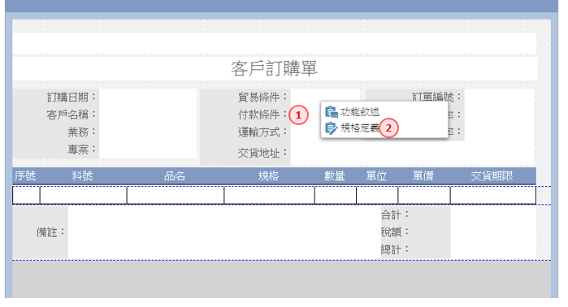
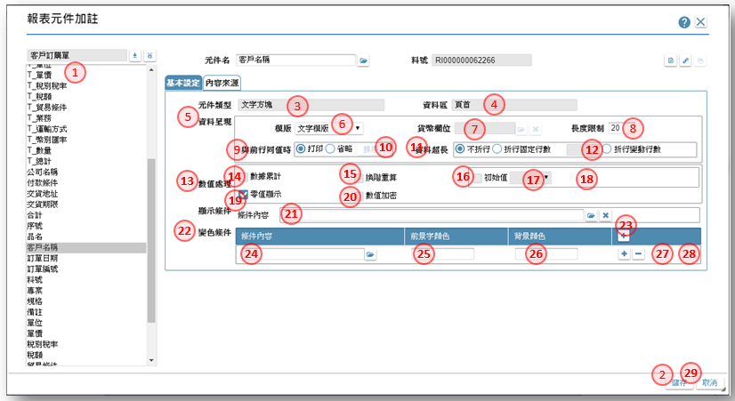
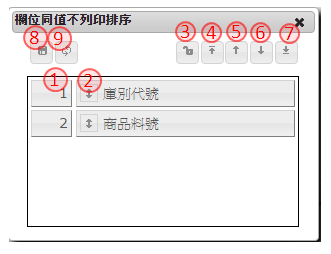
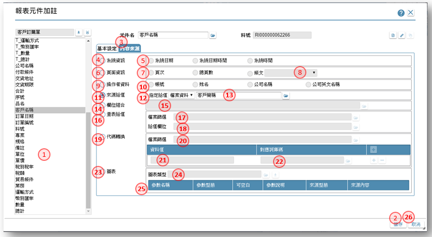

#作業目的：
在完成報表的版面設計，宣告了報表上的資料欄位，接下來就是對各個輸出的資料欄位定義其資料處理規格，以滿足報表的需求。
>

## **15.1 開啟報表元件加註**
> 作業目的：設定每一個報表元件的資料處理規格。開啟的方式有二：一是自報表版面開啟，二是自報表元件清單中開啟。
> 參考資料：[☢影片](https://youtu.be/Py6MolPqeUM){:target='_blank'} [℗文件](pdf/14-1報表元件之規格定義介面.pdf){:target='_blank'}

1. 開啟報表版面，駐留報表元件
2. 點選滑鼠右鍵，選擇「規格定義」

## **15.2 基本設定**
> 作業目的：針對報表元件顯示的基本設定
> 參考資料：[☢影片](https://youtu.be/P3GTmftCSvE){:target='_blank'} [℗文件](pdf/14-2報表元件基本設定說明.pdf){:target='_blank'}

1. 報表元件清單：駐留要定義規格的報表元件資料列													
2. 編修鍵：點選本鍵，進入編修狀態													
3. 元件類型：顯示本報表元件的類型													
4. 資料區：顯示本欄位所屬的資料區域，由版面的位置決定													
5. 資料呈現：本區塊在設定元件的本屬性													
6. 模版：挑選指定元件呈現的模版樣式													
7. 貨幣欄位：若模版是貨幣屬性，且顯示金錢符號時，必須宣告指定對應的幣別欄位					
8. 長度限制：輸入顯示在報表上的最大長度													
9. 與前行同值時：即當相同資料區內同一欄位資料內容相同時要處理的方式 
　打印：表示資料相同也重複列印 
　空白：表示資料相同時，以空白顯示，而不重複列印 
10. 排序鍵：													
11. 資料超長：當儲存在資料庫裡的內容，超出限定的顯示長度時，處理模式 
　不折行：以限定長度做為顯示的依據 
　折行固定行高：將超出的部份進行換行的動作，但限定在固定的高度內 
　折行變動行高：將超出的部份進行換行的動作，但不限定高度，以完整顯示為準 
　附註：若為頁身元件，則會依版面寬度超過即折行顯示，若非頁身元件，有折行需求時，則須設定多行文字方塊元件。 
12. 折行固定行高數：在資料超長時，處理模式＝折行固定行高，則輸人行數						
13. 數值處理區：本區塊要處理的是數值計算的相關設定													
14. 數據累計：勾選本項時，表示要進行數據的累計													
15. 換階重算：勾選本項，表示數據累計是否有須要重置的功能													
16. 初始值：在勾選數據累計的狀況下，設定本欄位是否有參考的初始值依據勾選時，表示有		
17. 初始值參考類別：指定給初始值類別，下拉：自訂／欄位／元件／參數									
18. 初始值參考內容：依 [初始值參考類別] 內容，進行不同介面給值												
19. 零值顯示：勾選本項，表示數據是０的欄位，要顯示０；否則顯示空白
20. 數值加密：勾選本項，表示數據內容以＊號取代，不直接顯示內容
21. 顯示條件：欄位若在指定的條件下才顯示者，必須在本處 開啟[【條件式】](20.html#ConditionStatement)中, 指定限定顯示的條件；否則無條件時，代表一律顯示													
22. 變色條件區：若欄位的顏色，在不同條件下特別的處理方式，可在本表格中指定內容
24. 變色條件：若在指定的變色的條件，開啟[【條件式】](20.html#ConditionStatement)中, 設定條件
22. 新增條件項目鍵：新增變色條件資料列													
25. 前景字顏色：設定字體顏色，開啟[【調色盤】](20.html#Palette)中, 挑選顏色													
26. 背景顏色：設定背景顏色，開啟[【調色盤】](20.html#Palette)中, 挑選顏色													
27. 插入條件項目鍵：在駐留筆插入變色條件資料列													
28. 刪除條件項目鍵：刪除變色條件資料列													
29. 儲存鍵：編輯模式，本按鍵會變成儲存作用，把異動後的資料存回資料庫													

### **15.2.1 欄位同值不列印排序**
> 作業目的：當報表裡有多個欄位是設定空白不列印時，可指定其空白判定的欄位順序

1. 單筆移動 : 駐留表單欄位資料列，按住滑鼠往上或往下拖拉到指定的位置，再放掉滑鼠
2. 多筆移動：利用鎖定鍵，挑選多筆欄位組成群組，按住滑鼠往上或往下拖拉到指定的位置，再放掉滑鼠
3. 解鎖: 解除鎖定的欄位
4. 頂端：把鎖定的多欄位, 移到是前面
5. 上移：把駐留的單一欄位或鎖定的多欄位, 往上移
6. 下移：把駐留的單一欄位或鎖定的多欄位, 往下移
7. 底端：把駐留的單一欄位或鎖定的多欄位, 移到是後面
8. 存回: 儲存調整後的駐留順序
9. 取消: 取消編修後的內容

## **15.3 資料處理**
> 作業目的：針對表單元件顯示的特殊規格。
> 參考資料： [☢影片](https://youtu.be/upQvWtSbzJU){:target='_blank'} [℗文件](pdf/14-3報表元件內容來源說明.pdf){:target='_blank'}

1. 報表元件清單：駐留要定義規格的報表元件資料列
2. 編修鍵：點選本鍵，進入編修狀態
3. 內容來源：切換到內容來源的頁籤
4. 來源＿系統資訊：選擇本項，表示資料來源由系統的資料取值
5. 系統資訊類別：挑選指定系統資訊的類別，選項：系統日期/系統日期時間/系統時間
6. 來源＿頁面資訊：選擇本項，表示資料來源由報表執行時的頁面資料取值
7. 頁面資訊類別：挑選指定頁面資訊的類別，選項：頁次/總頁數/系統時間/條文
8. 報表條文：當 頁面資訊類別＝條文時，開啟【報表條文】中, 指定要顯示的條文內容。操作說明請參考［16.6］
9. 操作者資料：選擇本項，表示資料來源由登入使用者的資料取值
10. 操作者資料類別：挑選操作者資料的類別，選項：帳號/姓名/公司名稱/公司英文名稱
11. 來源＿來源給值：選擇本項，表示資料來源由指定的來源取值
12. 指定給值類別：下拉：檔案資料/傳入參數/報表元件
13. 指定給值內容：依 [指定給值類別] 內容，進行不同介面給值
14. 來源＿欄位組合：選擇本項，表示資料來源由指定的來源取值
15. 欄位組合：開啟[【運算式】](20.html#ExpressionStatement)於運算式內容中設定組合欄位，適用於欄位來源非單一欄位者， 
EX:元件.品名規格，其來源即可設定欄位組合:欄位.品名+欄位.規格。 
16. 來源＿查表給值：選擇本項，表示資料來源須另行查表取得
17. 查表給值：開啟[【條件式】](20.html#ConditionStatement), 設定查表來源及相關過濾條件內容。
18. 給值欄位：依上述查詢表格過濾，挑選所需欄位
19. 來源＿代碼轉換：選擇本項，表示依據某欄位內容值進行輚換給值的動作
20. 檔案篩選：挑選判斷的來源欄位
21. 資料值：指定 [檔案篩選] 判斷的內容值
22. 對應詞庫碼：指定當 [檔案篩選] 的內容值=[資料值]時，應給的詞庫內容，開啟[【多語詞庫】](16.html#MaintainMultilingual)指定挑選詞庫，操作方法請參考［16.2］
23. 來源＿圖表：勾選本項，表示數據內容以圖表方式呈現
24. 圖表類型：開窗挑選圖表的樣式類型
25. 圖表類型參數：相關參數的填法說明：，請參考［附錄A.圖表］
26. 儲存鍵：編輯模式，本按鍵會變成儲存作用，把異動後的資料存回資料庫

## **15.4 其它功能**

1. 自動對應鍵：會出現提示訊息，按下確定後，系統會依報表加註資料來源欄位與報表元件名稱進行比對，將未設定加註內容元件，依相同名稱者執行自動對應。 資料處理：會將相同名稱欄位預設為來源給值。
附註：自動對應執行後，請依實際規格再進入調整模版及長度…等內容。
2. 欄位說明鍵：開啟[【規格描述】](06.html#SpecificationAnnotated)進行規格說明，操作方式請參考［6.1.1］
3. 元件清單鍵：可利用本鍵進入元件查詢的畫面，利用[【元件欄位清單】](15.html#ComponentList)查詢相關內容，請參考［15.4］
4. 複製鍵：可利用本鍵進入複製的頁面
5. 駐留報表：顯示啟動本作業的報表名稱
6. 駐留元件：顯示啟動本作業的元件名稱
7. 複製報表：挑選指定要複製的元件所在的報表名稱
8. 複製元件：挑選指定要複製的元件名稱
9. 載入鍵：點選本鍵時，會把來源元件的內容載入表格中
10. 替代內容：來源元件在指定的規格項目若有使用到須要替換的項目時，會表列在本表格，供設計者挑選指定
11. 類型：顯示應替代內容使用到的類型
12. 原使用名稱：顯示應替代內容使用到的元件名稱
13. 替換名稱：依應替換元件原先定義的類型，挑選指定要替代的內容
14. 同名對應鍵：利用本按鍵，依替代表格內所出現的原使用名稱，找到本報表內有相同類型、相同名稱者進行對應，減少用戶挑選的時間
15. 取代鍵：點選按鍵，把已指定好的規格項目及替代內容，替換掉原本按鍵的加註定義

---
[**回到章節目錄**](index.html#MainMenu)