# **17 設計輔助工具** 	 

* [**17.1 AT01.料號對照**](#PartNoList)
* [**17.2 AT02.BOM表**](#ProjectBOMStructure)
* [**17.3 AT03.結構追蹤**](#VersionStructire)
* [**17.4 AT04.版本發行**](#VersionRelease)
* [**17.5 AT11.表格欄位清單**](#TableFieldList)
* [**17.6 AT12.元件欄位清單**](#ComponentList)
* [**17.7 AT15.待辦事項清單**](#ToDoList)
* [**17.8 AT21.規格複製**](#CopyFromThisProject)
* [**17.9 AT22.跨專案複製**](#CopyFromOtherProject)
* [**17.10 AT31.規格書產出**](#ProduceDocument)

---
##  **17.1 AT01.料號對照**
> 作業目的：以料號來查詢其本質，包含名稱及類別，也可以連結到該元件的規格定義畫面，進行進一步的規格維護。如果是以名稱來載入，會將所有符合條件的元件全部載入，以供後續處理，包含對特定標的直接進行規格設定(連結操作)，或是加入代辦事項中，以利工作管理。

參考資料：[℗文件](pdf/18-11料號對照.pdf){:target='_blank'}

1. 指定料號：輸入要查詢的料號
2. 指定名稱：輸入要查詢的元件名稱
3. 載入鍵：利用本鍵，把符合指定料號或名稱的內容，表列在清單上
4. 以上全選鍵：以指定的記錄為準，將駐留以上資料勾選全部勾選
5. 以上取消鍵：以指定的記錄為準，將駐留以上資料勾選取消勾選
6. 以下全選鍵：以指定的記錄為準，將駐留以下資料勾選全部勾選
7. 以下取消鍵：以指定的記錄為準，將駐留以下資料勾選取消勾選
8. 反向選取鍵：利用本鍵，將清單內原勾選者改為取消勾選狀態，原無勾選者進行勾選狀態
9. 列入代辦鍵：利用本鍵，將開啟【列入待辦】視窗，將勾選的記錄，列入待辦清單中，操作說明請參考［17.7.1 列入待辦］
10. 勾選：針對單筆記錄行行勾選或取消的動作
11. 連結操作鍵：依駐留記錄的類型，開啟個別的規格定義註解視窗，方便檢視及異動內容

##  **17.2 AT01.BOM表**
> 作業目的：檢視專案下規格結構化的內容，方便展開或追溯各元件間的關係

參考資料：[℗文件](pdf/18-7BOM表.pdf){:target='_blank'}

1. 載入鍵：將專案內目前編輯區規格元件BOM表進行全展的動作
2. 重建ＢＯＭ表鍵：將專案內的BOM表重整
3. BOM清單：呈現專案下的材料結構內容，可利用各階節點的開合按鍵進行檢視

##  **17.3 AT03.結構追蹤**
> 作業目的：為了追蹤某個元件被哪些元件用到，或是將某個元件下的所有原件展開。在修改某個元件的規格時，可以了解影響的範圍，評估是否適合修改。ruRU IDE可查詢某個元件被哪些元件用到，或是某個元件下有用到哪些元件。

參考資料：[℗文件](pdf/18-8公用工具-結構追蹤.pdf){:target='_blank'}

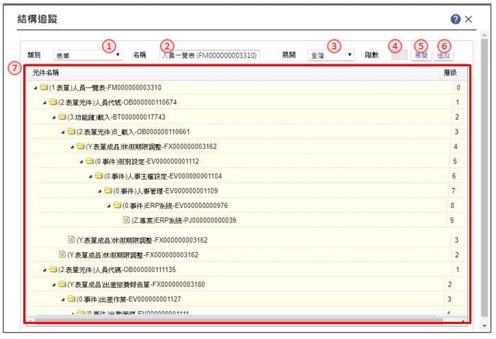
1. 類別：挑選指定查詢的類別，下拉清單顯示所有的元件類別
2. 名稱：依據指定的類別，開啟不同的內容的清單，供挑選指定
3. 展開方式：選擇展開階層的方式，選擇：全階／單階／指定
4. 階數：選擇展開方式＝指定時，在本欄位輸入展開的階數
5. 展開鍵：依指定的條件，以正展的方式將規格結構以BOM表階層展開，顯示在BOM清單中
6. 追踨鍵：依指定的條件，以逆展的方式將規格結構以BOM表階層展開，顯示在BOM清單中
7. BOM清單：呈現展開後的結果, 可利用各階節點的開合按鍵進行檢視

##  **17.4 AT04.版本發行**

參考資料：[℗文件](pdf/17版本發行.pdf){:target='_blank'}

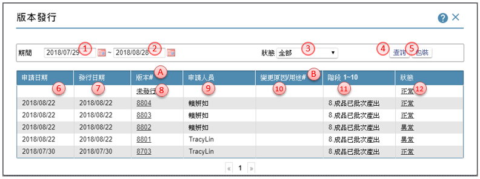
1. 日期起：輸入所要查詢的起始日期，預設為系統日期前一個月。
2. 日期迄：輸入所要查詢截止日期，預設為系統日期前一個月。
3. 狀態：選擇查詢的版本狀態，選項：全部／未發行／發行中／己發行／處理完成 
全部：所有的狀態 
未發行：已有異動但尚未發行的狀態 
發行中：已按下發行動作，但尚未完成動作者 
已發行：已發行完成，但尚未收到工廠段的回覆者 
處理完成：已收到工廠段的回覆狀態 
4. 查詢鍵：濾出符合關鍵字的內容到版本清單
5. 包裝鍵：把發行完成的系統程式打包成安裝檔，可點擊開啟【改版安裝檔指定作業】操作說明請參考［17.4.5 改版安裝檔指定作業］
6. 申請日期：顯示進行版本發行的日期，未發行者不顯示
7. 版本日期：顯示完成版本發行的日期，未發行者不顯示
8. 版本＃：顯示發行後的版本號；未發行者顯示＂未發行 
版本號的編碼原則＝西元年的最後2碼＋月份1碼＋流水號3碼 
未發行的內容可點擊連結，進行發行的動作，操作說明請參考［17.4.1 發行新版本］ 
版本號可點擊開啟【17.4.1 發行新版本】，檢視發行內容，操作說明請參考［17.4.2 檢視已發行版本］ 
9. 申請人員：顯示執行版本發行的人員姓名
10. 變更原因/用途：顯示駐留版本發行的說明
11. 階段：顯示駐留版本的執行階段
12. 狀態：顯示駐留版本的發行狀態，可點選開啟明細

A. **全版發行**：將全版的規格重新產生異動記錄，重新改版產出。 
B. **全版檢錯**：不限定檢查本次版有異動的記錄，而是將全版的規格重新檢查。 

### **17.4.1 發行新版本**
> 作業目的：將已定義完成的規格，發行到工廠，以自動產出到測試環境，以利測試驗證功能完整及品質保證針對狀態為未發行狀態的記錄，連結本動作

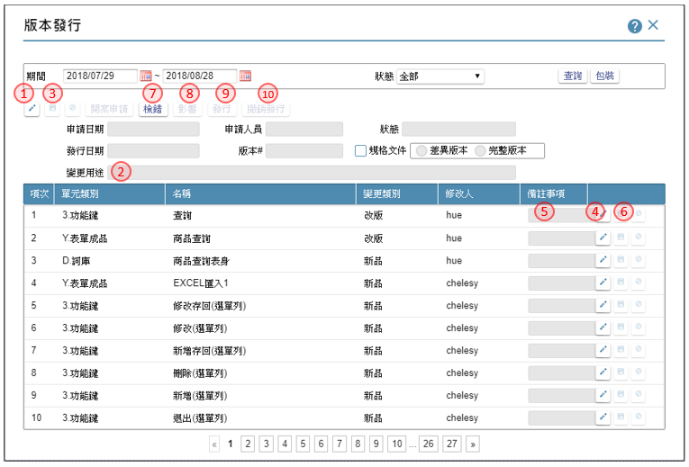
1. 編修鍵：點選本鍵，進入編修狀態
2. 變更用途：輸入此次異動版本的用途及說明內容
3. 儲存鍵：點選本鍵，將異動內容儲存資料庫
4. 異動記錄鍵：點選本鍵，進入編修指定異動單元的編修狀態
5. 備註事項：輸入此元件的異動原因及說明內容
6. 異動儲存鍵：點選本鍵，將異動內容儲存資料庫
7. 檢錯鍵：點選本鍵，將異動的所有內容進行語法檢查及相關驗證，當有錯誤時，會開啟【發行檢錯訊息】，表列錯誤內容，操作說明請參考［17.4.3 發行檢錯訊息］
8. 影響鍵：當通過除錯鍵後，便可利用本鍵開啟【版本發行影響】，顯示因本次異動所牽動連帶的影響內容，操作說明請參考［17.4.4 版本發行影響］
9. 發行鍵：當通過除錯鍵後，便可利用本鍵開始發行的動作
10. 撤銷發行鍵：當前一版本已發行但未到處理完成的階段時，可利用本鍵撤回前一版本的發行記錄，併入未發行狀態

### **17.4.2 檢視已發行版本**
> 作業目的：對已發行到工廠的版本，檢視其發行的內容及異動的說明，或者進行撤銷的動作針對狀態為有版本號的記錄，開啟本單

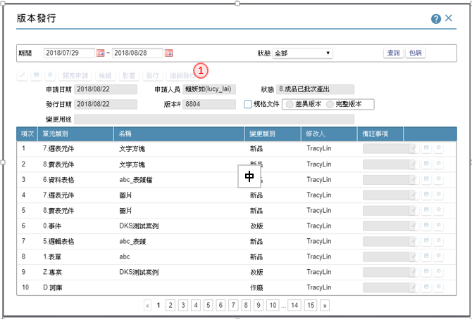
1. 撤銷發行鍵：當本版本已發行但未到處理完成的階段時，可利用本鍵撤回發行記錄，併入未發行狀態

### **17.4.3 發行檢錯訊息**

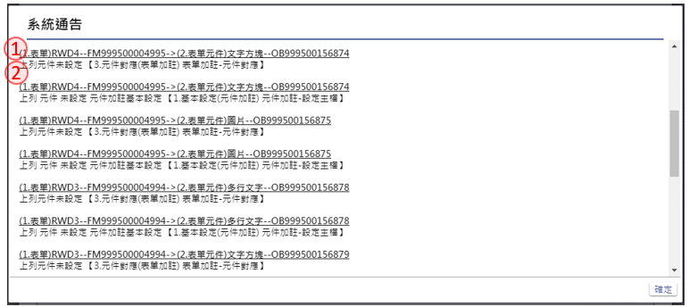
1. 錯誤來源：顯示錯誤來源的相關資訊，可利用連結開啟原設定規格的操作畫面
2. 錯誤內容：提示錯誤的原因

### **17.4.4 改版安裝檔指定作業**

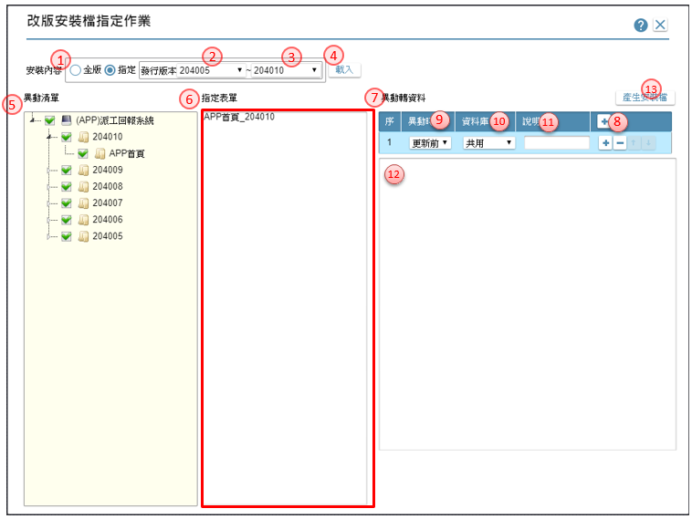
1. 安裝內容：指定要包裝的內容來源類別，選擇：全版／指定版本
2. 指定版本起：當安裝內容類別＝指定版本時，指定載入的起始版本
3. 指定版本迄：當安裝內容類別＝指定版本時，指定載入的終止版本
4. 載入鍵：濾出符合指定版本內有異動的表報表單到[異動清單]內
5. 異動清單：進行勾選的動作，當勾選父節點時，子節點也同時隨之異動
6. 指定表單鍵：顯示有勾選的表單內容，當同時載入多版本時，若發生有相同的表單存在，則顯示最大版的的記錄
7. 異動轉資料：設定本次改版安裝的封包裡，若需要轉檔或更新資料庫的異動，可利用本表格內容進行資料庫指令的描述
8. 新增鍵：利用本鍵新增異動的項目
9. 異動時機：設定 [異動描述] 執行的時機，選擇：改版異動前／改版異動後
10. 資料庫：指定影響的資料庫類別，選擇：共用／分公司
11. 說明：輸入說明內容
12. 異動描述：輸入要異動的資料庫指令
13. 產生包裝檔鍵：點選本鍵，把 [指定表單]內的內容進行安裝檔的打包動作

##  **17.5 AT11.表格欄位清單**
> 作業目的：為了比對不同表格中，相同名稱的欄位的資料屬性是否一致，並且可做管理。

參考資料：[℗文件](pdf/18-10表格欄位清單.pdf){:target='_blank'}

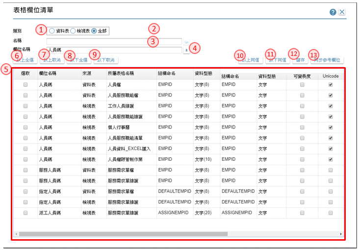
1. 表格類別：指定要查詢的表格類別，選擇：資料表／來視表／全部
2. 表格名稱：依據表格類別選擇，開啟表格清單進行挑選
3. 欄位名稱：輸入指定的關鍵字，以方便搜尋查詢
4. 搜尋鍵：濾出符合關鍵字的內容到 [欄位清單]
5. 欄位清單：顯示符合條件的欄位明細，可駐留單筆勾選、修改內容
6. 以上全選鍵：以指定的記錄為準，將駐留以上資料勾選全部勾選
7. 以下取消鍵：以指定的記錄為準，將駐留以上資料勾選取消勾選
8. 以下全選鍵：以指定的記錄為準，將駐留以下資料勾選全部勾選
9. 以下取消鍵：以指定的記錄為準，將駐留以下資料勾選取消勾選
10. 以上同值鍵：以指定的記錄為準，將駐留以上資料內容，同駐留筆異動後的資料
11. 以下同值鍵：以指定的記錄為準，將駐留以下資料內容，同駐留筆異動後的資料
12. 儲存鍵：針對有勾選的內容，把異動後的資料存回資料庫
13. 同步參考欄位鍵：當欄位為資料表的欄位時，可利用本鍵, 開啟【同步參考欄位】，操作說明請參考［17.5.1］

###  **17.5.1 同步參考欄位**
> 作業目的：當表格的欄位有異動時，必須連帶影響有引用到上階物件。本功能鍵利用追蹤的功能查詢相關的內容，並經由指定的進行同步動作

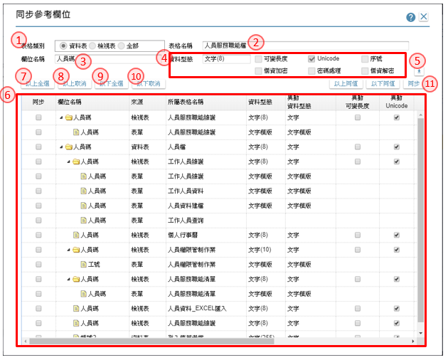
1. 表格類別：指定要查詢的表格類別，選擇：資料表／來視表／全部
2. 表格名稱：依據表格類別選擇，開啟表格清單進行挑選
3. 欄位名稱：依據表格名稱，開啟元件清單進行挑選
4. 資料內容：顯示指定欄位的資料相關內容
5. 搜尋鍵：濾出符合關鍵字的內容到 [同步清單]
6. 同步清單：顯示符合條件的元件明細，可駐留單筆勾選、修改內容
7. 以上全選鍵：以指定的記錄為準，將駐留以上資料同步全部勾選
8. 以下取消鍵：以指定的記錄為準，將駐留以上資料同步取消勾選
9. 以下全選鍵：以指定的記錄為準，將駐留以下資料同步全部勾選
10. 以下取消鍵：以指定的記錄為準，將駐留以下資料同步取消勾選
11. 同步鍵：針對同步有勾選的內容，把異動後的資料存回資料庫

##  **17.6 AT12.元件欄位清單**
> 作業目的：輔助工作管理，提供專案內的元件清單查詢，並可標註待處理的元件，列入待辦事項，或是指派給其他專案成員。

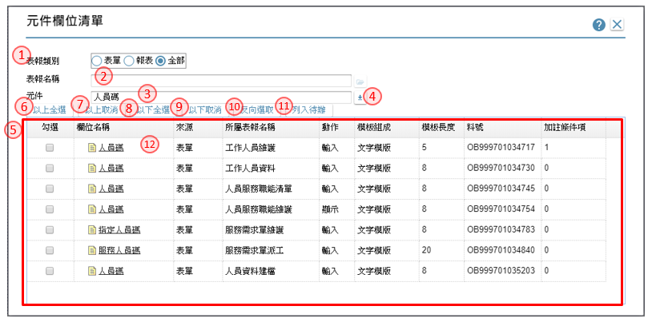
1. 表報類別：指定要查詢的表格類別，選擇：表單／報表／全部
2. 表報名稱：依據表報類別選擇，開啟表報清單進行挑選
3. 元件名稱：依據表報名稱，開啟元件清單進行挑選
5. 搜尋鍵：濾出符合元件名稱的內容到 [勾選清單]
6. 勾選清單：顯示符合條件的元件明細，可駐留單筆勾選
7. 以上全選鍵：以指定的記錄為準，將駐留以上資料同步全部勾選
8. 以下取消鍵：以指定的記錄為準，將駐留以上資料同步取消勾選
9. 以下全選鍵：以指定的記錄為準，將駐留以下資料同步全部勾選
10. 以下取消鍵：以指定的記錄為準，將駐留以下資料同步取消勾選
11. 反向選取鍵：利用本鍵，將清單內原勾選者改為取消勾選狀態，原無勾選者進行勾選狀態
12. 列入代辦鍵：利用本鍵，將開啟【列入待辦】視窗，將勾選的記錄，列入待辦清單中，操作說明請參考［17.7.1 列入待辦］
13. 連結操作鍵：依駐留記錄的類型，開啟個別的規格定義註解視窗，方便檢視及異動內容

##  **17.7 AT15.待辦事項清單**
> 作業目的：將已標註待辦的內容，進行檢視及處理

1. 登錄人員：輸入當初列入代辦事項的指定的負責人員
2. 包含完工：勾選者，表示連同標註已完工的記錄一併顯示
3. 待辦說明：輸入指定的關鍵字，以方便搜尋查詢
4. 搜尋鍵：濾出符合條件的內容到 [待辦清單]
5. 待辦清單：顯示符合條件的待辦清單，可駐留記錄，影響 [待辦元件清單] 內容
6. 待辦元件清單：依駐留的待辦清單，顯示明細。可勾選異動完工狀態
7. 加註連結鍵：依駐留記錄的類型，開啟個別的規格定義註解視窗，方便檢視及異動內容
8. 刪除鍵：將駐留在 [待辦清單]的相關資料刪除

### **17.7.1 列入待辦**
> 作業目的：在相關的作業項目，操作時有需要元件標註為待處理的項目，可開啟本單列入待辦事項，或是指派給其他專案成員。

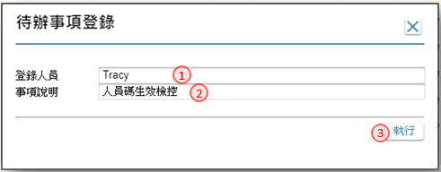
1. 登錄人員：輸入當初列入代辦事項的指定的負責人員
2. 事項說明：輸入要指派列入待辦的說明項目
3. 執行鍵：可利用本鍵，儲存內容到資料庫。可在【待辦事項清單】備查

##  **17.8 AT21.規格複製**
> 作業目的：在一個專案之內，常會有相似的表單或檢視表，可利用複製功能先行複製，再做修改，以加快專案的開發。複製類別：專案結構中的六大類內容都可以複製，包含：作業流程、表單、報表、資料表、檢視表及資料交易

參考資料：[℗文件](pdf/18-12規格複製.pdf){:target='_blank'}

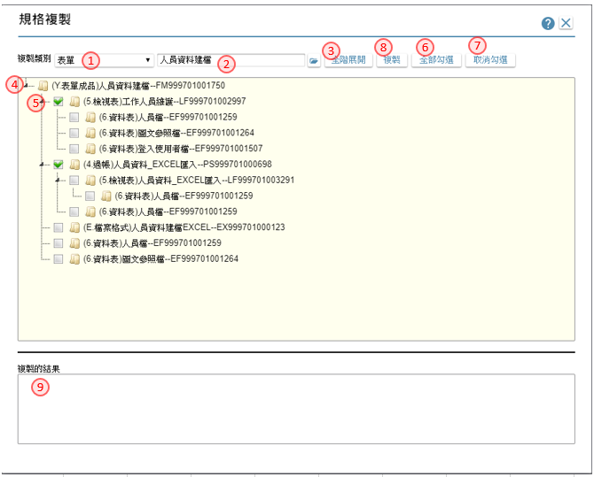
1. 複製類別：指定要複製的物件類別
2. 複製元件：依據類別選擇，開啟清單進行挑選。
3. 全階展開鍵：依挑選的複製元件，展開相關的結構明細，呈現在 [複製清單]
4. 複製清單：顯示複製元件下的相關內容，可單一勾選指定
5. 勾選選擇：把 [複製清單] 內的項目，單一的進行勾選或取消；勾選的用意在於複製後的結果，不單是複製的主角產生獨立物件，連同勾選的項目都產生新的物件。
6. 全部勾選鍵：把 [複製清單] 內的項目，全部打勾
7. 全部取消鍵：把 [複製清單] 內的項目，全部取消打勾
8. 複製鍵：依據勾選的項目，複製成新的元件, 系統會依原元件名稱加＿２ 為命名
9. 複製結果：顯示複製後的狀態訊息

##  **17.9 AT22.跨專案複製**
> 作業目的：同時擁有多個專案的設計者，可能需要在不同專案間複製相同的表單規格，或是不同的專案設計者，彼此間可交流設計的規格。

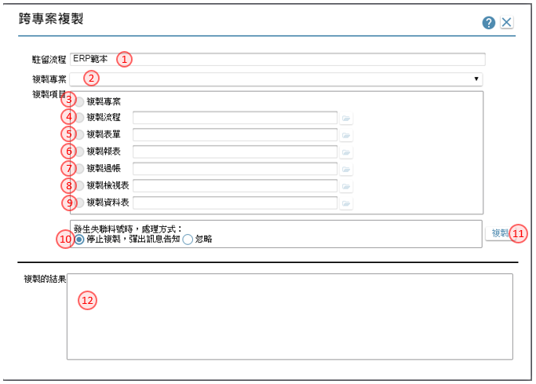
1. 駐留事件：顯示開啟本單時，在業務模組事件駐留的事件名稱		
2. 來源專案：指定要複製的專案來源，開啟有權限的專案清單進行挑選。		
3. 複製專案：選擇本項，表示全專案複製		
4. 複製事件：選擇本項，表示將挑選的來源事件，複製的駐留事件歸屬為該事件的下階		
5. 複製表單：選擇本項，表示將挑選的來源表單，複製到本專案。		
6. 複製報表：選擇本項，表示將挑選的來源報表，複製到本專案。		
7. 複製過帳：選擇本項，表示將挑選的來源過帳，複製到本專案。		
8. 複製檢視表：選擇本項，表示將挑選的來源檢視表，複製到本專案。		
9. 複製資料表：選擇本項，表示將挑選的來源資料表，複製到本專案。		
10. 處理方式：當複製來源的內容有異或失聯無法繼續複製時，指定後續處理的方式 
停止複製：中斷複製的動作 
彈出訊息告知：回覆錯誤訊息逐一詢問 
忽略：不理會異常，繼續往下執行	 
11. 複製鍵：依據勾選的項目，複製內容；若名稱有相同存在者，不執行複製"		
12. 複製結果：顯示複製後的狀態訊息		

##  **17.10 AT31.規格書產出**
> 作業目的：產出各類規格書及本應用系統操作手冊，供業主簽核或供使用者參考。

參考資料：[℗文件](pdf/18-13公用工具-規格書產出.pdf){:target='_blank'}

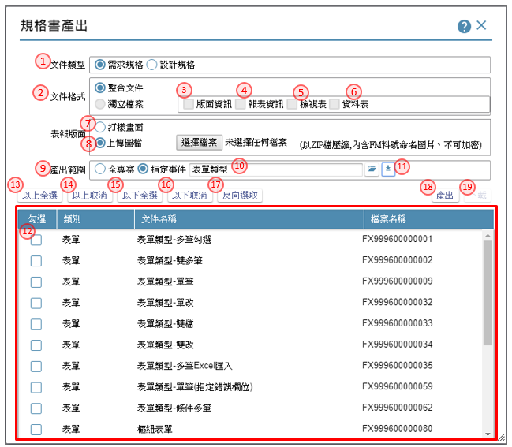
1. 文件內容：指定要輸出文件的類別，選項：需求規格／設計規格
需求規格：呈現SA階段的功能說明內容，沒有表格資訊
設計規格：表現SD階階段的設計規格，完整表達
2. 文件格式：指定要輸出文件的格式，選項：整合文件／獨立檔案
整合文件：以專案的完整度為考量，匯集所有內容在一個檔案裡
獨立檔案：依選擇的類別，將不同屬性的規格，個自獨立檔案。例：所有資料表存成PJXXXX_9701_EF.Docx，所有版面貟訊存成PJXXXX_9701_FM.Docx
3. 獨立檔案＿版面資訊：文件內包含：表單清單、表單資訊、版面樣張、欄位說明
4. 獨立檔案＿報表資訊：文件內包含：報表清單、報表資訊、報表樣張、欄位說明
5. 獨立檔案＿檢視表：文件內包含：檢視表清單、檢視表資訊、欄位結構、群組、參數設定
6. 獨立檔案＿資料表：文件內包含：表清單、資料表資訊、欄位結構、索引設定
7. 表報版面_打樣畫面：以規格段打樣呈現的畫面為輸出依據
8. 表報版面_上傳圖檔：選擇本項，表示已事先把畫面準備好, 並以FM料號為檔案名, 以ZIP壓縮檔上傳到伺服器端，由文件引用
9. 產出範圍：選擇全專案／指定事件
10. 指定事件：指定要選擇的事件，可開窗選擇
11. 載入鍵：依據指定的事件，相關的內容載入到 [勾選清單]
12. 勾選清單：呈現要產出文件的內容清單，可單一勾選指定
13. 以上全選鍵：以指定的記錄為準，將駐留以上資料勾選全部勾選
14. 以下取消鍵：以指定的記錄為準，將駐留以上資料勾選取消勾選
15. 以下全選鍵：以指定的記錄為準，將駐留以下資料勾選全部勾選
16. 以下取消鍵：以指定的記錄為準，將駐留以下資料勾選取消勾選
17. 反向選取鍵：利用本鍵，將清單內原勾選者改為取消勾選狀態，原無勾選者進行勾選狀態
18. 產出鍵：依據產出文件的條件及指定的內容，產出相關的文件，並打包成壓縮檔
19. 下載鍵：把已產出完成的文件壓縮檔，下載存檔

---
[**回到章節目錄**](index.html#MainMenu)

