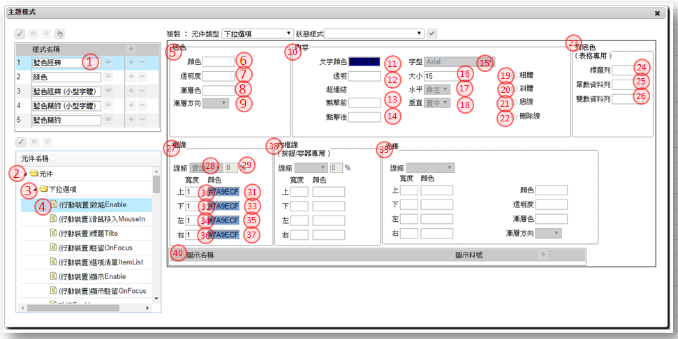
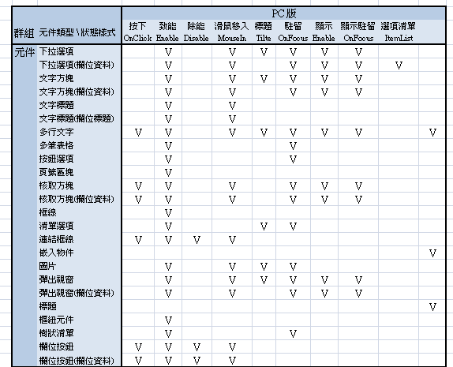
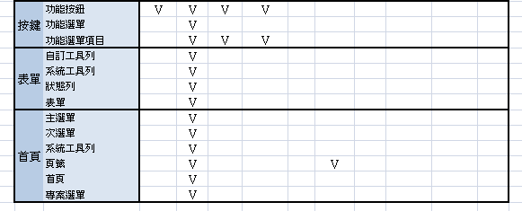
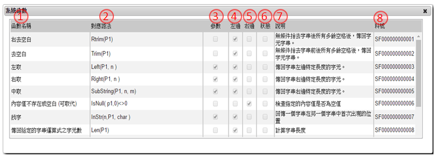

## **主題樣式**

1. [樣式名稱]：樣式的名稱，可利用開窗鍵, 開啟[【多語詞庫】](16.html#MaintainMultilingual)指定挑選詞庫, 請參考［16.2］來指定啟動說明
2. [元件群組]：下拉：元件／按鍵／表單／首頁
3. [元件類型]：依據元件群組，下拉挑選要設定樣式的類型
4. [狀態樣式]：各元件類型有可適用的狀態樣式，請參考［19.1.1］
5. [底色]：設定該狀態下的背景色
6. [底色_顏色]：設定顏色，開啟[【調色盤】](20.html#Palette)指定色碼，操作說明請參考［附錄A3］
7. [底色＿透明度]：數字０是全透明，數字愈大愈不透明
8. [底色＿漸層色]：設定要做漸層顏色，開啟[【調色盤】](20.html#Palette)指定色碼，操作說明請參考［附錄A3］
9. [底色＿漸層方向]：下拉：無／上／下／左／右／垂直／水平／向內／向外
10. [內容]：設定該狀態下的前景字體的內容
11. [內容＿文字顏色]：設定文字顏色，開啟[【調色盤】](20.html#Palette)指定色碼，操作說明請參考［附錄A3］
12. [內容＿透明]：設定透明度，數字０是全透明，數字愈大愈不透明
13. [內容＿超連結點擊前]：具超連結的文字，點擊前顯示的顏色，開啟[【調色盤】](20.html#Palette)指定色碼，操作說明請參考［附錄A3］
14. [內容＿超連結點擊後]：具超連結的文字，點擊後顯示的顏色，開啟[【調色盤】](20.html#Palette)指定色碼，操作說明請參考［附錄A3］
15. [內容＿字型]：字型的選擇
16. [內容＿大小]：字體的大小
17. [內容＿水平]：字體水平對齊的方式
18. [內容＿垂直]：字體垂直對齊的方式
19. [內容＿粗體]：勾選本項，表示字體變粗
20. [內容＿斜體]：勾選本項，表示字體變斜
21. [內容＿底線]：勾選本項，表示字體加底線
22. [內容＿刪除線]：勾選本項，表示字體加刪除線
23. [列底色]：設定表格資料列的數據
24. [列底色＿標題列]：表格的標題列顏色，開啟[【調色盤】](20.html#Palette)指定色碼，操作說明請參考［附錄A3］
25. [列底色＿單數資料列]：表格的資料列位於單數時的列顏色，開啟[【調色盤】](20.html#Palette)指定色碼，操作說明請參考［附錄A3］
26. [列底色＿雙數資料列]：表格的資料列位於雙數時的列顏色，開啟[【調色盤】](20.html#Palette)指定色碼，操作說明請參考［附錄A3］
27. [框線]：設定元件的框線屬性
28. [框線＿線條]：指定框線的樣式，下拉：無／實線／虛線／嵌入線／浮出線
29. [框線＿線條弧度]：指定框線的四個角的手戈廿水，０代表直角，最大５０
30. [框線＿上邊寛度]：指定上邊框線的寛度，數字愈大愈粗
31. [框線＿上邊顏色]：指定上邊框線的顏色，開啟[【調色盤】](20.html#Palette)指定色碼，操作說明請參考［附錄A3］
32. [框線＿下邊寛度]：指定下邊框線的寛度，數字愈大愈粗
33. [框線＿下邊顏色]：指定下邊框線的顏色，開啟[【調色盤】](20.html#Palette)指定色碼，操作說明請參考［附錄A3］
34. [框線＿左邊寛度]：指定左邊框線的寛度，數字愈大愈粗
35. [框線＿左邊顏色]：指定左邊框線的顏色，開啟[【調色盤】](20.html#Palette)指定色碼，操作說明請參考［附錄A3］
36. [框線＿右邊寛度]：指定右邊框線的寛度，數字愈大愈粗
37. [框線＿右邊顏色]：指定右邊框線的顏色，開啟[【調色盤】](20.html#Palette)指定色碼，操作說明請參考［附錄A3］
38. [內框線]：按鈕及容器元件有內框的設定，各欄位的設定操作同28~37
39. [光棒]：表格元件及選項清單有設定光棒的顏色，各欄位的設定操作同28~37，6~8
39. [光棒]：表格元件及選項清單有設定光棒的顏色，各欄位的設定操作同28~37，6~8
40. [圖示]：當元件類型有圖示可替代時，可在此處設定圖示，開啟[【圖示設定】](16.html#Icon)挑選圖示，請參考［16.3］

### **19.1.1 樣式狀態對照**
> 作業目的：各類元件可使用的樣式狀態, 打V者　表示可設定有作用。

各類樣式狀態的使用時機
	1. 按下OnClick：當元件被滑鼠或利用熱鍵按下時
	2. 除能Disable：當元件設定為除能狀態時
	3. 致能Enable：當元件設定為致能狀態時
	4. 滑鼠移入MouseIn：滑鼠移到元件位置上方，但未駐留OnFocus
	5. 駐留OnFocus：游標停留在元件上
	6. 標題Tilte：元件的標題文字
	7. 顯示Enable：當元件設定僅供顯示的狀態
	8. 顯示駐留OnFocus：當元件設定僅供顯示的狀態，但游標停留該元件上
	9. 選項清單ItemList：下拉元件的清單

|對於行動裝置下, 狀態樣式可也獨立設定|

## **19.2 系統函數**
> 作業目的：對已定義好的規格，進行語法及完成度的檢查。

1. 函數名稱：顯示函數的名稱
2. 對應語法：顯示在系統執行時的語法
3. 參數：勾選時，表示在條件時的左運算式出現時，必須指定參數
4. 左邊：勾選時，表示本函數可以出現在條件式左側
5. 右邊：勾選時，表示本函數可以出現在條件式右側
6. 狀態：勾選時，表示本函數回傳值為一判斷邏輯
7. 說明：顯示函數的說明文字
8. 料號：顯示函數的料號

|序|函數名稱(參數)|說明|回傳|Scrip語法|SQL 語法|
| :- | :- | :- | :- | :- | :- |
|01|右去空白|無條件捨去字串後所有多餘空格後，傳回字元字串。|文字|RTrim|RTrim|
|02|去空白|無條件捨去字串前後所有多餘空格後，傳回字元字串。|文字|Trim|LTrim(RTrim|
|03|左取|傳回字串左邊特定長度的字元。|文字|Left|Left|
|04|右取|傳回字串右邊特定長度的字元。|文字|Right|Right|
|05|中取|傳回字串右邊特定長度的字元。|文字|Mid|SubString|
|06|內容值不存在或空白 (可取代)|檢查指定的內容值是否為空值|布林|IsEmptyVal|IsNull|
|07|找字|回傳一個字串在另一個字串中首次出現的位置|數字|InStr|CHARINDEX|
|08|傳回給定的字串運算式之字元數|計算字串長度|數字|Len|Len|
|09|算長度(右去空白)|將字串右去空白後計算長度|數字|Len(RTrim|Len(RTrim|
|10|轉文字|將指定變數轉換為文字|文字|ToString|Cast|
|11|轉數字|將指定變數轉換為數字|數字|CDbl|Cast|
|12|日期轉文字(有斜線)|日期轉文字(有斜線)|文字|Left(ToString|Convert|
|13|日期轉文字(無斜線)|日期轉文字(無斜線)|文字|Left(DTOS|Convert|
|14|日期差|計算兩日期之間的差。|數字|DateDiff|DateDiff|
|15|取餘數|數字二對數字一取餘數||||
|16|使用者代號(數字型態)|取得使用者代號(數字型態)|數字|GetUserId()|RT[GetUserId()]|
|17|使用者代號(文字型態))|取得使用者代號(文字型態)|文字|ToString(GetUserId())|RT[ToString(GetUserId())]|
|18|使用者帳號|取得使用者帳號|文字|GetAccount()|RT[GetAccount()]|
|19|使用者姓名|取得使用者姓名|文字|GetUserName()|RT[GetUserName()]|
|20|簽入語系(數字型態)|簽入語系(數字型態)|數字|GetLanguageId()|RT[GetLanguageId()]|
|21|簽入語系(文字型態))|簽入語系(文字型態)|文字|ToString(GetLanguageId())|RT[ToString(GetLanguageId())]|
|22|根目錄|取得根目錄狀態|文字|cId_IsGetRootNodeing()|RT[cId_IsGetRootNodeing()]|
|23|大寫字母|判斷字串開頭是否為大寫字母||||
|24|系統日期|取得系統日期|日期|GetSysDate()|cast(convert(nchar(10),getdate(),21) as datetime)|
|25|執行唯一號()|取得執行唯一號|文字|GetRunSrlid()|RT[GetRunSrlid()]|
|26|登入組織序號|取得登入組織帳務的序號|數字|GetCorpId()|RT[GetCorpId()]|
|27|取日期欄位年度值|取日期欄位年度值|數字|Year|Year|
|28|取日期欄位月份值|取日期欄位月份值|數字|Month|Month|
|29|取日期欄位日值|取日期欄位日值|數字|Day|Day|
|30|取得週次|取得週次|數字|WeekOfYear|dbo.fn_WeekOfYear|
|31|取得表格駐留欄次|取得表格駐留欄次|數字|ColPos||
|32|取得登入用戶代號|取得登入使用者用戶代號|文字|GetUserNo()|RT[GetUserNo()]|
|33|日期計算|在指定日期新增一個時間間隔，並傳回新的 datetime 值。|日期|DateAdd|DateAdd|
|34|取得萬年曆週次(指定起始星期)|取得萬年曆週次(指定起始星期)|數字|WeekOfYear2|dbo.fn_WeekOfYear2|
|35|數字加總|將函數內的參數進行加總。||||
|36|文字函數|可任意輸入一段文字|文字|||
|37|文字轉日期|輸入一個長度為8碼(YYYYMMDD)或14碼(YYYYMMDDhhmmss)的字串，轉換為對應的日期或日期時間|日期|STOD|Convert|
|38|文字轉日期(有斜線)|輸入一個完整的日期字串(YYYY/MM/DD)或日期時間字串(YYYY/MM/DD hh:mm:ss)，轉換為對應的日期或日期時間|日期|CDate|Convert|
|39|左補字元|檢查指定的字串(參數一)，若長度小於指定的長度(參數二)則靠左補足指定字元(參數三)|文字|padl|REPLACE|
|40|日期時間轉文字(有斜線)|將一個日期時間型態的變數轉為字串(YYYY/MM/DD hh:mm:ss)|文字|ToString|Replace(Convert|
|41|取空格|取得指定長度的空白字串|文字|Space|Space|
|42|取整數|將指定數字無條件捨去至整數|數字|Fix|Floor|
|43|數字函數|可任意輸入串數字|數字|||
|44|左去空白|除去前導空格後，傳回字元運算式。|文字|LTrim|LTrim|
|45|登入人員聯絡信箱|NULL|文字|||
|46|內容值不存在|NULL||||
|47|取得外部程式狀態|NULL||||
|48|取得外部程式暫存區資料|NULL||||
|49|新增模式|NULL||||
|50|修改模式|NULL||||
|51|刪除模式|NULL||||
|52|取得表單成品料號|NULL|文字|GetFormFinishPdno()|RT[GetFormFinishPdno()]|
|53|取得指定日期當月首日( 日期 )|NULL|日期|GetMonthFirstDay|dbo.fn_GetMonthFirstDay|
|54|取得指定日期當月末日( 日期 )|NULL|日期|GetMonthLastDay|dbo.fn_GetMonthLastDay|
|55|判斷日期是否相等|判斷日期是否相等|數字|ValueCompare||
|56|取得伺服器IP|取得伺服器IP||GetServerIpAddress()||
|57|取得伺服器Port|取得伺服器Port||GetServerPort()||
|58|數值四捨五入(銀行型)|數值四捨五入(銀行型)|數字|Round|dbo.fn_Round|
|59|數值四捨五入(一般型)|數值四捨五入(一般型)|數字|FormatNumber|Round|
|60|邏表輸出欄位給值判斷|邏表輸出欄位給值判斷|||IsNull|
|61|取得駐留元件檔區|需求說明 : 右邊判斷式, 寫(固定值)表頭檔區/表身檔區|布林|ControlIsAttachAlias_ByIdName||
|64|取得點擊多筆表格元件代號|取得點擊多筆表格元件代號|布林|GetPreClickColId||
|65|判斷點擊多筆表格空白欄位|判斷點擊多筆表格空白欄位|布林|ClickOnEmptyRow||
|66|判斷元件駐留狀態|判斷元件駐留狀態|布林|IsFocused||
|67|日期時間取日期|日期時間取日期|日期|CDate|cast|
|68|取得指定段落產生變數值|取得指定段落產生變數值|數字|GetNowDSValue||
|69|取得暫存鍵值|取得暫存鍵值|||SF000000000069|
|70|取得登入企業代號|取得登入企業代號|文字|GetEnterpriseNo()||
|71|取得行動裝置尺寸|取得行動裝置尺寸|數字|GetMobileDeviceWidth()||
|72|裝置解析度尺寸(5吋)|裝置解析度尺寸(5吋)|布林|IsSmallDeviceWidth()||
|73|裝置解析度尺寸(7吋)|裝置解析度尺寸(7吋)|布林|IsMediumDeviceWidth()||
|74|裝置解析度尺寸(9吋)|裝置解析度尺寸(9吋)|布林|IsBigDeviceWidth()||
|75|次序函數|次序函數|數字||ROW_NUMBER() OVER |
|76|次序函數(無群組欄位)|次序函數(無群組欄位)|數字||ROW_NUMBER() OVER |
|77|排序函數|排序函數|數字||RANK() OVER |
|78|排序函數(無群組欄位)|排序函數(無群組欄位)|數字||RANK() OVER |
|79|取得目前輸入值|取得目前輸入值||GetZnSelfVal()||
|80|陣列函數|陣列函數||Array||
|81|開單參數轉換|開單參數轉換|文字|TransParam||
|82|系統日期時間|取得系統日期時間|日期|GetSysDateTime()|GetDate()|
|83|時間差|計算兩時間之間的差|數字|TimeDiff||
|84|取得登入企業名稱|取得登入企業名稱|文字|GetEnterpriseName()||
|85|換行函數|換行函數||\r\n||
|86|相關係數函數|判斷兩個陣列內容之間的關係|數字|CORREL||
|87|截距函數|利用現有的x值和y值計算出一線與y軸的交叉點|數字|INTERCEPT||
|88|斜率函數|傳回穿過yArray和xArray中資料點之線性迴歸線的斜率|數字|SLOPE||
|89|布林函數|可輸入true、false或位元(邏輯)型態欄位|布林|||
|90|全唯碼函數|可輸入全唯碼字串或全唯碼型態欄位||||
|91|日期時間函數|可輸入 yyyy/mm/dd 或 yyyy/mm/dd hh:mm:ss 或 yyyy/mm/dd hh:mm 或 日期(日期時間)型態欄位|日期|||
|92|GPS差異距離計算_直徑|計算兩點座標直線距離, 回傳指定單位的距離數值|數字|GetMapsDistance1||
|93|GPS差異距離計算_行徑|依據交通工具計算兩點座標可行走距離, 回傳指定單位的距離數值|數字|GetMapsDistance2||
|94|行事曆_取得目前駐留日期|取得行事曆物件目前駐留日期內容值|日期|CtrlEmbed_GetInfo||
|95|系統時間|取得系統時間|文字|GetSysTime2()||
|96|GPS位置轉換| 對於指定的位置進行經緯度與地址內容轉換|文字|TransMapsPosition||
|97|取得檔案系統資料參數|在嵌入網址物件, 指向圖片網址+檔案唯一號所在的檔案路徑, 來開啟圖片|文字|GetSystemFilePath||
|98|取得檔案系統二進位資料|經檔案唯一號取得檔案系統二進位資料, 僅在過帳的目的欄位使用||GetSystemFileBinary||
|99|取得型態預設值|依據指定的欄位型態給預設值(類似清空的動作)||GetDefaultValue|dbo.fn_GetDefaultValue|
|100|取得民國年|依傳入的西元年日期或文字, 回傳數字型態的民國年|數字|GetChineseYear|(DATEPART|
|101|查詢轉換欄位為空值|針對下拉多選的欄位值,若經轉換者,判斷是否為空的狀態|布林|SqlFormatItemEmpty|dbo.fn_SqlFormatItemEmpty|
|102|身份證字號驗證|驗證傳入的身分證字號是否合法，合法回傳true，不合法回傳false|布林|IdentityValid||
|103|統一編號驗證|驗證傳入的統一編號是否合法，合法回傳true，不合法回傳false|布林|TaxIdValid||
|104|EAN-13商品條碼驗證|驗證傳入的條碼是否符合EAN-13的編碼，符合回傳true，不符合回傳false|布林|EAN13Valid||
|105|無條件進位|將傳入的值依據指定的小數位數進行無條件進位|數字|Ceil||

---
## **19.3 邏輯函數**
> 作業目的：為特定邏輯所撰寫的函數，稱之為邏輯函數。對於比較複雜的產業界常用的	處理功能，平台上特別開發了一些邏輯函數，讓設計師在按鈕的公格設計時可以引用，以簡化設計工程。本章節針對邏輯函數的各項用途及參數進行說	明。
>

### 19.3.1 表單暫存區設定

|#|參數名稱|參數說明|對應內容|
| :-: | :- | :- | :- |
|1|vtcName|名稱|NULL|
|2|vtxVal|欲儲存的值|NULL|

### 19.3.2 	圖檔上傳\_至資料庫

|#|參數名稱|參數說明|對應內容|
| :-: | :- | :- | :- |
|1|vtcFldNm|圖片元件|類別:/元件|
|2|vtcUpdTblNm|存入實體表格的名稱|類別:/實體表格|
|3|vtcUpdFilt|存入實體表格的過濾式|類別:/條件式|
|4|vtcUpdFldNm|存入實體表格的欄位名稱|類別:/查表欄位|
|5|vtcShareYn|寫入的實體是否在共用資料庫 (1.是/2.否)|選項:/是/否|

### 19.3.3 	多筆元件\_執行勾選

|#|參數名稱|參數說明|對應內容|
| :-: | :- | :- | :- |
|1|vtcBrwId|多筆元件|類別:/元件|
|2|vtcNextSkip|1:往下移動/2:往上移動|選項:/往下移動/往上移動|
|3|vtnChoose|0:取消勾選 1:勾選|選項:/取消勾選/勾選|
|4|vtcMsg|執行完成後，欲顯示的訊息盒|類別:/多語詞庫|
|5|vtnCountType|勾選類型=1.本頁/2.全部記錄/3.指定筆數(未設時，預設為1.本頁)|選項:/本頁/全部記錄/指定筆數|
|6|vtnCount|指定筆數(當干涉.vtnCountType=3.指定筆數時)|類別:/固定值/元件/參數|

### 19.3.4 	執行系統功能鍵\_新增

### 19.3.5 	檔區\_駐留指定記錄

|#|參數名稱|參數說明|對應內容|
| :-: | :- | :- | :- |
|1|vtoAls|檔區|類別:/檔區|
|2|vtcKeyValExpr|檔區排序欄位值條件式(例:元件1+元件2)|類別:/運算式|

### 19.3.6 	主檔區\_移動記錄除能

### 19.3.7 	BOM正展\_用量計算

|#|參數名稱|參數說明|對應內容|
| :- | :- | :- | :- |
|1|vtcSelect|來源SELECT子句|類別:/邏輯表格|
|2|vtcFldNm|來源本階KEY欄位名|類別:/查表欄位|
|3|vtcFFldNm|來源父階KEY欄位名|類別:/查表欄位|
|4|vtcRootSelect|ROOT節點來源|類別:/邏輯表格|
|5|vtcRootFilter|ROOT過濾式|類別:/條件式|
|6|vtcRootPKNO|ROOT本階PKEY|類別:/查表欄位|
|7|vtcRootQTY|計算用量|類別:/查表欄位|
|8|vtcRootTreeKey|ROOT節點KEY|類別:/查表欄位|
|9|vtcDesTblNm|目的實體|類別:/實體表格|
|10|vtcDesSrlidFldNm|唯一號欄位|類別:/查表欄位|
|11|vtcSrlid|唯一號|類別:/函數|
|12|vtcDesFldNm|目的本階KEY欄位|類別:/查表欄位|
|13|vtcDesFFldNm|目的父階KEY欄位|類別:/查表欄位|
|14|vtcDesLevelFldNm|目的階層欄位(系統用)|類別:/查表欄位|
|15|vtcDesSeqFldNm|目的順序欄位(系統用)|類別:/查表欄位|
|16|vtcDesChildQtyFldNm|目的子階數量(系統用)|類別:/查表欄位|
|17|vtcDesRootIdFldNm|目的ROOT欄位(系統用)|類別:/查表欄位|
|18|vtcDesTreeKey|TREE-KEY|類別:/查表欄位|
|19|vtcUseQty|標準用量欄位|類別:/查表欄位|
|20|vtcType|1.無秏損率/2.有秏損率|選項:/無耗損率/有耗損率|
|20|vtcType|1.無秏損率/2.有秏損率|類別:/元件/參數/選項|
|21|vtcLoss|秏損率欄位|類別:/查表欄位|
|22|vtcUsage|展開用量目的欄位|類別:/查表欄位|
|23|vtcRelation|目的.PKNO=來源.PKNO|類別:/固定值|
|24|vtcDesFSeqFldNm|目的父階的順序欄位(系統用)|類別:/查表欄位|
|25|來源排序欄位1|　|類別:/欄位排序|
|26|來源排序欄位2|　|類別:/欄位排序|
|27|來源排序欄位3|　|類別:/欄位排序|
|28|來源排序欄位4|　|類別:/欄位排序|
|29|來源排序欄位5|　|類別:/欄位排序|
|30|來源排序欄位6|　|類別:/欄位排序|
|31|來源排序欄位7|　|類別:/欄位排序|
|32|來源排序欄位8|　|類別:/欄位排序|
|33|來源排序欄位9|　|類別:/欄位排序|
|34|來源排序欄位10|　|類別:/欄位排序|
|35|來源排序欄位11|　|類別:/欄位排序|
|36|來源排序欄位12|　|類別:/欄位排序|

### 19.3.8 	BOM逆展\_料工費計算

|#|參數名稱|參數說明|對應內容|
| :- | :- | :- | :- |
|1|vtcFeed\_Semi|目的欄位：本料件的料錢(所有子階總合)|類別:/查表欄位|
|2|vtcCost|目的欄位：本料件成本(料工費總合)|類別:/查表欄位|
|3|vtcRelation|目的.PKNO=來源.PKNO|類別:/固定值|
|4|vtcSelect|來源SELECT子句|類別:/邏輯表格|
|5|vtcFldNm|來源本階KEY欄位名|類別:/查表欄位|
|6|vtcFFldNm|來源父階KEY欄位名|類別:/查表欄位|
|7|vtcRootSelect|ROOT節點來源|類別:/邏輯表格|
|8|vtcRootFilter|ROOT過濾式|類別:/條件式|
|9|vtcRootPKNO|ROOT本階PKEY|類別:/查表欄位|
|10|vtcRootTreeKey|ROOT節點KEY|類別:/查表欄位|
|11|vtcDesTblNm|目的實體|類別:/實體表格|
|12|vtcDesSrlidFldNm|唯一號欄位|類別:/查表欄位|
|13|vtcSrlid|唯一號|類別:/函數|
|14|vtcDesFldNm|目的本階KEY欄位|類別:/查表欄位|
|15|vtcDesFFldNm|目的父階KEY欄位|類別:/查表欄位|
|16|vtcDesLevelFldNm|目的階層欄位(系統用)|類別:/查表欄位|
|17|vtcDesSeqFldNm|目的順序欄位(系統用)|類別:/查表欄位|
|18|vtcDesChildQtyFldNm|目的子階數量(系統用)|類別:/查表欄位|
|19|vtcDesRootIdFldNm|目的ROOT欄位(系統用)|類別:/查表欄位|
|20|vtcDesTreeKey|TREE-KEY|類別:/查表欄位|
|21|vtcType|1.無秏損率/2.有秏損率|選項:/無耗損率/有耗損率|
|21|vtcType|1.無秏損率/2.有秏損率|類別:/元件/參數/選項|
|22|vtcLoss|秏損率欄位|類別:/查表欄位|
|23|vtcUseQty|標準用量欄位|類別:/查表欄位|
|24|vtcFeed|料錢欄位|類別:/查表欄位|
|25|vtcWork|工錢欄位|類別:/查表欄位|
|26|vtcFee|費用欄位|類別:/查表欄位|
|27|來源排序欄位1|　|類別:/欄位排序|
|28|來源排序欄位2|　|類別:/欄位排序|
|29|來源排序欄位3|　|類別:/欄位排序|
|30|來源排序欄位4|　|類別:/欄位排序|
|31|來源排序欄位5|　|類別:/欄位排序|
|32|來源排序欄位6|　|類別:/欄位排序|
|33|來源排序欄位7|　|類別:/欄位排序|
|34|來源排序欄位8|　|類別:/欄位排序|
|35|來源排序欄位9|　|類別:/欄位排序|
|36|來源排序欄位10|　|類別:/欄位排序|
|37|來源排序欄位11|　|類別:/欄位排序|
|38|來源排序欄位12|　|類別:/欄位排序|

### 19.3.9 	BOM正逆展\_MRP日期計算

|#|參數名稱|參數說明|對應內容|
| :-: | :- | :- | :- |
|1|vtcMODE|1:正排/2:逆排|選項:/正排/逆排|
|2|vtcDATE|計算基準日期   例如：2013-09-01 或 date()|類別:/元件/參數/函數/固定值|
|3|vtcOFFVIEW|放假日參數1:來源VIEW|類別:/邏輯表格|
|4|vtcYEAR|放假日參數2:年欄位名|類別:/查表欄位|
|5|vtcMONTH|放假日參數3:月欄位名|類別:/查表欄位|
|6|vtcDAY|放假日參數4:日欄位名|類別:/查表欄位|
|7|vtcHRS|放假日參數5:工廠生產時數欄位名|類別:/查表欄位|
|8|vtcPRODVIEW|產品資料來源參數1:來源VIEW|類別:/邏輯表格|
|9|vtcSOURCTYPE|產品資料來源參數3:主要來源別欄位名(內容為：1.採購/2.製造/3.委外/4.其它)|類別:/查表欄位|
|10|vtcLTTDAYS|產品資料來源參數4:前置天數欄位名(採購件的購買天數)|類別:/查表欄位|
|11|vtcLEADTIME|產品資料來源參數5:標準工時欄位名|類別:/查表欄位|
|12|vtcLTUNIT|產品資料來源參數6:工期單位欄位名(內容為D.天/H.時/M.分)|類別:/查表欄位|
|13|vtcBOMFilter|本次執行的過濾式。|類別:/條件式|
|14|vtcBOMKey|產品資料來源參數7:BOM ROOT欄位名|類別:/查表欄位|
|15|vtcBOMFSEQ|產品資料來源參數8:BOM父階順序欄位|類別:/查表欄位|
|16|vtcBOMSEQ|產品資料來源參數9:BOM本階順序欄位|類別:/查表欄位|
|17|vtcBOMQTY|產品資料來源參數10:BOM用量欄位|類別:/查表欄位|
|18|vtcBOMLevel|產品資料來源參數11:BOM階層欄位|類別:/查表欄位|
|19|vtcBOMNextQTY|產品資料來源參數12:BOM子階數量欄位|類別:/查表欄位|
|20|vtcMRPTable|目的寫入參數1:實體英文名|類別:/實體表格|
|21|vtcBookStartDay|目的寫入參數2:預定開工日欄位|類別:/查表欄位|
|22|vtcBookCompletionDay|目的寫入參數3:預定完工日欄位|類別:/查表欄位|
|23|vtcBookDuration|目的寫入參數4:預定工期欄位(內容值:單位(分))|類別:/查表欄位|

### 19.3.10	BOM正展\_用量計算\_支援重複料號

|#|參數名稱|參數說明|對應內容|
| :-: | :- | :- | :- |
|1|vtcSelect|來源SELECT子句|類別:/邏輯表格|
|2|vtcFldNm|來源本階KEY欄位名|類別:/查表欄位|
|3|vtcFFldNm|來源父階KEY欄位名|類別:/查表欄位|
|4|vtcRootSelect|ROOT節點來源|類別:/邏輯表格|
|5|vtcRootFilter|ROOT過濾式|類別:/條件式|
|6|vtcRootPKNO|ROOT本階PKEY|類別:/查表欄位|
|7|vtcRootQTY|計算用量|類別:/查表欄位|
|8|vtcRootTreeKey|ROOT節點KEY|類別:/查表欄位|
|9|vtcDesTblNm|目的實體|類別:/實體表格|
|10|vtcDesSrlidFldNm|唯一號欄位|類別:/查表欄位|
|11|vtcSrlid|唯一號|類別:/函數|
|12|vtcDesFldNm|目的本階KEY欄位|類別:/查表欄位|
|13|vtcDesFFldNm|目的父階KEY欄位|類別:/查表欄位|
|14|vtcDesLevelFldNm|目的階層欄位(系統用)|類別:/查表欄位|
|15|vtcDesSeqFldNm|目的順序欄位(系統用)|類別:/查表欄位|
|16|vtcDesChildQtyFldNm|目的子階數量(系統用)|類別:/查表欄位|
|17|vtcDesRootIdFldNm|目的ROOT欄位(系統用)|類別:/查表欄位|
|18|vtcDesTreeKey|TREE-KEY|類別:/查表欄位|
|19|vtcUseQty|標準用量欄位|類別:/查表欄位|
|20|vtcType|1.無秏損率/2.有秏損率|選項:/無秏損率/有秏損率|
|20|vtcType|1.無秏損率/2.有秏損率|類別:/元件/參數/選項|
|21|vtcLoss|秏損率欄位|類別:/查表欄位|
|22|vtcDesUsage|展開用量目的欄位|類別:/查表欄位|
|23|vtcRelation|目的.PKNO=來源.PKNO|類別:/固定值|
|24|vtcDesFSeqFldNm|目的父階的順序欄位(系統用)|類別:/查表欄位|
|25|來源排序欄位1|　|類別:/欄位排序|
|26|來源排序欄位2|　|類別:/欄位排序|
|27|來源排序欄位3|　|類別:/欄位排序|
|28|來源排序欄位4|　|類別:/欄位排序|
|29|來源排序欄位5|　|類別:/欄位排序|
|30|來源排序欄位6|　|類別:/欄位排序|
|31|來源排序欄位7|　|類別:/欄位排序|
|32|來源排序欄位8|　|類別:/欄位排序|
|33|來源排序欄位9|　|類別:/欄位排序|
|34|來源排序欄位10|　|類別:/欄位排序|
|35|來源排序欄位11|　|類別:/欄位排序|
|36|來源排序欄位12|　|類別:/欄位排序|

### 19.3.11	異動公司資料

|#|參數名稱|參數說明|對應內容|
| :- | :- | :- | :- |
|1|分公司序號|　|類別:/元件/參數/固定值|
|2|公司名稱|　|類別:/元件/參數/固定值|
|3|公司英文名稱|　|類別:/元件/參數/固定值|

### 19.3.12	外包單料錢計算\_需求展開

|#|參數名稱|參數說明|對應內容|
| :- | :- | :- | :- |
|1|vtcSelect|來源|類別:/邏輯表格|
|2|vtcDesTblNm|目的實體|類別:/實體表格|
|3|vtcSrlid|執行唯一號|類別:/函數|

### 19.3.13	外包單料工費分開計算

|#|參數名稱|參數說明|對應內容|
| :- | :- | :- | :- |
|1|vtcSelect1|來源1-料品BOM|類別:/邏輯表格|
|2|vtcSelect2|來源2-外包入庫資訊|類別:/邏輯表格|
|3|vtcSelect3|來源3-外包發料資訊|類別:/邏輯表格|
|4|vtcSelect4|來源4-料號資訊|類別:/邏輯表格|
|5|vtcSrlid|執行唯一號|類別:/函數|

### 19.3.14	申請執行唯一號

### 19.3.15	樹元件\_編輯功能

|#|參數名稱|參數說明|對應內容|
| :- | :- | :- | :- |
|1|vtcId|樹元件|類別:/元件|
|2|vtnType|1.新增子階/2.插入同階/3.刪除/4.複製/5.剪下/6.貼上/7.同階上移/8.同階下移|選項:/新增子階/插入同階/刪除/複製/剪下/貼上/同階上移/同階下移|

### 19.3.16	呼叫其它專案表單

|#|參數名稱|參數說明|對應內容|
| :-: | :- | :- | :- |
|1|vtbHttps|連線型態是否為HTTPS|選項:/true/false|
|2|vtcParam4\_Nm|參數4的名稱|類別:/固定值|
|3|vtxParam4\_Val|參數4的值|類別:/元件/參數/函數/固定值|
|4|vtcParam5\_Nm|參數5的名稱|類別:/固定值|
|5|vtxParam5\_Val|參數5的值|類別:/元件/參數/函數/固定值|
|6|vtcParam6\_Nm|參數6的名稱|類別:/固定值|
|7|vtxParam6\_Val|參數6的值|類別:/元件/參數/函數/固定值|
|8|vtcParam7\_Nm|參數7的名稱|類別:/固定值|
|9|vtxParam7\_Val|參數7的值|類別:/元件/參數/函數/固定值|
|10|vtcParam8\_Nm|參數8的名稱|類別:/固定值|
|11|vtxParam8\_Val|參數8的值|類別:/元件/參數/函數/固定值|
|12|vtcParam9\_Nm|參數9的名稱|類別:/固定值|
|13|vtxParam9\_Val|參數9的值|類別:/元件/參數/函數/固定值|
|14|vtcParam10\_Nm|參數10的名稱|類別:/固定值|
|15|vtxParam10\_Val|參數10的值|類別:/元件/參數/函數/固定值|
|16|vtcParam11\_Nm|參數11的名稱|類別:/固定值|
|17|vtxParam11\_Val|參數11的值|類別:/元件/參數/函數/固定值|
|18|vtcParam12\_Nm|參數12的名稱|類別:/固定值|
|19|vtxParam12\_Val|參數12的值|類別:/元件/參數/函數/固定值|
|20|vtcKey|若為空白，會再開新單，若Key有值時，會判斷是否已開啟，若已開啟，會切至該單上，否則開新單|類別:/元件/參數/函數/固定值|
|21|vtcServer|伺服器名稱|類別:/元件/參數/固定值|
|22|vtcPort|伺服器的連接埠|類別:/元件/參數/固定值|
|23|vtcProjectId|專案代號|類別:/元件/參數/固定值|
|24|vtnCmpId|公司序號|類別:/元件/參數/固定值|
|25|vtnLanguageId|語言代號|類別:/函數|
|26|vtcLoginName|登入帳號|類別:/元件/參數/固定值|
|27|vtcPassword|登入密碼|類別:/元件/參數/固定值|
|28|vtcFormObjectId|表單的OBJECTID(ex.FMD:FMD.成品料號)|類別:/固定值|
|29|vtcParam1\_Nm|參數1的名稱|類別:/固定值|
|30|vtxParam1\_Val|參數1的值|類別:/元件/參數/函數/固定值|
|31|vtcParam2\_Nm|參數2的名稱|類別:/固定值|
|32|vtxParam2\_Val|參數2的值|類別:/元件/參數/函數/固定值|
|33|vtcParam3\_Nm|參數3的名稱|類別:/固定值|
|34|vtxParam3\_Val|參數3的值|類別:/元件/參數/函數/固定值|
|35|vtcFiltExpr|過濾條件式|類別:/運算式|
|39|vtcParam13\_Nm|參數13的名稱|類別:/固定值|
|40|vtxParam13\_Val|參數13的值|類別:/元件/參數/函數/固定值|
|41|vtcParam14\_Nm|參數14的名稱|類別:/固定值|
|42|vtxParam14\_Val|參數14的值|類別:/元件/參數/函數/固定值|
|43|vtcParam15\_Nm|參數15的名稱|類別:/固定值|
|44|vtxParam15\_Val|參數15的值|類別:/元件/參數/函數/固定值|
|45|vtcParam16\_Nm|參數16的名稱|類別:/固定值|
|46|vtxParam16\_Val|參數16的值|類別:/元件/參數/函數/固定值|
|47|vtcParam17\_Nm|參數17的名稱|類別:/固定值|
|48|vtxParam17\_Val|參數17的值|類別:/元件/參數/函數/固定值|
|49|vtcParam18\_Nm|參數18的名稱|類別:/固定值|
|50|vtxParam18\_Val|參數18的值|類別:/元件/參數/函數/固定值|
|51|vtcParam19\_Nm|參數19的名稱|類別:/固定值|
|52|vtxParam19\_Val|參數19的值|類別:/元件/參數/函數/固定值|
|53|vtcParam20\_Nm|參數20的名稱|類別:/固定值|
|54|vtxParam20\_Val|參數20的值|類別:/元件/參數/函數/固定值|

### 19.3.17	從資料庫\_至伺服端

|#|參數名稱|參數說明|對應內容|
| :-: | :- | :- | :- |
|1|vtcParamNm|儲存的表單暫存區的名稱|類別:/固定值|
|2|vtcTable|Table名稱|類別:/實體表格|
|3|vtcShareYn|1:共用資料庫 2:分公司資料庫|選項:/共用資料庫/分公司資料庫|
|3|vtcShareYn|1:共用資料庫 2:分公司資料庫|類別:/選項|
|4|vtcFldNm|欄位名稱|類別:/查表欄位|
|5|vtcFiltExpr|過濾條件式|類別:/條件式|
|6|vtcExtrFileNm|下載檔案的副檔名|類別:/查表欄位/固定值|

### 19.3.18	執行表單更新鍵

|#|參數名稱|參數說明|對應內容|
| :-: | :- | :- | :- |
|1|vtoAls|更新檔區|類別:/檔區|
|2|vtcType|檔區更新方式(1.駐留筆/2.駐留筆及子檔區/3.整個檔區)|選項:/駐留筆/駐留頁面/全部|
|3|vtcTreeType|樹元件更新方式(1.本節點/2.父節點/3.正展/4.逆展/5.根節點/6.重顯更新)|選項:/駐留筆/正展/逆展/根節點/整棵樹|

### 19.3.19	BOM樹狀展開

|#|參數名稱|參數說明|對應內容|
| :-: | :- | :- | :- |
|1|鍵值|來源鍵值|類別:/元件/參數/函數/固定值|
|2|查詢邏輯表格|來源VIEW|類別:/邏輯表格|
|3|ROOT節點過濾式|ROOT節點過濾式|類別:/條件式|
|4|父階欄位名稱|父階欄位名稱|類別:/查表欄位|
|5|本階欄位名稱|本階欄位名稱|類別:/查表欄位|
|6|排序類別|排序類別(1.每個ROOT個別排序的順序/2.所有ROOT統一排序的順序)|選項:/個別排序/統一排序|
|7|展開類型|展開類型(1.正展/2.逆展/3.正展(展過不寫)/4.逆展後正展/5.正展(展過不展))|選項:/正展/逆展/正展(展過不寫)/逆展後正展/正展(展過不展)|
|8|查詢排序欄位1|　|類別:/欄位排序|
|9|查詢排序欄位2|　|類別:/欄位排序|
|10|查詢排序欄位3|　|類別:/欄位排序|
|11|查詢排序欄位4|　|類別:/欄位排序|
|12|查詢排序欄位5|　|類別:/欄位排序|
|13|查詢排序欄位6|　|類別:/欄位排序|
|14|查詢排序欄位7|　|類別:/欄位排序|
|15|查詢排序欄位8|　|類別:/欄位排序|
|16|查詢排序欄位9|　|類別:/欄位排序|
|17|查詢排序欄位10|　|類別:/欄位排序|
|18|查詢排序欄位11|　|類別:/欄位排序|
|19|查詢排序欄位12|　|類別:/欄位排序|

### 19.3.20	執行系統登出

### 19.3.21	表身記錄\_插入單筆

|#|參數名稱|參數說明|對應內容|
| :- | :- | :- | :- |
|1|插入資料元件|多筆元件/樹元件|類別:/元件/元件|

### 19.3.22	表身記錄\_刪除全部

|#|參數名稱|參數說明|對應內容|
| :- | :- | :- | :- |
|1|刪除資料元件|多筆元件/樹元件|類別:/元件/元件|

### 19.3.23	表身記錄\_移動位置

|#|參數名稱|參數說明|對應內容|
| :- | :- | :- | :- |
|1|多筆元件|多筆元件|類別:/元件|
|2|搜尋運算式|　|類別:/運算式|

### 19.3.24	檔區\_改變資料排序

|#|參數名稱|參數說明|對應內容|
| :- | :- | :- | :- |
|1|元件1|　|類別:/元件|
|2|元件2|　|類別:/元件|
|3|元件3|　|類別:/元件|
|4|元件4|　|類別:/元件|
|5|元件5|　|類別:/元件|
|6|元件排序方式1|1:升冪/"2":降冪|選項:/升冪/降冪|
|7|元件排序方式2|1:升冪/"2":降冪|選項:/升冪/降冪|
|8|元件排序方式3|1:升冪/"2":降冪|選項:/升冪/降冪|
|9|元件排序方式4|1:升冪/"2":降冪|選項:/升冪/降冪|
|10|元件排序方式5|1:升冪/"2":降冪|選項:/升冪/降冪|

### 19.3.25	表身記錄\_插入多筆

|#|參數名稱|參數說明|對應內容|
| :- | :- | :- | :- |
|1|流水編碼元件|　|類別:/元件|
|2|指定起始號|當未設定時，表示最大流水號加1|類別:/元件/參數/固定值|
|3|產生筆數|　|類別:/元件/參數/固定值|
|4|編碼模版|ex:'999','Z999' (9:0~9 Z:0~9 A~Z A:A~Z)|類別:/元件/參數/固定值|

### 19.3.26	產生QRCODE

|#|參數名稱|參數說明|對應內容|
| :- | :- | :- | :- |
|1|vtcData|產生QRCODE的文字|類別:/固定值/元件/參數/運算式|
|2|vtcTable|儲存的Table名|類別:/實體表格|
|3|vtcFldNm|儲存的欄位名稱|類別:/查表欄位|
|4|vtnUpdType|更新資料庫方式  1.新增/2.修改|選項:/新增/修改|
|4|vtnUpdType|更新資料庫方式  1.新增/2.修改|類別:/選項|
|5|vtcFilter|過濾式|類別:/條件式|
|6|vtcExtrFld1\_Nm|額外儲存的欄位1\_欄位名稱|類別:/查表欄位|
|7|vtxExtrFld1\_Val|額外儲存的欄位1\_寫入值|類別:/固定值/元件/參數|
|8|vtcExtrFld2\_Nm|額外儲存的欄位2\_欄位名稱|類別:/查表欄位|
|9|vtxExtrFld2\_Val|額外儲存的欄位2\_寫入值|類別:/固定值/元件/參數|
|10|vtcExtrFld3\_Nm|額外儲存的欄位3\_欄位名稱|類別:/查表欄位|
|11|vtxExtrFld3\_Val|額外儲存的欄位3\_寫入值|類別:/固定值/元件/參數|

### 19.3.27	動態面版\_切換頁籤

|#|參數名稱|參數說明|對應內容|
| :- | :- | :- | :- |
|1|動態面版元件|　|類別:/元件|
|2|頁籤ID|切換至哪個頁籤ID|類別:/面版名稱|

### 19.3.28	畫布上傳\_至伺服端

|#|參數名稱|參數說明|對應內容|
| :- | :- | :- | :- |
|1|畫布元件|　|類別:/元件|

### 19.3.29	駐留指定元件

|#|參數名稱|參數說明|對應內容|
| :- | :- | :- | :- |
|1|vtcFocusNo|指定要駐留的元件|類別:/元件|

### 19.3.30	行動裝置\_挑選檔案上傳

|#|參數名稱|參數說明|對應內容|
| :- | :- | :- | :- |
|1|vtcSrlId|執行唯一號|類別:/函數|
|2|vtcTable|儲存的Table名|類別:/實體表格|
|3|vtnUpdType|更新資料庫方式  1.新增/2.修改|選項:/新增/修改|
|3|vtnUpdType|更新資料庫方式  1.新增/2.修改|類別:/選項|
|4|vtcFilter|過濾式|類別:/條件式|
|5|vtcExtrFld1\_Nm|額外儲存的欄位1\_欄位名稱|類別:/查表欄位|
|6|vtxExtrFld1\_Val|額外儲存的欄位1\_寫入值|類別:/元件/參數/固定值|
|7|vtcExtrFld2\_Nm|額外儲存的欄位2\_欄位名稱|類別:/查表欄位|
|8|vtxExtrFld2\_Val|額外儲存的欄位2\_寫入值|類別:/元件/參數/固定值|
|9|vtcExtrFld3\_Nm|額外儲存的欄位3\_欄位名稱|類別:/查表欄位|
|10|vtxExtrFld3\_Val|額外儲存的欄位3\_寫入值|類別:/元件/參數/固定值|
|11|vtcFileCttFld|儲存的欄位名稱|類別:/查表欄位|
|12|vtcFileNameFld|紀錄檔名的實體欄位名稱|類別:/查表欄位|

### 19.3.31	定時翻頁

|#|參數名稱|參數說明|對應內容|
| :- | :- | :- | :- |
|1|vtnTimer|翻頁時間(單位:秒)，若小於等於0代表執行一次就停止|類別:/元件/參數/固定值|
|2|vtnLastPageStep|最後一筆時的處理方式  1.回第一筆 / 2.停在目前駐留筆|選項:/回第一筆/停在目前駐留筆|

### 19.3.32	產生檔案並回傳URL

|#|參數名稱|參數說明|對應內容|
| :- | :- | :- | :- |
|1|vtcTable|Table名稱|類別:/實體表格|
|2|vtcUrlFldName|儲存超連結位置的欄位|類別:/查表欄位|
|3|vtnUpdType|更新資料庫方式  1.新增/2.修改|選項:/新增/修改|
|3|vtnUpdType|更新資料庫方式  1.新增/2.修改|類別:/選項|
|4|vtcFilter|過濾式|類別:/條件式|
|5|vtcIPPort|指定的超連結IP位置  ex: https://192.168.20.1:8080/    若不指定|類別:/元件/參數/固定值|
|6|vtcBinaryFldName|檔案儲存的欄位，若有設定，則會在指定的資料實體中儲存|類別:/查表欄位|
|7|vtcFileNameFld|儲存檔案名稱的欄位，若有指定干涉.vtcBinaryFldName則有效|類別:/查表欄位|

### 19.3.33	產生IRIS報告書

|#|參數名稱|參數說明|對應內容|
| :- | :- | :- | :- |
|1|CORPDBNAME|CorpDBName|類別:/元件/參數/固定值|
|2|CASENO|CaseNo|類別:/元件/參數/固定值|
|3|REVISION|Revision|類別:/元件/參數/固定值|
|4|FILENAME|FileName|類別:/元件/參數/固定值|
|5|FTPURL|FtpUrl|類別:/元件/參數/固定值|
|6||錯誤寫入實體表格|類別:/實體表格|
|7||錯誤寫入CASENO欄位名|類別:/查表欄位|
|8||錯誤寫入錯誤訊息欄位名|類別:/查表欄位|
|9||進度尺標題|類別:/多語詞庫|
|10||外部程式料號|類別:/固定值|
|11||來源邏輯表格|類別:/固定值|
|12|DOCSERIAL|　|類別:/元件/參數/固定值|

---
[**回到章節目錄**](index.html#MainMenu)