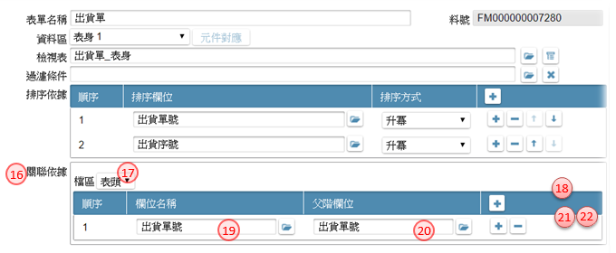
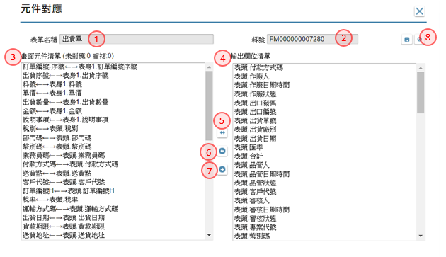

{#FormAnnotation}
作業目的：定義作業表單層級的處理規格。完成表單宣告、畫面編輯，以及相關實體資料表及邏輯資料表的設計與編輯之後，進入進一步的資料處理以及表單結構的規格設定

按鍵功能包含以下項目： 
- **9.1 表單檔區介定 file zone**
- **9.2 表單型態 form types**
	- [**9.2.1 單檔單筆作業 single record form** ](#Form_TYPE_921)
	- [**9.2.2 單檔多筆作業 multiple record form** ](#Form_TYPE_922)
	- [**9.2.3 主檔附檔作業 mater detail form** ](#Form_TYPE_923)
	- [**9.2.4 多主檔對附檔作業 dual detail form** ](#Form_TYPE_924)
	- [**9.2.5 條件式多筆作業 conditional multiple record** ](#Form_TYPE_925)
	- [**9.2.6 指定條件執行 conditional transaction** ](#Form_TYPE_926)
	- [**9.2.7 多筆修改 multiple edits record** ](#Form_TYPE_927)
	- [**9.2.1 單檔單筆作業 single record form** ](#Form_Type_SR)
	- [**9.2.2 單檔多筆作業 multiple record form** ](#Form_Type_MR)
	- [**9.2.3 主檔附檔作業 mater detail form** ](#Form_Type_MD)
	- [**9.2.4 多主檔對附檔作業 dual detail form** ](#Form_Type_DD)
	- [**9.2.5 條件式多筆作業 conditional multiple record** ](#Form_Type_CM)
	- [**9.2.6 指定條件執行 conditional single transaction** ](#Form_Type_CT)
 	- [**9.2.7 多筆修改 multiple edit record** ](#Form_Type_ME)
- **9.3 表單的規格**
	- [**9.3.1 基本設定** ](#FormAnnotation_BasicSet)
	- [**9.3.2 資料處理(表單結構)** ](#FormAnnotation_DataArea)
	- [**9.3.3 元件對應設定**](#FormAnnotation_Mapping)
	- [**9.3.4 表單接收參數設定**]
	
## **9.1 表單檔區介定 file zone**
> 作業目的：依據工作內容設定合理的資料檔區，並以檔區來認定關聯及所屬的資料來源。

1. 表頭區：一頁顯示一筆記錄
2. 表頭區：把多筆記錄在一頁裡顯示
3. 表身1：跟著表頭檔區出現的多筆明細資料
4. 表身2 : 跟著表頭檔區或表身1檔區 出現的多筆明細資料

## **9.2 作業表單型態 form types** {#Form_types}
> 作業目的：宣告作業表單的各種結構，包含單純的單筆式主檔維護、單筆表頭表身的搭配，或是單筆表頭搭配多個單筆表身，或是多筆式的表頭搭配多筆式的表身；以滿足各種作業型態的需求。

參考資料：[℗文件](pdf/8-3表單設計-表單呈現類型.pdf){:target='_blank'}
目前支援的表單型態如下：

### **9.2.1 單檔單筆作業single record form** {#Form_TYPE_921}

|說明|內容|
| :- | :- |
|單筆|一頁單筆型(單筆):頁面只呈現一筆記錄|
|特性|表單啟動時預設為瀏覽狀態，使用於一個檔案的單筆資料維護，例如：客戶主檔維護，或是項目主檔的維護|
|傳統表單|系統功能：☑瀏覽 ☑新增 ☑修改 ☑刪除 ☑速查 ☑過濾 |
|RWD表單|系統功能：☑瀏覽 ☒新增 ☒修改 ☒刪除 ☑速查 ☑過濾 |
|APP表單|系統功能：☑瀏覽 ☒新增 ☒修改 ☒刪除 ☒速查 ☒過濾 |

### **9.2.2 單檔多筆作業multiple record form** {#Form_TYPE_922}

|說明|內容|
| :- | :- |
|傳統樣式|系統功能：☑瀏覽 ☑新增 ☑修改 ☑刪除 ☑過濾 ☑速查 |
|RWD 樣式|系統功能：☑瀏覽 ☑新增 ☑修改 ☑刪除 ☑過濾 ☑速查 |
|APP 樣式|系統功能：☑瀏覽 ☒新增 ☒修改 ☒刪除 ☒過濾 ☒速查 |

|樣式 RWD||

### **9.2.2 單檔多筆作業multiple record form**{#Form_Type_MR}

|說明|內容|
| :- | :- |
|多筆|一頁多筆型(多筆): 頁面同時呈現多筆記錄，系統提供標準的新增、修改、刪除等基本的檔案維護功能。|
|特性|無過濾條件的明細資料維護或查詢，一般使用於多筆明細資料的維護，例如：出入庫明細查詢|
|傳統表單|系統功能：☑瀏覽 ☑新增 ☑修改 ☑刪除 ☑速查 ☑過濾 |
|RWD表單|系統功能：☑瀏覽 ☒新增 ☒修改 ☒刪除 ☑速查 ☑過濾 |
|APP表單|系統功能：☑瀏覽 ☒新增 ☒修改 ☒刪除 ☒速查 ☒過濾 |

### **9.2.3 主檔附檔作業 mater detail form** {#Form_TYPE_923}
|說明|內容|
| :- | :- |
|傳統樣式|系統功能：☑瀏覽 ☑新增 ☑修改 ☑刪除 ☑過濾 ☑速查 |
|RWD 樣式|系統功能：☑瀏覽 ☒新增 ☒修改 ☒刪除 ☑過濾 ☒速查 |
|APP 樣式|系統功能：☑瀏覽 ☒新增 ☒修改 ☒刪除 ☒過濾 ☒速查 |

### **9.2.3 主檔附檔作業 mater detail form**{#Form_Type_MD}

|說明|內容|
| :- | :- |
|雙檔|單頭多身多筆型(雙檔)：頁面以一筆主要的檔頭記錄, 同時呈現一或多個檔身的多筆記錄；系統提供標準的新增、修改、刪除等基本的檔案維護功能同時處理主檔及附檔具關聯性的資料。|
|特性|使用於處理主檔搭配一個或多個多筆的副檔資料，例如員工主檔與該員的學經歷明細資料|
|傳統表單|系統功能：☑瀏覽 ☑新增 ☑修改 ☑刪除 ☑速查 ☑過濾 |
|RWD表單|系統功能：☑瀏覽 ☒新增 ☒修改 ☑刪除 ☑速查 ☑過濾 |

### **9.2.4 多主檔對附檔作業dual detail form** {#Form_TYPE_924}
|說明|內容|
| :- | :- |
|傳統樣式||
|系統功能|☑瀏覽 ☑新增 ☑修改 ☑刪除 ☑過濾 ☑速查|
|RWD樣式||
|系統功能|☑瀏覽 ☒新增 ☒修改 ☒刪除 ☑過濾 ☑速查|

### **9.2.4 多主檔對附檔作業dual detail form**{#Form_Type_DD}

|說明|內容|
| :- | :- |
|雙多筆|多頭多身多筆型(雙多筆): 頁面主要的檔頭記錄以多筆呈現, 同時帶有一或多個附檔的記錄；系統提供標準的新增、修改、刪除等基本的檔案維護功能同時處理主檔及附檔具關聯性的資料。|
|特性|使用於處理主檔為多筆型態搭配個自多筆的副檔資料，例如員工主檔與該員的學經歷明細資料及扶養親屬明細|
|傳統表單|系統功能：☑瀏覽 ☑新增 ☑修改 ☑刪除 ☑速查 ☑過濾 |

### **9.2.5 條件式多筆作業 conditional multiple record** {#Form_TYPE_925}

|說明|內容|
| :- | :- |
|傳統樣式||
|系統功能|☑瀏覽 ☑新增 ☑修改 ☑刪除 ☑過濾 ☑速查|
|RWD 樣式||
|系統功能|☑瀏覽 ☒新增 ☒修改 ☑刪除 ☑過濾 ☑速查|

### **9.2.5 條件式多筆作業 conditional multiple record**{#Form_Type_CM}

|說明|內容|
| :- | :- |
|條件 多筆|過濾條件查詢(條件多筆)：頁面先以多個欄位當條件，讓使用者指定後, 以查詢鍵, 載入符合條件的記於多筆內容；針對多筆內的記錄就同　單檔多筆作業　的模式，進行增、修、刪等動作。|
|特性|有過濾條件的明細資料維護或查詢，需先輸入過濾條件值，才能得到明細資料|
<<<<<<< Updated upstream
|傳統表單|系統功能：☑瀏覽 ☒新增 ☑修改 ☒刪除 ☒速查 ☑過濾 |
|RWD表單|系統功能：☑瀏覽 ☒新增 ☒修改 ☒刪除 ☒速查 ☑過濾 |
|APP表單|系統功能：☑瀏覽 ☒新增 ☒修改 ☒刪除 ☒速查 ☑過濾 |

### **9.2.6 指定條件執行 conditional transaction**  {#Form_TYPE_926}

|說明|內容|
| :- | :- |
|傳統樣式||
|系統功能|☑瀏覽 ☒新增 ☑修改 ☒刪除 ☑過濾 ☒速查|
|RWD 樣式||
|系統功能|☑瀏覽 ☒新增 ☑修改 ☒刪除 ☑過濾 ☒速查|
|APP 樣式||
|系統功能|☑瀏覽 ☒新增 ☑修改 ☒刪除 ☑過濾 ☒速查|

### **9.2.6 指定條件執行 conditional single transaction**{#Form_Type_CT}

|說明|內容|
| :- | :- |
|單改|設定條件執行按鈕(單改): 頁面主要的輸入條件後, 以按鈕的方式執行功能鍵, 本身不具儲存動作|
|特性|使用於直接登打交易資料後，即行遞交後台處理|
|傳統表單|系統功能：☒瀏覽 ☒新增 ☑修改 ☒刪除 ☒速查 ☒過濾 |
|RWD表單|系統功能：☒瀏覽 ☒新增 ☑修改 ☒刪除 ☒速查 ☒過濾 |
|APP表單|系統功能：☒瀏覽 ☒新增 ☑修改 ☒刪除 ☒速查 ☒過濾 |

### **9.2.7 多筆修改 multiple edits record**   {#Form_TYPE_927}

|說明|內容|
| :- | :- |
|系統功能|☒瀏覽 ☒新增 ☑修改 ☒刪除 ☒過濾 ☒速查|
|傳統樣式||
|系統功能|☒瀏覽 ☒新增 ☑修改 ☒刪除 ☒過濾 ☒速查|
|RWD樣式||
|系統功能|☒瀏覽 ☒新增 ☑修改 ☒刪除 ☒過濾 ☒速查|
|APP樣式||

### **9.2.7 多筆修改 multiple edit record**{#Form_Type_ME}

|說明|內容|
| :- | :- |
|多改|利用條件把資料載入多筆內，進行連續編修，最後利用按鍵將有異動的記錄，存回資料庫|
|特性|表單啟動時預設為瀏覽狀態，使用於一個檔案的單筆資料維護，例如：客戶主檔維護，或是項目主檔的維護|
|傳統表單|系統功能：☑瀏覽 ☒新增 ☑修改 ☒刪除 ☒速查 ☒過濾 |
|系統功能|☑瀏覽 ☒新增 ☑修改 ☒刪除 ☒過濾 ☒速查|
|傳統樣式||

## **9.3 表單的規格**
> 作業目的：依據工作內容設定合理的資料檔區，並以檔區來認定關聯及所屬的資料來源。

### 9.3.1 基本設定 {#FormAnnotation_BasicSet}
參考資料：
- [℗文件](pdf/8-1表單設計-開啟規格定義介面.pdf){:target='_blank'}
- [℗文件](pdf/8-2-1表單設計-啟動表單時開關首頁選單.pdf){:target='_blank'}
- [℗文件](pdf/8-2-2表單設計-連續異動.pdf){:target='_blank'}
- [℗文件](pdf/8-2-3記錄異動立即過濾重載.pdf){:target='_blank'}
- [℗文件](pdf/8-2-4使用表單元件顯示錯誤訊息.pdf){:target='_blank'}

1. 表單名稱：可利用開窗鍵, 開啟[【多語詞庫】](16.html#MaintainMultilingual)指定挑選詞庫，操作方法請參考［16.2］來改變表單的名稱
2. 料號：顯示表單的料號
3. 表單類別有四: 依據使用的需求，選擇不同的表單類型，作業差異請參考9.2 作業表單型態
	配合設計類型的差異，選項如下： 
	3-1. 當表單設計類型=傳統表單，選項：一頁單筆(單筆)/一頁多筆(多筆)/單頭一身多筆型(雙檔)/多頭單身多筆型(雙多筆)/過濾條件查詢(條件多筆)/指定條件執行(單改)/指定條件修改(雙改)/樞紐表單 
	3-2. 當表單設計類型=APPS，選項：一頁單筆(單筆)/一頁多筆(多筆)/過濾條件查詢(條件多筆)/指定條件執行(單改) 
	3-3. 當表單設計類型=自適應(RWD)，選項：一頁單筆(單筆)/一頁多筆(多筆)/單頭一身多筆型(雙檔)/多頭單身多筆型(雙多筆)/過濾條件查詢(條件多筆)/指定條件執行(單改)
4. 資料呈現：決定開啟表單時, 顯示的記錄順序 
	最首筆: 選擇本項時, 表示資料依表單排序原則, 顯示第一筆 
	最末筆: 選擇本項時, 表示資料依表單排序原則, 顯示最後一筆 
	空白頁: 表示開單時, 不顯示任何資料 				
5. 資料重顯時間勾選：若表單的資料需要定時重新顯示時，可利用本欄位設定重顯的週期。當表單設計類型=APP，不支援									
6. 重顯分鐘：分鐘數，下拉, 00~60。當表單設計類型=APP，不支援									
7. 重顯秒數：秒數，下拉, 00~59。當表單設計類型=APP，不支援									
8. 獨立開啟：此勾選決定本表單是否出現在選單上。									
9. 連續異動：決定本表單編修記錄時, 是否開啟連續異動的功能。連續異動的作用,在於編輯記錄時, 在存回記錄後, 不離開編輯狀態, 而是繼續編輯下一筆。
當表單類型= 一頁多筆(多筆)/過濾條件查詢(條件多筆) 時才有效用。當表單設計類型=APP，不支援"
10. 首頁選單：本設定作用於此表單開啟時，是否將選開關閉，可下拉: 空白/強制開啟/強制關閉, 預設=空白，表示保留原狀。當表單設計類型=APP，不支援									
11. 錯誤訊息指定否：系統預設有錯誤訊息須提示時，是以彈出訊息窗的方式處理，但若用戶有特殊需求是要把訊息放置在特定的欄位元件時，可在此處設定									
12. 錯誤訊息元件：在 錯誤訊息指定元件　為勾狀態下，由本欄位指定顯示訊息的元件，可開啟【表單元件清單】進行挑選指定									
13. 記錄異動立即過重載：在處理資料的異動後，宣告是否立即重顯所有資料。當表單設計類型=APP，不支援									
14. 接收參數：當表單有被其它單據開啟時，而必須接收參數來辨識或處理後續資料時，在本表格宣告相關內容。									
15. 參數名：參數的名稱，同一表單, 參數名不允重複									
16. 型態：參數的型態，下拉,：文字/數字/日期, 預設: 文字									
17. 說明：說明參數的用途									
18. 參數增加鍵鍵 ：增加參數項目列									
19. 參數刪除鍵鍵 ：刪除參數項目列									
20. 規格說明：顯示說明的內容									
21. 使用時機敘述：輸入本表單的使用時機

### 9.3.2 資料處理設定 {#FormAnnotation_DataArea}
> 作業目的：宣告作業表單的結構，資料來源及多檔區的連結關係。

參考資料：
- [℗資料處理-單](pdf/8-4-1表單設計-單筆、單改、多筆表單資料處理.pdf){:target='_blank'}
- [℗資料處理-多](pdf/8-4-2表單設計-雙檔、雙多筆表單資料處理.pdf){:target='_blank'}
- [℗資料處理-條件](pdf/8-4-3表單設計-條件多筆表單資料處理.pdf){:target='_blank'}
- [℗資料處理-雙改](pdf/8-4-4表單設計-雙改表單資料處理.pdf){:target='_blank'}

**表頭檔區**

1. 表單名稱：顯示表單的名稱
2. 料號：顯示表單的料號
3. 資料區：以表單類型的要求, 安排表頭、表身1. 不同資料區域的來源資訊。一張表單最多支援10個資料來源.
4. 檢視表：可利用本鍵開啟【檢視表】做為表單資料區的來源
5. 檢視表參數：檢視表若指定須傳遞參數時,可利用本按鈕開[【傳遞參數】](20.html#PassParameters)畫面, 對參數欄位給值，操作說明請參考［附錄A4］
6. 檢視表過濾條件：可利用本鍵開啟[【條件式】](20.html#ConditionStatement)中, 指定限定符合的條件內容, 做為過濾檢視表格記錄的條件，操作說明請參考［附錄A1］
7. 清除鍵：利用本鍵清除原指定的條件式
8. 排序依據：本區域在指定表單記錄呈現時, 排序依據的欄位及方式
9. 順序：欄位順序
10. 排序欄位：開窗挑選指定的來源檢視表格的欄位清單
11. 排序方式：下拉挑選升冪(由小到大排)/降冪(由大到小排列)
12. 排序增加鍵：增加排序的項目
13. 排序刪除鍵：刪除排序的項目
14. 排序上移鍵：將本列的排序往上移
15. 排序下移鍵：將本列的排序往下移
16. 角色條件：本區域在指定表單在執行時時, 角色條件的判斷條件
17. 增加角色條件鍵：增加角色條件的項目
18. 角色條件欄位：開窗設定條件式
19. 角色條件方式：下拉挑選升冪(由小到大排)/降冪(由大到小排列)
20. 插入角色條件鍵：在駐留項次插入角色條件的項目
21. 角色條件刪除鍵：刪除角色條件的項目
22. 角色條件上移鍵：將本列的角色條件往上移
23. 角色條件下移鍵：將本列的角色條件往下移

**表身檔區**

16. 關聯依據：設定本檔區與上階檔區的關聯
17. 關聯檔區：設定本檔區關聯的父階檔區
18. 關聯順序：欄位順序
19. 欄位名稱：開窗挑選指定的本檔區檢視表格的欄位清單
20. 父階欄位：開窗挑選指定的父階檔區檢視表格的欄位清單
21. 關聯增加鍵：增加關聯的項目
22. 關聯刪除鍵：刪除關聯的項目

### **9.3.3 元件對應設定** {#FormAnnotation_Mapping}
> 作業目的：完成資料來源設定，已確定來源檢視表時，必須設定作業表單上的那些資料欄位(data field) 要對應到檢視表的檢視欄位，以供系統儲存及查詢時對照之用。

參考資料： [℗文件](pdf/8-5表單設計-元件對應設定.pdf){:target='_blank'}

1. 表單名稱：顯示表單的名稱
2. 料號：顯示表單的料號
3. 畫面元件清單：表列所有表單上的元件明細
4. 輸出欄位清單：表列本表單各資料檔區所對應的檢視表，包含的檢視表欄位明細
5. 自動對應鍵：此鍵可自動將兩邊名稱相同的欄位對應起來。
6. 單一對應鍵：同時指定表單元件及輸出元件後，將指定的輸出元件對應到表單元件
7. 單一取消鍵：將指定的表單元件，清空對應內容
8. 儲存鍵 ：將設定好的對應內容存檔

### **9.3.4 元件對應設定** {#FormAnnotation_Mapping}
> 作業目的：完成資料來源設定，已確定來源檢視表時，必須設定作業表單上的那些資料欄位(data field) 要對應到檢視表的檢視欄位，以供系統儲存及查詢時對照之用。

參考資料： [℗文件](pdf/8-6表單設計-表單接收參數設定.pdf){:target='_blank'}

---
[**回到章節目錄**](index.html#MainMenu)
