## Mobile Application Environment Reference Manual

### **修訂記錄** (Revision History)

| 版本 Version  |出版日期 Issue Date  |修訂章節 Section Changed |出版修訂原因 Reason for Issue |
| :-: | :-: | :-: | :-: |
| 8.10.1 | 2021/12/25 | All | 依MAE運行台8.10.1 改版, 更新說明內容 |

### **章節目錄**

[**1. 登入系統**](#Login)  
&nbsp;&nbsp;&nbsp;1.1 安裝Apps  
&nbsp;&nbsp;&nbsp;1.2 登入MAE  

[**2. 基本操作**](#Basicoperation)  
&nbsp;&nbsp;&nbsp; 2.1 MAE運行平台框架  

[**3. 相關設定**](#BasicSetting)  
&nbsp;&nbsp;&nbsp; 3.1 設定  
&nbsp;&nbsp;&nbsp; 3.2 問題回報     
&nbsp;&nbsp;&nbsp; 3.3 推播記錄  
&nbsp;&nbsp;&nbsp; 3.4 主要裝置     

# **1.系統登入** {#Login}
> 作業目的：系統登入的目的管理用戶及其權限，每一個ruRU MAE user都需要有帳號，並規屬於一個以登記的企業/機構之下。新用戶必須先申請帳號，舊用戶必須輸入正確的帳號及密碼。ruRU MAE新帳號核准的權限是在企業管理員。
>

## **1.1 安裝Apps**
> 作業目的：登入ruRU MAE之前必須安裝APP

 * Google 手機請在Google play, Apple 手機在Apple store 找關鍵字 「如如」, 找到ruRU MAE –如如研創後, 進行安裝  
 * 利用QR code 軟體, 依手機類型, 刷上面的行動條碼  QR Code

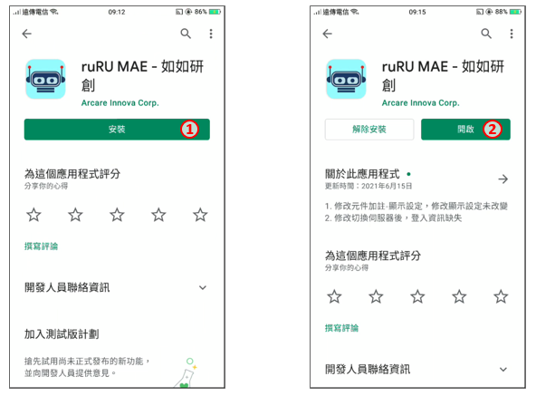
1. 找到ruRU  MAE 進行安裝  
2. 安裝完成, 點選開啟  

### **1.1.1 指定伺服器**
> 作業目的：MAE為可提供一對多台伺服器的服務，在安裝完成後必須先指定伺服器才可執行應用系統。
>

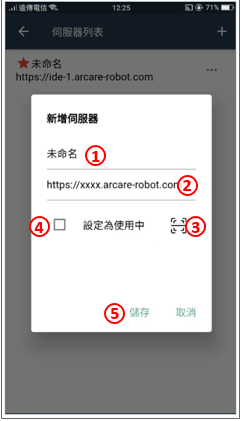

1. 為伺服器命名，系統預設為未命名  
2. 輸入伺服器所在的URL，輸入系統會進行連線測試。  
3. 若輸入的網址有QRCode, 可以點選本圖示啟動掃碼程式，進行讀取動作  
4. 指定是否設定為使用中的連線（一個MAE 可以設定多組連線伺服器，但同時間僅可一組為使用中  
5. 按下本鍵進行儲存。  

## **1.2 登入MAE**
> 作業目的：。

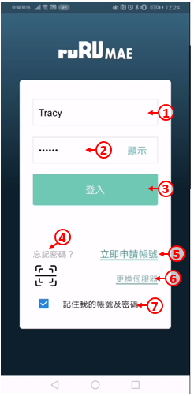

1. 輸入帳號。
2. 輸入密碼。
3. 按下登入鍵。
4. 如果忘記密碼，可按下忘記密碼連結，並依照畫面指示操作。
5. 如果沒有帳號，請按下立即申請帳號連結，並依照畫面指示操作，申請之後請通知貴公司系統管理員進行核准。
6. 如果要切換伺服器，可按下切換伺服器連結，並依照畫面指示操作。
7. 可勾選指定是否記錄帳號密碼。

### **1.2.1 帳號申請**
> 作業目的：若未有帳號者，可點選「申請帳號」連結，依螢幕指示操作申請新帳號。為了管理使用者只能看到其所屬公司的系統，所以帳號的申請必須提供其服務公司的企業代號，來過濾出它可以看得到的系統清單。
>
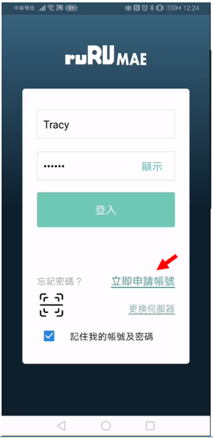  

* 此部份功能請連結參照 RWD運行台 的 [帳號申請](doc/RTE_8.10.0/zh-Hant/RWD.HTML#NewAccount)

### **1.1.2 忘記密碼**
> 作業目的：使用者忘記密碼時，可依本節說明重設密碼，使用此功能之前，必須確定使用者的電子郵件地址是正確而且可以收到信的。。

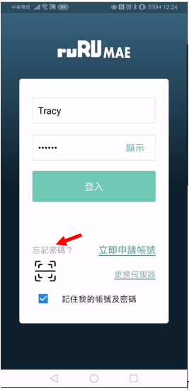

* 此部份功能請連結參照 RWD運行台 的  [忘記密碼](doc/RTE_8.10.0/zh-Hant/RWD.HTML#ChangePassword)

## **1.1.3 切換伺服器** {#SwapServer}
> 作業目的：登入ruRU MAE後，必須指定使用的系統名稱。唯是否有使用系統的權限則由系統管理員設定。

##### 設定伺服器：
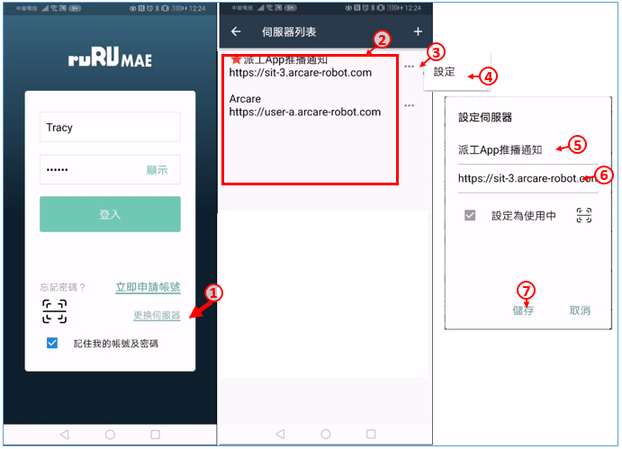

1. 在登入畫面中，按下「切換伺服器」連結。
2. 伺服器列表：表列所有伺服器的清單，有標註紅色星星者，為使用中的伺服器
3. 若要改變 使用中的伺服器的資訊時， 可點選設定鍵
4. 開啟設定的小選單後，點選「設定」項
5. 伺服器名稱：依需求更名
6. 伺服器網址：依環境設定連線內容
7. 按下儲存鍵，完成編輯。

##### 變更伺服器：
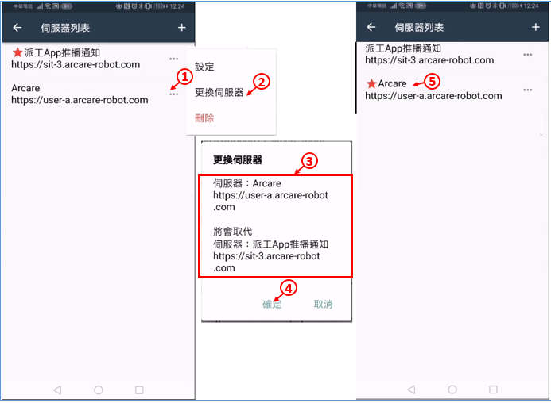

1. 若要改變伺服器的資訊時， 可點選設定鍵，
2. 開啟設定的小選單後，點選「更換伺服器」項
3. 系統彈出更換的資訊, 要求確認
4. 確定無誤後，按下確定鍵，完成變更。
5. 原伺服器列表，重新顯示使用中的伺服器清單

##### 刪除伺服器：
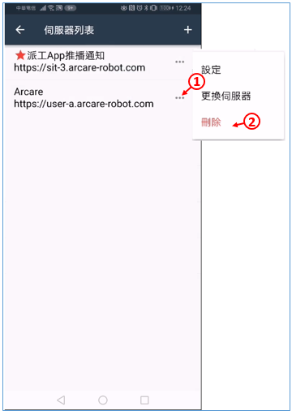

1. 若要刪除伺服器的資訊時， 可點選設定鍵  
2. 開啟設定的小選單後，點選「刪除」項  

# **2.基本操作** {#Basicoperation}

## **2.1 MAE運行平台框架**
> 作業目的：

登入後的畫面選單呈現有兩種模式

### **2.1.1 清單式選單**

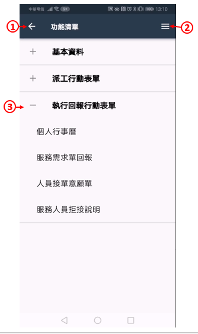
1. 功能清單: 依作業的選單或表單而顯示相關內容
2. 系統設定:點選本鍵可進入設定頁面
3. 依系統設計或權限選單上的設定顯示不同層次的類型，可以是模組、流程跟表單。

### **2.1.2 首頁式選單**

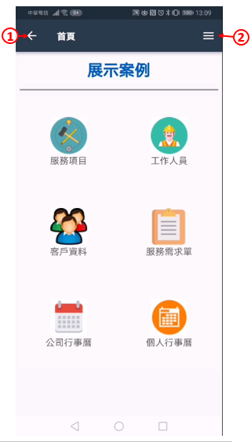
1. 功能清單: 依作業的選單或表單而顯示相關內容
2. 系統設定:點選本鍵可進入設定頁面
3. 由系統設計時指定特定頁面為首頁，則登入系統時，優先顯示本表單

# **3.相關設定** {#BasicSetting}
> 作業目的：。
>

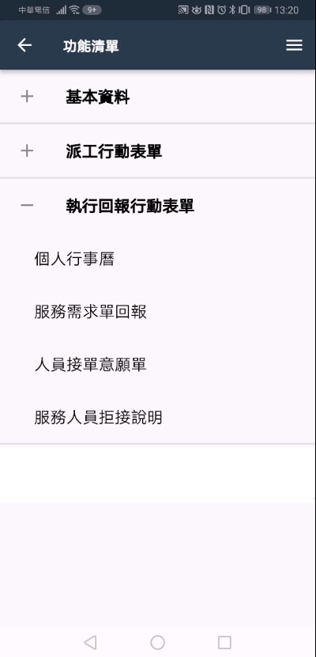

## 3.1 設定

### **3.1.1 逾時時間**

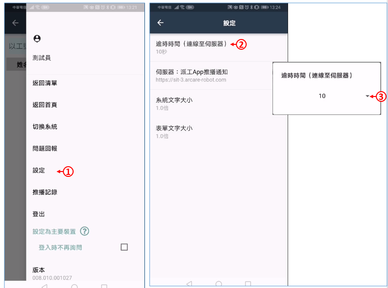
1. 點選「設定」的功能項， 開啟設定的頁面。  
2. 點選「逾時時間」的功能項，設定系統發出指令等待伺服器回應最長等待秒數。若超過此秒數尚未收到回應則會彈錯誤訊息。  
3. 秒數：指定逾時的秒數，預計１０秒

### **3.1.2 伺服器狀態**

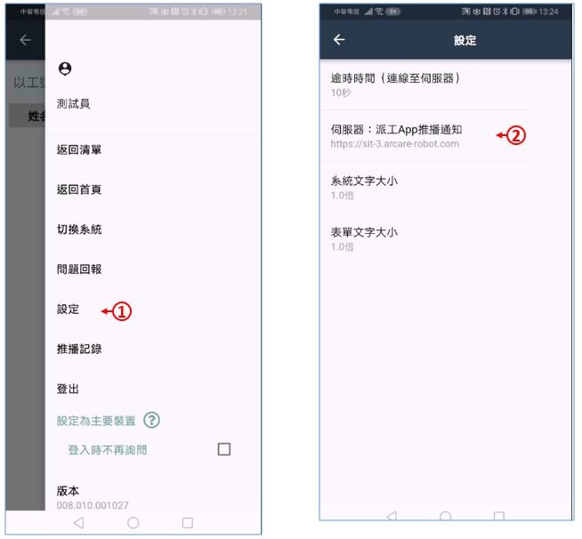

1. 點選「設定」的功能項， 開啟設定的頁面。  
2. 顯示目前使用中的伺服器資訊，若要切換伺服器，可點選標題進行動作，相關設定請參考[切換伺服器](#SwapServer)。  

## 3.1.3 系統文字倍率
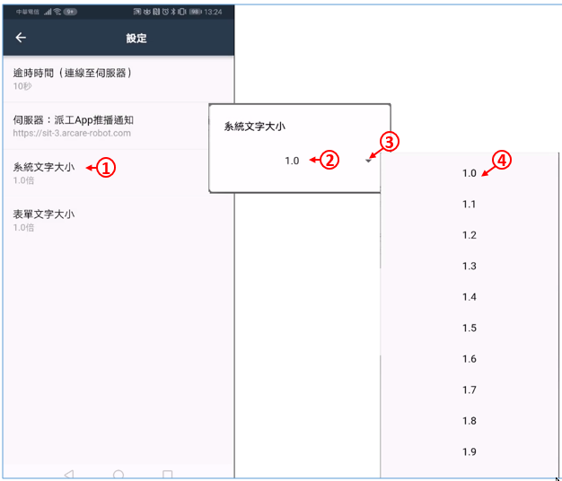
1. 點選「系統文字大小」的功能項，設定系統在顯示系統文字時，所參照的倍數。  
2. 字體倍數：預設為１倍(原字大小)。   
3. 若要放大字體時，可下拉指定倍數。（倍數愈大字體愈大）  

## 3.1.4 表單文字倍率

1. 點選「表單文字大小」的功能項，設定系統在顯示表單文字時，所參照的倍數。  
2. 字體倍數：預設為１倍(原字大小)。   
3. 若要放大字體時，可下拉指定倍數。（倍數愈大字體愈大）  

## 3.2 問題回報
>作業目的：當操作表單遇到錯誤發生時，可以使用問題會報功能，將問題回報給系統管理員。當然，您也可以使用其他傳統方式回報問題。

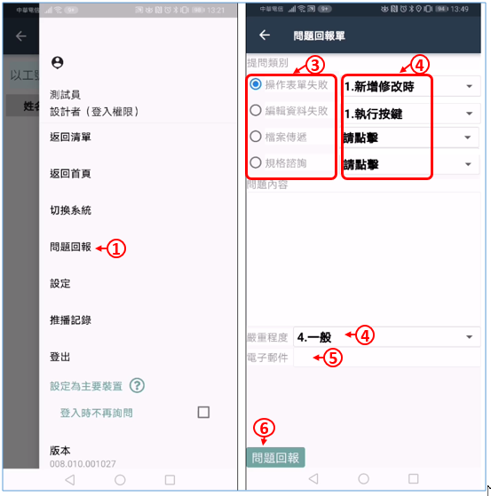

1. 點選「設定」的功能項， 開啟設定的頁面。  
2. 點選「問題回報」的功能項，將相關問題回報給系統管理者。  
3. 問題類別：依據發生的錯誤情況，挑選提問類別。  
4. 詳細描述問題的內容，系統管理員才能看懂並處理您的問題。  
5. 選擇問題的嚴重程度。  
6. 若有圖片或是文件可上傳至此。  
7. 輸入E-MAIL地址。  
8. 送出問題即可。  

## 3.3 推播記錄
>作業目的：行動裝置具有接收推播通知的功能，本作業主要在檢視接收到的通知內容

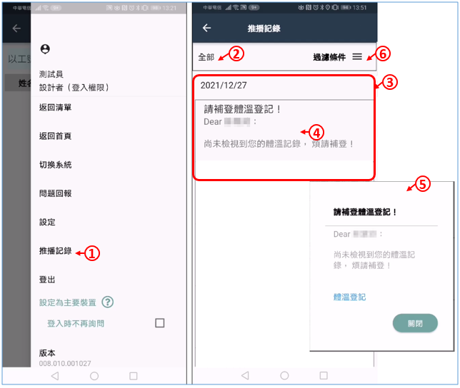
1. 點選「推播記錄」的功能項，檢視與登入帳號有關的推播記錄。  
2. 系統別：選擇推播記錄的資料來源是全部系統或單一系統，預設為全部。  
3. 推播清單：顯示符合過濾條件的推播內容。  
4. 推播本文：點選推播記錄清單的本文文字。  
5. 推播明細：可開啟推播內容頁面，進行推播內容的後續。  
6. 點選過濾條件進行條件設定  

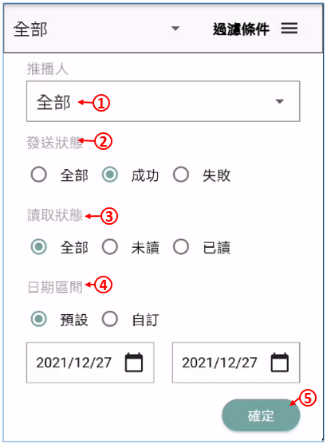
1. 推播人：下拉選擇全部或限定的推播人員。  
2. 發送狀態：選擇顯示的記錄的發送狀態。
3. 讀取狀態：選擇顯示的記錄的讀取狀態。
4. 日期區間：選擇預設或自訂  
  - 預設：系統日期  
  - 自訂：可指定日期的起、迄區間。  
5.按下確定鍵，即可重新顯示推播清單。  

## 3.4 主要裝置
>作業目的：同帳號可以在不同行動裝置上登入，當推播通知發送時，必須確定要通知的裝置設備，，以可以讓接收到推播訊息的同時，有通知列出現。

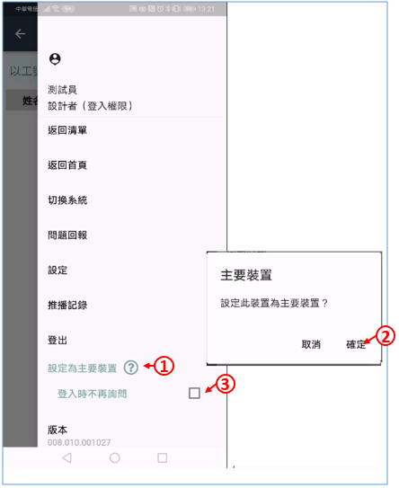
1. 點選「設定為主要裝置」的功能項，開啟詢問視窗。
2. 點選確定鍵，進行設定。
3. 登入時不再詢問：每個登入的帳號都應該要設定主要裝置，系統在登入時會提示設定的通知；但若此帳號沒有推播的需求時，就可以勾選本設定，讓系統不再提示訊息。

---
[**回到目錄**](/RELEASE/README.html)
